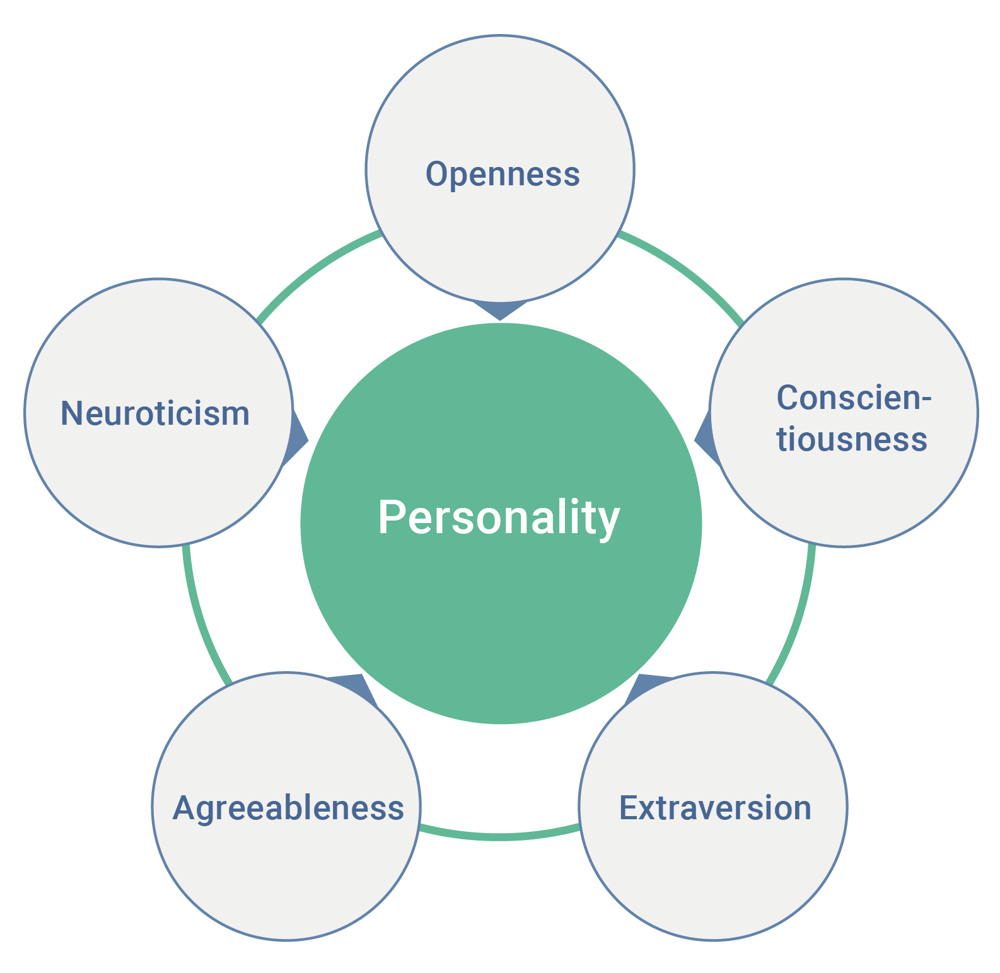

Сегодня мы работаем с очень мощным датасетом. Это [данные](https://www.kaggle.com/tunguz/big-five-personality-test) личностного опросника «Big-Five Factor Markers», сконструированного по модели [Big Five](https://en.wikipedia.org/wiki/Big_Five_personality_traits).

На измерение каждого фактора в опроснике отведено по десять утверждений:

* `EXT1`--`EXT10` --- extraversion
* `EST1`--`EST10` --- neuroticism (emotional stability)
* `AGR1`--`AGR10` --- agreeableness
* `CSN1`--`CSN10` --- conscientiousness
* `OPN1`--`OPN10` --- openness

Подробное описание датасета представлено в [этом файле](https://raw.githubusercontent.com/angelgardt/hseuxlab-wlm2021/master/data/big_five_bffm_codebook.txt). Факторную структуру можно изучить [здесь](https://ipip.ori.org/newBigFive5broadKey.htm). Датасет содержит 1 015 342 наблюдения[^1].

[^1]: Это почти 400 Мб данных. Это много. Если ваша машина не справляется с таким объемом, отберите случайную подвыборку из 10 000 / 100 000 / 300 000 наблюдений (в зависимости от мощности машины), и выполняйте задания на ней.

***

**1. Загрузите [датасет](https://drive.google.com/uc?export=download&id=1G3GUfDW8GFs6oWgfdnUuNl8Eq0UndXTY). Проверьте типы переменных. Если есть такие переменные, которые по своему содержанию должны быть другого типа, приведите их к нужному типу. Приведите данные к виду tidy data --- cделайте необходимые преобразования с переменными, если они потребуются. (2 балла)**

***

**2. Проведите разведочный анализ. Изучите закономерности, представленные данных. Какие особенности есть в данных? Какие преобразования могут потребоваться? (2 балла)**

***

**3. Если необходимы какие-либо преобразования данных перед проведением конфирматорного факторного анализа, выполните их. (3 балла)**

*Подсказка*

[Матрица направлений вопросов](https://raw.githubusercontent.com/angelgardt/hseuxlab-wlm2021/master/data/direction_matrix_bffm.csv)

***

**4.  Постройте модель конфирматорного факторного анализа для проверки классической структуры модели Big Five. (2 балла)**

***

**5. Оцените качество модели. Хорошо ли она подходит под данные? (2 балла)**

***

**6. Проинтерпретируйте результаты конфирматорного факторного анализа. Изучите факторные нагрузки, ковариации и остатки модели. Есть ли «фиктивные» факторы в модели? (3 балла)**

***

**7. Визуализируйте получившуюся модель. (1 балл)**

***

**8. Изучите индексы модификации для построенной модели. Какие связи можно добавить в модель для повышения её качества? (2 балла)**

***

**9. Постройте дополненную модель на основе имеющейся. Включите в неё _от двух до пяти_ связей с наибольшими индексами модификации. Оцените качество модели. Стала ли она лучше по сравнению с предыдущей? Исследуйте факторные нагрузки. Какие изменения произошли по сравнению с исходной моделью? Визуализируйте дополненную модель. (2 балла)**

***

**10. Сравните две имеющиеся модели. Сделайте вывод об их различии. Какая из моделей лучше описывает имеющиеся данные? (1 балл)**

