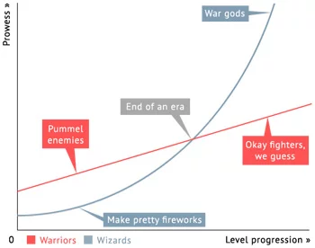
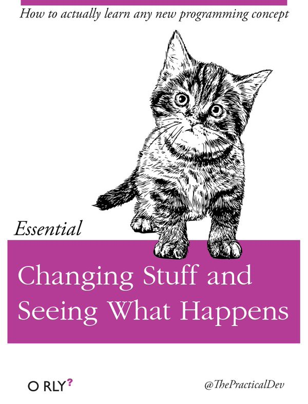

# (PART) R programming {-}
# Знакомство с R и RStudio

> _--- Я вот не могу выбрать: делать на R или на Python? <br>
> --- Да какая разница! Главное --- делай!_

## Что это и откуда?

[**R**](https://www.r-project.org/) --- популярный язык программирования среди исследователей в социальных и гуманитарных науках. Если совсем коротко, то начиналось всё с языка [**S**](https://en.wikipedia.org/wiki/S_(programming_language)), который был языком программирования для статистического анализа. Потом его [доработали](https://www.researchgate.net/publication/240040602_Evaluating_the_Design_of_the_R_Language) и получился **R**.

Хотя сегодня всё ещё можно услышать, что «R --- это язык программирования для статистической обработки данных», это [ложь](https://en.wikipedia.org/wiki/False_(logic)). Да, когда-то [давно](https://en.wikipedia.org/wiki/Devonian) дела обстояли именно так, но сейчас **R** --- это полноценный язык программирования, который позволяет решать широкий спект задач от статистического анализа и data wrangling до машинного обучения, моделирования и создания сайтов и приложений.


## Почему R?

* свободное ПО (часть [GNU Project](https://en.wikipedia.org/wiki/GNU_Project))
* динамично развивается
* громадные возможности расширения функционала
  + более 10 000 пакетов
  + открытый исходный код
  + возможность написать свои пакеты
<center>

</center>
<font size=1>
<p align="right">[_Source_](https://gist.github.com/daroczig/3cf06d6db4be2bbe3368)</p>
</font>
* большое сообщество по всему миру, много ресурсов для задавания вопросов
* [Linear Warriors vs Quadratic Wizards](https://1d4chan.org/wiki/Linear_Warriors,_Quadratic_Wizards)
  + в SPSS (и другие GUI пакеты) ниже порог вхождения, но развитие навыков --- линейное
  + в R порог вхождения выше, но впоследствии случается резкий буст, и вы становитесь богами дата саенс

<center>

</center>
<font size=1>
<p align="right">[_Source_](https://1d4chan.org/wiki/Linear_Warriors,_Quadratic_Wizards)</p>
</font>

* [репродуцируемость](https://en.wikipedia.org/wiki/Reproducibility_Project) результатов

### А он лучше Питона?
<center>

</center>
<font size=1>
<p align="right">[_Source_](https://andreyex.ru/programmirovanie/r-vs-python-samaya-aktualnaya-diskussiya-dlya-nachinayushhih-uchenyh-dannyh/)</p>
</font>

Нет. Но он и **не хуже**.

Вообще файт **R vs Python**, на мой взгляд, несколько бессмысленный, поскольку, по факту, всё упирается в синтаксис языка. Ну, и запрос работодателя, конечно. Возможности обоих языков и скорость работы сопоставимы. Области применения по большей части тоже. Поэтому я пользуюсь следующей эвристикой:

* аналитика, статистика, графики, покрутить данные --- **R**
* машинное обучение, нейросети, другой ИИ, интерфейсы и [собственно] программирование --- **Python**

Многие, наверняка, оспорят такое разделение --- я же не стану отстаивать его истинность.

Мы будем работать на **R**, поскольку он всё же более популярен в наших кругах --- среди «социально-гуманитарных аналитиков».


## Установка R и RStudio

Чтобы нам радостно и приятно жилось, нужно установить:

* Сначала **R**
  + на [Windows](https://cran.r-project.org/bin/windows/base/)
  + на [Mac](https://cran.r-project.org/bin/macosx/)
  + на [Linux](https://cran.rstudio.com/bin/linux/)
* Затем [**RStudio**](https://www.rstudio.com/products/rstudio/download/)

Если что-то не установилось или вы предпочитаете облачные сервисы, то можно работать через браузер в [RStudio Cloud](https://rstudio.cloud/).


### А зачем обе штуки ставить?

Вопрос не безосновательный. Не углубляясь в мелкие детали, скажем так: R --- это собственно язык программирования, а RStudio --- это среда ([IDE](https://ru.wikipedia.org/wiki/%D0%98%D0%BD%D1%82%D0%B5%D0%B3%D1%80%D0%B8%D1%80%D0%BE%D0%B2%D0%B0%D0%BD%D0%BD%D0%B0%D1%8F_%D1%81%D1%80%D0%B5%D0%B4%D0%B0_%D1%80%D0%B0%D0%B7%D1%80%D0%B0%D0%B1%D0%BE%D1%82%D0%BA%D0%B8), [integrated development environment](https://en.wikipedia.org/wiki/Integrated_development_environment)), которая позволяет в этом языке удобно и просто работать, а также расширяет его возможности.

> RStudio --- не единственная среда для работы в R, но, определённо, самая топовая. Почти все пользуются именно ею, и нет смысла искать что-то более удобное.

## Где спросить вопрос или искать ответ?
* [Google](https://google.com) --- препарат выбора
* [Stack Overflow](https://stackoverflow.com/) --- ответы на вопросы, и не только по R
* [Stack Overflow на русском](https://ru.stackoverflow.com/) --- то же самое, только отечественные специалисты
* [Cookbook for R](http://www.cookbook-r.com/) --- хорошая книжка для старта
* [RStudio Community](https://community.rstudio.com/) --- ответы на вопросы по R
* [R-bloggers](https://www.r-bloggers.com/) --- про новинки в R и рядом с ним
* [Хабр про R](https://habr.com/ru/hub/r/)
* …


## Интерфейс R
Можно, конечно, работать и без RStudio вовсе --- чисто в R. Мы кратенько взглянем на его интерфейс, чтобы наслаждение от встречи с IDE-шкой было больше.


Выглядит весьма по-программистски. Есть окно скрипта, где пишутся команды, есть консоль, в которой они выполняются, иногда открываются окна с графиками. Но, в общем, посмотрели для общего развития --- и хватит. Пора серьезными делами заняться.


## Интерфейс RStudio
Итак, посмотрим на RStudio. При запуске у вас откроется что-то такое:


Видно четыре (или три[^1]) окна. Давайте последовательно разбираться, что в каждом из них происходит.


### Console
В консоль можно писать команды и запускать их нажатием `Enter`. Они будут сразу выполняться. После некоторых команд будет выводиться какой-то результат. С помощью стрелок `↑` и `↓` можно вывести предыдущие команды, например, чтобы запустить их ещё раз, не вводя повторно, или каким-либо образом их изменить.

Можно, в прицнипе, работать только из консоли, но на практике это не очень удобно. Главным образом, из-за того, что команды улетают «вникуда» и к некоторым уже будет нельзя вернуться. Поэтому существует редактор кода.


### Code Editor
По своей сути это обычный блокнот с той лишь разницей, что здесь некоторые слова раскрашены. И в этом блокноте мы пишем _текст_ программы (скрипт), который состоит из комманд. Чтобы выполнить команду, нам необхожимо отправить её в консоль с помощью `Ctrl + Enter` (`Cmd + Enter`). Нажатие `Enter` здесь как и в обычном текстовом редакторе осуществляет переход на новую строку. Результат выполнения команды отображается в консоли, как будто вы изначально запускали команду там.

В консоли удобно что-то быстро поститать, скрипт же удобнее при работе с длинными командами и для сохранения кода (текста) для дальнейшей работы. Чтобы сохранить скрипт, сделайте `File → Save (as…)` или нажмите `Ctrl + S` (`Cmd + S`).

Несмотря на то, что файл сохраняется с расширением _.R_, это всё ещё обычный текст, который можно открыть и редактировать в любом текстовом редакторе (типа _Notebook_ или _TextEdit_).

> К вопросу _текста_ мы ещё вернёмся.


#### Кодировка
Компьютер умеет [хранить в памяти]() только цифры. А текст мы набираем буквами. Поэтому ему приходится перекодировать буквы в цифры. Делать это можно по-разному --- поэтому существуют разные _кодировки_.

При сохранении скрипта важно следить за кодировкой, особенно если в тексте встречаются кириллические знаки. В разных операционных систем разная кодировка по умолчанию, поэтому на другом компьютере файл может открываться с неведомой кракозяброй типа этой:


Обычно при сохрании файла с кириллицей программа автоматически спрашивает, в какой кодировке его надо сохранить. Выбирайте `UTF-8` --- она корректно откроется в любой операционной системе. Также вы можете сохранить файл в определенной кодировке в помощью `File → Save with Encoding…`.

Если при открытии файла у вас отображается кракозябра, подобная той, которая показана выше, нужно узнать кодировку файла[^2] (для Win это обычно `ASCII`, для Mac --- `UTF-8`) и выполнить `File → Reopen with Encoding…`.


### Environment (Workspace) и History
Здесь, в Environment, можно наблюдать переменные и другие объекты, которые создаются в процессе работы кода, а также некоторую информацию о них. Это удобно, поскольку код, бывает, разрастается до сумасшедшего количества строк, и что вы там насоздавали тремястами строками выше --- уже и не упомнить. А тут всё под рукой.

В окне History можно найти историю команд, которые вы выполняли. Может быть полезно, чтобы не листать консоль, которая, как правило, завалена результатами и ошибками.


### Plots, Files, Packages, Help, Viewer
Очень полезное окно в кучей всего.

* сюда выводятся графики, которые вы строите
* здесь можно найти справку по функциям и пакетам
* проверить, какие у вас установлены пакеты и их версии
* посмотреть файлы в рабочей директории
* наблюдать 3D-визуализации, превью отчетов, презентаций и много чего ещё


## R как калькулятор
R --- полноценный язык программирования с множеством возможностей, но давайте начнём с малого. Первое, от чего стоит избавиться --- это страх консоли. Боязни калькулятора вроде не бывает (но это не точно[^3]), поэтому стартанём с этого.

### Арифметические операции
В R есть все привычные нам математические операции и операторы для них: `+`, `-`, `*`, `/`, `^`. Выполняются они тоже вполне предсказуемо:
```{r, style}
2 + 5 # сложение
10 - 4 # вычитание
3 * 7 # умножение
30 / 3 # деление
2 ^ 10 # возведение в степень
```

Также есть два особых деления:

```{r}
5 %/% 2 # целочисленное деление
5 %% 2 # взятие остатка от деления (5 mod 2)
```


<div class="task">
Попробуйте самостоятельно посчитать какие-нибудь простые примеры.
</div>

<center>

</center>
<font size=1>
<p align="right">[_Source_](https://medium.com/@strayblues/gsoc-2018-changing-stuff-and-seeing-what-happens-c6694ec41d05)</p>
</font>

В R есть скобки --- `()`. Их назначение такое же, как и в математике. Порядок выполнения арифметических действий (приоритет операторов[^4], *operator precedence*) тоже как в математике. Итого имеем:

```{r}
4 * 4 + 4
4 * (4 + 4)
5 * 5 ^ 5
(5 * 5) ^ 5
```

Так что используйте скобки, если вы не уверены, в каком порядке будут выполняться действия. Или смотрите таблицу приоритетор операторов по команде `?Syntax`.

### Функции
Но что, если нам надо посчитать что-то более сложное? Например, извлечь корень или вычислить логарифм? С корнем мы можем провернуть математический финт, если вспомним, что $\sqrt{x} = x^{\frac{1}{2}}$:

```{r}
4 ^ 0.5
```
Однако с логарифмом так уже не прокатит. Для вычисления подобных штук существуют _функции_. К вопросу, что есть функция, мы ещё не раз вернемся, а пока ограничимся самым общим пониманием: функция это некоторая команда, которая имеет вид `название_функции()`, просит что-то указать у себя в скобках (например, число) и после выполнения возвращает нам некоторый ответ (например, снова число).

На примере с квадратным корнем это выглядит так:

```{r}
sqrt(4)
```

> R чувствителен к регистру (case-sensitive), то есть `SQRT(4)` не сработает.

А вот логарифм:

```{r}
log(16)
```

Вот только здесь есть одна важная деталь.


<div class="task">
Какая?
</div>

Если мы вспомним определение логарифма, то окажется, что
$$\log_a b = c \Leftrightarrow a^c = b$$
> Логарифм некоторого числа --- это показатель степени, в которую нужно возвести _основание_, чтобы получить данное число.

Здесь придется чуть углубиться в **аргументы функции**. Аргументы --- это то самое «что-то», что мы записываем в скобках. Бывают _обязательные аргументы_, без которых функция просто не будет работать и выдаст ошибку, например,

```{r, eval=FALSE}
log() # попробуйте выполнить эту команду
```

и _необязательные аргументы_, у которых уже задано некоторое значение по умолчанию, например, аргумент `base` у функции `log()`, который отвечает как раз за задание основания логарифма.

Список аргументов функции можно посмотреть в справке по данной функции, открыв окно _Help_ и введя в поиск название функции, или выполнив одну из следующих команд:

```{r}
help(log) # ищет справку по функции
?log # синоним предыдущей команды
```

Также в справке можно найти много другой полезной информации.


<div class="task">
Какое значение по умолчанию определено для аргумента `base` функции `log()`?
</div>

Согласно хелпу, значение по умолчанию равно $e$, то есть вычисляется натуральный логарифм, если основание не указано. Но подождите, в хелпе не написано никакого $e$, там есть что-то странное в виде `exp(1)`. Да, тут спросить бессмысленно, однако `exp(1)` --- это не что иное, как экспонента от единицы, то есть $e^1 = e$, что равно:

```{r}
exp(1)
```

Итак, мы выучили две важные вещи: (1) функцию `exp()` и то, что (2) _в качестве аргументов функции можно передавать результаты другой функции_. Посмотрите примеры:

```{r}
log(x = 16, base = 2) # эксплицитно задаём основание и число
log(x = 16, b = 2) # имена аргументов можно не дописывать, если они не совпадают с другими
log(base = 2, x = 16) # при таком способе задания порядок аргументов можно менять
log(625, 25) # имя аргумента можно не писать, но тогда соблюдать порядок следования
log(16, base = exp(sqrt(2))) # задаём аргумент через результат функций
log10(1000) # десятичный логарифм
log2(512) # двоичный логарифм
```

На логарифмах, естественно, свет клином не сошёлся, есть и множество других функций, например, тригонометрические (`sin()`, `cos()`, …). Да и сами арифметические операции, на самом деле, это тоже функции:

```{r}
'+'(7, 3)
```

К функциям, как я говорил, мы ещё вернемся, а пока двинемся дальше.

Но перед этим ещё одна важная деталь. Вы, наверняка, заметили, что после команд я часто пишу `#` и далее текст. Это _комментарии_. Они крайне важны в коде, поэтому я, и не только я, настоятельно советую вам их оставлять --- и чем больше, тем лучше. Сейчас это может казаться бессмысленным, но поверьте, когда ваш код будет занимать 50+ строк --- а это очень небольшой код --- разобраться уже будет непросто, не говоря о том, что делать, если вы открыли его через месяц или, не дай боже, год…

<center>

</center>
<font size=1>
<p align="right">[_Source_](https://twitter.com/Loly_girl/status/1009726649263325184/photo/1)</p>
</font>

Закомментить несколько строк сразу можно сочетанием `Ctrl` + `Shift` + `C` (`Cmd` + `Shift` + `C`).


<div class="task">
Посчитайте в R значения следующих выражений. Для проверки введите неокруглённое значение до четвёртого знака после запятой.

* $(\log_3 65)^7$

<div class="autocheck">
<input class="taskinput" id="input1" type="text">
<input class="taskcheck" type="button" value="Проверить" onClick="check1()">
<div class="taskans" id="taskans1" hidden></div>
</div>

* $e^\sqrt[3]{5.5}$

<div class="autocheck">
<input class="taskinput" id="input2" type="text">
<input class="taskcheck" type="button" value="Проверить" onClick="check2()">
<div class="taskans" id="taskans2" hidden></div>
</div>

* $\sin(8\pi + 4)$

<div class="autocheck">
<input class="taskinput" id="input3" type="text">
<input class="taskcheck" type="button" value="Проверить" onClick="check3()">
<div class="taskans" id="taskans3" hidden></div>
</div>

* $\log \cos(-5\sqrt{12})$

<div class="autocheck">
<input class="taskinput" id="input4" type="text">
<input class="taskcheck" type="button" value="Проверить" onClick="check4()">
<div class="taskans" id="taskans4" hidden></div>
</div>

* $\displaystyle 2\tan \log_{\sqrt{3}}8 + \sin^{(20\! \mod\! 3)} \Big(e  + \frac{8}{3}\Big)$

<div class="autocheck">
<input class="taskinput" id="input5" type="text">
<input class="taskcheck" type="button" value="Проверить" onClick="check5()">
<div class="taskans" id="taskans5" hidden></div>
</div>

</div>

```{js, echo=FALSE}
var input1 = document.getElementById("input1")
var input2 = document.getElementById("input2")
var input3 = document.getElementById("input3")
var input4 = document.getElementById("input4")
var input5 = document.getElementById("input5")
var taskans1 = document.getElementById("taskans1")
var taskans2 = document.getElementById("taskans2")
var taskans3 = document.getElementById("taskans3")
var taskans4 = document.getElementById("taskans4")
var taskans5 = document.getElementById("taskans5")

function check1() {
  if (input1.value == 11435.05) {
    taskans1.hidden = false;
    taskans1.innerHTML = 'Верно!';
    taskans1.style = "color:  #00aa4a";
  } else
  {
    taskans1.hidden = false;
    taskans1.innerHTML = 'У меня другой ответ…';
    taskans1.style = "color:  #b73239";
  }
}

function check2() {
  if (input2.value == 5.8425) {
    taskans2.hidden = false;
    taskans2.innerHTML = 'Верно!';
    taskans2.style = "color:  #00aa4a";
  } else
  {
    taskans2.hidden = false;
    taskans2.innerHTML = 'У меня другой ответ…';
    taskans2.style = "color:  #b73239";
  }
}

function check3() {
  if (input3.value == -0.7568) {
    taskans3.hidden = false;
    taskans3.innerHTML = 'Верно!';
    taskans3.style = "color:  #00aa4a";
  } else
  {
    taskans3.hidden = false;
    taskans3.innerHTML = 'У меня другой ответ…';
    taskans3.style = "color:  #b73239";
  }
}

function check4() {
  if (input4.value == -3.1763) {
    taskans4.hidden = false;
    taskans4.innerHTML = 'Верно!';
    taskans4.style = "color:  #00aa4a";
  } else
  {
    taskans4.hidden = false;
    taskans4.innerHTML = 'У меня другой ответ…';
    taskans4.style = "color:  #b73239";
  }
}

function check5() {
  if (input5.value == 2.1133) {
    taskans5.hidden = false;
    taskans5.innerHTML = 'Верно!';
    taskans5.style = "color:  #00aa4a";
  } else
  {
    taskans5.hidden = false;
    taskans5.innerHTML = 'У меня другой ответ…';
    taskans5.style = "color:  #b73239";
  }
}
```


### Сравнение и логические операции

Как мы знаем, числа можно сравнивать. Также мы знаем, что существуют операторы сравнения --- все они есть и в R: `>`, `<`, `>=`, `<=`, `==`, `!=` --- больше, меньше, больше или равно, меньше или равно, равно (ли), не равно.

> Обратите внимание, что сравнение на равенство осуществляется с помощью оператора `==`! Одинарное «равно» (`=`) имеет другой смысл (см. ниже).

Посмотрим на ряд простых примеров:

```{r}
2 > 4
2 < 6
3 == 5 - 2
7 >= 7
4 != 8 ^ 2
```

Вроде все логично и понятно. Единственное, что стоит помнить, это то, что приоритет операторов сравнения _ниже_, чем у арифметических операций.


<div class="task">
Сделайте самостоятельно несколько простых сравнений.
</div>

Само по себе сравнение интуитивно понятно, однако нам интересен здесь получаемый результат. Ранее мы имели дело с числами --- здесь что-то другое. С одно стороны, программы выдает на слово, но это не простое слово. Это особый _тип данных_ --- логическое значение («истина» `TRUE` или «ложь» `FALSE`). [Типы данных]() и [элементы алгебры логики]() мы подробно будем обсуждать далее, пока же снова ограничимся простым и интуитивным пониманием.

Мы можем составлять из простых сравнений сложные высказывания с помощью _логических операторов_. Самые известные и часто используемые из них --- «И» (`&`) и «ИЛИ» (`|`). Подробно об их смысле [здесь](). Если в двух словах, то «И» истинно, когда _оба_ соединяемых им утверждений истинны, а «ИЛИ» истинно, когда _хотя бы одно_ из соединяемых им утвердений истинно. Например,

```{r}
2 > 6 & 8 < 12
1 != 4 & 5 == 10 / 2
6 + 2 < 10 | 8 == 10 # что по сути эквивалентно 8 <= 10
1 + 1 == 2 | FALSE & 4 != 2 * 2
(1 + 1 == 2 | FALSE) & 4 != 2 * 2
```

Как видно из примеров, приоритет логических операторов _ниже_ приоритета операторов сравнения, а приоритет у `&` _выше_, чем у `|`.


## Assignment и переменные
Мы что-то считаем в R и нам важно не терять результаты вычислений. Для этого существуют **переменные**, в которые можно записывать промежуточные результаты. Делается это так:

```{r}
x <- 3
```

В данном случае мы записали в переменную `x` значение $3$. Разберёмся подробно:

1. Обозначаем название переменной, в данном случае `x`. На самом деле, название может быть любое, однако рекомендуется давать им осмысленные имена, чтобы потом не запутаться. Длинные названия --- это, скорее, хорошо. Это немного съедает времени сейчас, но значительно экономит его в будущем! Также **НЕ** рекомендуется использовать для обозначения переменных _названия функций_ (например, `data()`, `str()` и др).
2. Говорим, что надо записать в переменную значение или же присвоить какой-то результат функции. Делается это с помощью _оператора присваивания_ (*assignment*) `<-`, который вводится с клавиатуры шорткатом `Alt` + `-` (`Option` + `-`). Этот оператор записывает то, что справа в то, что слева.
3. Пишем то, что нужно присвоить в переменную. Это может быть конкретное значение, но чаще это результат какой-либо функции, например:

```{r}
y <- sin(90)
```

После создания переменной, она появляется в **Environment**. Далее переменные можно использовать в вычислениях:

```{r}
x + y
x^y * x^2
log(y, x)
x == y
```

Обратите внимание ещё раз, что сравнивания переменные мы используем оператор `==`. А что будет если использовать одно «равно»?

```{r}
x = y
x
```

Выполнилась операция присваивания. Да, её можно записывать и через «равно», но это не очень принято. Традиционно `<-` используют для присваивания, а `=` для задания аргументов функций. У оператора присваивания самый низкий приоритет из всех, то есть присваивание выполняется после всех вычислений. Хм, как неожиданно и логично.


<div class="task">
Запишите в переменную `k` значение следующего выражения:
```
9^sqrt(8) + log(3,6)
```
в переменную `l` значение такого выражения:
```
(TRUE | FALSE) & (FALSE & TRUE)
```
в переменную `m` значение вот этого выражения:
```
6 >= 4 & 8 - 1 != 7 | sqrt(25) == 5
```

и в переменную `n` результат вот такой страшной команды:
```{r, include=FALSE, echo=FALSE, eval=FALSE}
# create data frame with NA for the task
write.csv(x=data.frame(x=NA), file = "data/Rintro_logic.csv")
```
```
read.csv("https://raw.githubusercontent.com/angelgardt/hseuxlab-wlm2021/master/book/wlm2021-book/data/Rintro_logic.csv?token=ALSN47DNCZIDP5NE6QOCSMC7UPMV2")[['x']]
### fix the link!!!
```
```{r, include=FALSE, echo=FALSE, eval=FALSE}
k <- 9^sqrt(8) + log(3,6)
l <- (TRUE | FALSE) & (FALSE & TRUE)
m <- 6 >= 4 & 8 - 1 != 7 | sqrt(25) == 5
n <- NA
```

Какой результаты выдают следующие команды?

* `k & l`

<div class="autocheck">
<input class="taskinput" id="input6" type="text">
<input class="taskcheck" type="button" value="Проверить" onClick="check6()">
<div class="taskans" id="taskans6" hidden></div>
</div>

* `k & m`

<div class="autocheck">
<input class="taskinput" id="input7" type="text">
<input class="taskcheck" type="button" value="Проверить" onClick="check7()">
<div class="taskans" id="taskans7" hidden></div>
</div>

* `m & l | ((k & l) | m)`

<div class="autocheck">
<input class="taskinput" id="input8" type="text">
<input class="taskcheck" type="button" value="Проверить" onClick="check8()">
<div class="taskans" id="taskans8" hidden></div>
</div>

* `k & l & n`

<div class="autocheck">
<input class="taskinput" id="input9" type="text">
<input class="taskcheck" type="button" value="Проверить" onClick="check9()">
<div class="taskans" id="taskans9" hidden></div>
</div>

* `(1 | 2) & 0`

<div class="autocheck">
<input class="taskinput" id="input10" type="text">
<input class="taskcheck" type="button" value="Проверить" onClick="check10()">
<div class="taskans" id="taskans10" hidden></div>
</div>

</div>

```{js, echo=FALSE}
var input6 = document.getElementById("input6")
var input7 = document.getElementById("input7")
var input8 = document.getElementById("input8")
var input9 = document.getElementById("input9")
var input10 = document.getElementById("input10")
var taskans6 = document.getElementById("taskans6")
var taskans7 = document.getElementById("taskans7")
var taskans8 = document.getElementById("taskans8")
var taskans9 = document.getElementById("taskans9")
var taskans10 = document.getElementById("taskans10")

function check6() {
  if (input6.value.toLowerCase() == 'false') {
    taskans6.hidden = false;
    taskans6.innerHTML = 'Верно!';
    taskans6.style = "color:  #00aa4a";
  } else
  {
    taskans6.hidden = false;
    taskans6.innerHTML = 'У меня другой ответ…';
    taskans6.style = "color:  #b73239";
  }
}

function check7() {
  if (input7.value.toLowerCase() == 'true') {
    taskans7.hidden = false;
    taskans7.innerHTML = 'Верно!';
    taskans7.style = "color:  #00aa4a";
  } else
  {
    taskans7.hidden = false;
    taskans7.innerHTML = 'У меня другой ответ…';
    taskans7.style = "color:  #b73239";
  }
}

function check8() {
  if (input8.value.toLowerCase() == 'true') {
    taskans8.hidden = false;
    taskans8.innerHTML = 'Верно!';
    taskans8.style = "color:  #00aa4a";
  } else
  {
    taskans8.hidden = false;
    taskans8.innerHTML = 'У меня другой ответ…';
    taskans8.style = "color:  #b73239";
  }
}

function check9() {
  if (input9.value.toLowerCase() == 'na') {
    taskans9.hidden = false;
    taskans9.innerHTML = 'Верно!';
    taskans9.style = "color:  #00aa4a";
  } else
  {
    taskans9.hidden = false;
    taskans9.innerHTML = 'У меня другой ответ…';
    taskans9.style = "color:  #b73239";
  }
}

function check10() {
  if (input10.value.toLowerCase() == 'false') {
    taskans10.hidden = false;
    taskans10.innerHTML = 'Верно!';
    taskans10.style = "color:  #00aa4a";
  } else
  {
    taskans10.hidden = false;
    taskans10.innerHTML = 'У меня другой ответ…';
    taskans10.style = "color:  #b73239";
  }
}
```


## Рабочая директория. Projects
В ходе нализа данных мы работаем со множеством файлов: скрипты, файлы сырых данных данных, файлы предобработанны данных, файл объектов из рабочего пространства, графики, результаты анализа… Это всё куда-то надо сохранять --- вопрос куда?

В R есть понятие **рабочей директории**. Директория --- это синоним папки. Рабочая директория --- это папка, в которую смотрит R во время работы. Что это за папка можно узнать через команду:

```{r}
getwd() # get working directory
```

У меня он смотрел вот в эту папку, у вас, скорее всего, будет что-то типа `C://users/имя_пользователя` или `/Users/имя_пользователя`, что указывает на папку пользователя по умолчанию.

Можно установить другую рабочую директорию с помощью команды `setwd()`:

```{r, eval=FALSE}
setwd("/Users/antonangelgardt/R")
```

Теперь он будет смотреть в папку `R`, которая лежит в дефолтной папке пользователя. Такой способ достаточно удобен, однако можно сделать ещё лучше --- создать проект (*Project*).

Кто-то любит работать в проектах, кто-то нет --- дело вкуса. Мне это нравится, даже если вам не понравится. Простите, если мы вдруг не сойдёмся во вкусах, но, повторюсь, это нравится мне, сугубо, лично… Поэтому я буду про это рассказывать и рекламировать.

Зайдите в `File → New Project…`. У вас откроется такое окно:


Выберите `New Directory`, затем еще раз `New Project`:


Откроется вот это:


В `Directory name` указываем название нашей папки, во втором поле указываем путь к той папке, в которой будет лежать создаваемая папка. Нажимаем `Create Project`, после чего R перезапускает сессию, и открывается привычное окно. Однако в верхнем правом углу R теперь указано название проекта, в котором мы работаем.


<div class="task">
Создайте проект для нашего курса.

1. Откройте `File → New Project…`
2. Выберите `New Directory → New Project`
3. Назовите новую директорию `hseuxlab-wlm2021`
4. Задайте расположение внутри папки пользователя системы
5. Создайте новый скрипт и скопируйте туда следующий код:

```
print("Hello, World of Linear Models!")
```

6. Сохраните скрипт нажатием `Ctrl` + `S` (`Cmd` + `S`)
</div>

Теперь при работе в рамках курса мы будем запускать проект и работать в нём, чтобы ничего не запуталось.


Много ли это приносит профита? Ну, не так уж и много… По сути, что открыть проект, что выполнить `setwd("пусть_к_папке")` --- примерно одно и то же. Вот только строку кода можно забыть запустить после открытия скрипта, а если мы запустили проект, мы уверены, что у нас все автоматически настроилось и ошибок не будет.


### Terminal

> Это дополнительный раздел. Если пока что вы чувствуете себя не уверенно в работе с комплюктером, пропустите. Будет ещё время вернуться.

Мы освоили консоль в R. Но это не предел. Следующий шаг --- консоль компьютера! Хвала небесам, она встроена в RStudio, и нам никуда не надо выходить. Называется она **Terminal**. Располагается в правой от консоли вкладке и выглядит так:


[^1]: При первом запуске может не быть окна Code Editor. Чтобы его открыть, сделайте `File → New File → R Script` или нажмите `Ctrl` + `Shift` + `N` (`Cmd` + `Shift` + `N`).
[^2]: Чтобы не возникало лишних вопросов, лучше снабдить папку с файлами документом README.md, где описать все важные детали, в том числе и кодировку файла. Об это ещё немного поговорим поздее.
[^3]: Бывает, что [вот это](https://psychtimes.com/logizomechanophobia-fear-of-computers/) распространяют и на калькуляторы тоже. [Кек]
[^4]: А вообще в разных языках программирования этот вопрос решается [по-разному](https://www.quora.com/Do-all-computer-languages-with-operator-precedence-use-the-same-operator-precedence).