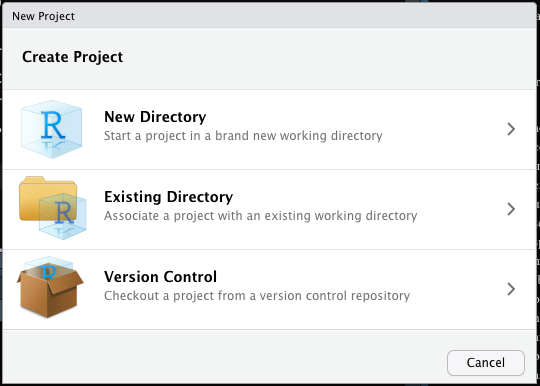
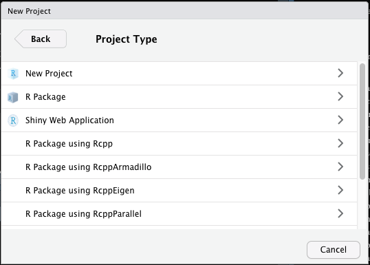
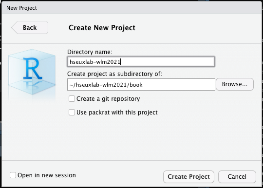

# Работа с реальными данными {#realdata}

Итак, мы приступаем к самому интересному и самому важному разделу первого блока! Мы будем тренироваться на данных о фильма и сериалах Netflix.


## Рабочая директория

Раз мы хотим работать в данными, надо их откуда-то взять. Скачайте датасет [по этой ссылке](https://drive.google.com/uc?export=download&id=1P1liIRyPrYnmFmoAFUDJthki_dWhalzF).

**Датасетом** мы будем называть любой набор данных, который у нас есть.

Мы уже говорили о рабочей директории и проектах в самом начале курса. Немного вспомним эту тему. Мы накапливаем много различных файлов (скрипты, файлы сырых данных данных, файлы предобработанны данных, файл объектов из рабочего пространства, графики, результаты анализа…) в процессе анализа данных, и это необходимо каким-то образом систематизировать.

Есть **рабочая директория** --- это папка, в которую смотрит R во время работы. Что это за папка можно узнать через команду:

```{r}
getwd() # get working directory
```

У меня он смотрел вот в эту папку, у вас, скорее всего, будет что-то типа `C://users/имя_пользователя` или `/Users/имя_пользователя`, что указывает на папку пользователя по умолчанию.

Можно установить другую рабочую директорию с помощью команды `setwd()`:

```{r, eval=FALSE}
setwd("/Users/antonangelgardt/R")
```

Теперь он будет смотреть в папку `R`, которая лежит в дефолтной папке пользователя. Такой способ достаточно удобен, однако можно сделать ещё лучше --- создать проект (*Project*).

> Кто-то любит работать в проектах, кто-то нет --- дело вкуса. Мне это нравится, даже если вам не понравится. Простите, если мы вдруг не сойдёмся во вкусах, но, повторюсь, это нравится мне, сугубо, лично… Поэтому я буду про это рассказывать и рекламировать.

Зайдите в `File → New Project…`. У вас откроется такое окно:



Выберите `New Directory`, затем еще раз `New Project`:



Откроется вот это:



В `Directory name` указываем название нашей папки, во втором поле указываем путь к той папке, в которой будет лежать создаваемая папка. Нажимаем `Create Project`, после чего R перезапускает сессию, и открывается привычное окно. Однако в верхнем правом углу R теперь указано название проекта, в котором мы работаем.


> Если вы уже это сделали в начале курса, то пропустите это задание.


<div class="task">
Создайте проект для нашего курса.

1. Откройте `File → New Project…`
2. Выберите `New Directory → New Project`
3. Назовите новую директорию `hseuxlab-wlm2021`
4. Задайте расположение внутри папки пользователя системы
5. Создайте новый скрипт и скопируйте туда следующий код:

```
print("Hello, World of Linear Models!")
```

6. Сохраните скрипт нажатием `Ctrl` + `S` (`Cmd` + `S`)
</div>

Теперь при работе в рамках курса мы будем запускать проект и работать в нём, чтобы ничего не запуталось.


Много ли это приносит профита? Ну, не так уж и много… По сути, что открыть проект, что выполнить `setwd("пусть_к_папке")` --- примерно одно и то же. Вот только строку кода можно забыть запустить после открытия скрипта, а если мы запустили проект, мы уверены, что у нас все автоматически настроилось и ошибок не будет.


> Если вы уже это сделали в начале курса, то пропустите это задание.


<div class="task">
Откройте директорию (папку) проекта курса и создайте в ней несколько папок. Они нам понадобятся для структурирования нашего пространства в процессе курса, потому что файлов будет много. Кроме того, будем постепенно привыкать к тому, чтобы наше рабочее пространство было чистым и опрятным.

Нам понадобятся следующие папки:

* `scripts` для хранения скриптовых файлов
* `data` для хранения файлов данных
* `figures`, чтобы выгружать графики

Потом мы сможем дополнить их другими папками, если нам таковые понадобятся, а также создать более мелкие подразделы внутри созданных папок.
</div>

> Дальнейший разговор будет вестись с учетом того, что вы работаете в созданном проекте или задали рабочую директорию через `setwd()`, а также у вас созданы папки `scripts`, `data` и `figures` внутри папки нашего курса.

## Импорт данных

Окей, файл с данными у нас есть. Теперь наша задача его как-то загрузить в R, чтобы мы могли с ним работать. Вариантов существует несколько. Разберём сначала следующий.

* переложите [скачанный файл](https://drive.google.com/uc?export=download&id=1P1liIRyPrYnmFmoAFUDJthki_dWhalzF) из «Загрузок» в папку `data`
* обратите внимание на расширение этого файла: `netflix_title.csv`

Такие файлы можно *прочитать* с помощью функции `read.csv()`. В аргументах это функции надо указать файл, который надо прочитать (а также путь к нему, начиная с подпапки рабочей директории). То есть:

```{r}
netflix <- read.csv('data/netflix_titles.csv')
```

Почему так? Так как мы установили рабочую директорию (или запустили проект), то R по умолчанию теперь смотрит в папку нашего курса. А вот далее его надо сориентировать --- поэтому мы пишем `data/netflix_titles.csv`. То есть говорим ему: «иди дальше в папку `data` и принеси мне файл `netflix_titles.csv`. Собственно, он нам его и принёс.

Можно это проверить:
```{r}
head(netflix)
```

Что-то загрузилось. Это хорошо. Что именно --- выясним чуть позже.

Можно ли не прописывать `data`? Можно, но тогда придётся переложить файл данных в рабочую директорию (то есть папку курса). С одним файлом ничего, можно жить. А есть у вас 30 или 50 файлов разных респондентов? Уже тяжеловато и бардак. Поэтому, на мой взгляд, такая организация --- хороший компромисс: кода пишем чуть-чуть больше, но зато есть порядок[^1].

Конечно, можно хранить файлы данных где-то совсем отдельно. Но тогда и прописывать придётся путь от конревой папки компа:

```{r, eval=FALSE}
# например, можно прочитать файл прямо из папки «Загрузки»
netflix <- read.csv('/Users/antonangelgardt/Downloads/netflix_titles.csv')
```

Это выглядит не очень удобно.

На самом деле, в мире [облачных технологий](https://ru.wikipedia.org/wiki/Облачное_хранилище_данных) можно и вовсе обойтись без скачивания файлов на десктоп. Функция `read.csv()` вполне может прочитать файл прямо из интернета:

```{r, eval=FALSE}
# это ссылка на мой GitHub, где лежит нужный нам файл
netflix <- read.csv('https://raw.githubusercontent.com/angelgardt/hseuxlab-wlm2021/master/data/netflix_titles.csv')
```

Однако стоит помнить, что наши собранные руками данные в облаках, скорее всего, не лежат. Поэтому надо уметь загрузить файл и из интернета, и с компа.


### Форматы данных

Мы тактично соскользнули с момента расширения файла. Напомню, что у нас файл `netflix_titles.csv`. Пришло время уделить этому внимание.

Мы говорили о [типах данных](#datatypes), о [структурах данных](#datastructures) --- а теперь поговорим о *форматах данных*.

**Формат данных** --- это характеристика данных, которая определяет много чего:

* какие программы могут работать с этим файлом
* как структурирован файл внутри
* как структурированный файл разбирается на неструктирированные последовательности байтов (для хранения в памяти компьютера) и преобразуются обратно…

Ну, короче куча-куча всего. Формат файла (не вдаваясь в детали) задаётся его *разширением*, то есть тем, что написано после точки в его названии (`.R`, `.doc`, `.xlsx`, `.xml`, `.txt`, …).

Нас, прежде всего, интересуют файлы данных, поэтому об их форматах мы и поговорим.


#### Текстовые форматы

Проще всего хранить данные в тексте. Это удобно, такие файлы мало весят и в них можно поместить большое количество информации. Самый простой текстовый формат --- это `.txt`. Это тот самый «Блокнот», с которым наверняка когда-то все сталкивались. Никакого форматирования, никакой лишней мишуры --- только текст. Но нам ведь нужно из этого текста каким-то образом потом вытащить датафрейм. Для этого существуют *разделители.* Чаще всего в табличных `.txt` формате столбцы таблицы разделены между собой символами табуляции (`'\tab'`), а строки --- символом переноса строки (`'\n'`). Файл `.txt.` можно считать с помощью функции `read.table()`:


```{r}
#df <- read.table()
```

#### Табличные форматы

#### Форматы данных с особой разметкой

#### Файлы данных других статистических программ


## Исследование данных


## `.RData`


[^1]: …и, возможно, закон, но это не точно…