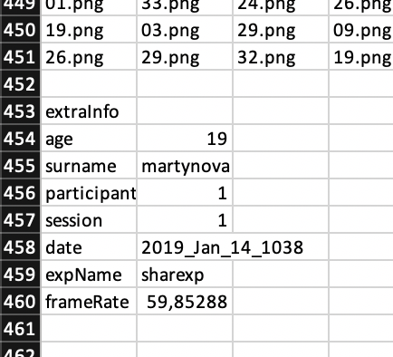

# Предобработка данных. Концепция tidy data {#tidy}

Мы приступаем к одной из ключевых тем курса ---  предобработка данных. И это тему мы будем осваивать c помощью семейства пакетов `tidyverse`.

## `tidyverse`

Чтобы преуспеть в этом деле, нам надо поставить себе на машину пакет с пакетами:

```{r, eval=FALSE}
install.packages('tidyverse', dependencies = TRUE)
```

Какие пакеты внутри пакета?

* `ggplot2` --- для визуализации
* `tibble` --- для работы с тибблами (как датафрейм, только лучше)
* `tidyr` --- для формата *tidy data*
* `readr` --- для чтения файлов
* `purrr` --- для функционального программирования
* `dplyr` --- для преобразования данных
* `stringr` --- для работы со строковыми переменными (с ним мы уже виделись)
* `forcats` --- для работы с факторными переменными

Кроме этого джентельменского набора нам еще пригодится пакет `readxl`, и которого мы будем брать функции для чтения файлов `.xls` и `.xlsx`.

Подключаем пакеты к сессии:

```{r}
library(tidyverse)
```

Нам написали верси пакетов, которые мы подгрузили, а также обозначили ряд конфликтов, которые произошли --- базовые функции перекрылись функциями из внешних пакетов[^1]. Но это всё можно игнорировать.


## Импорт данных

Мы уже говорили с вами, что для импорта данных есть generic-функция `read.table()` и ещё ряд функций, которые адаптированы под конкретные форматы данных (`read.tsv()`, `read.csv()`). Это всё хорошо и приятно, но мы будем пользоваться их сестами-близнецами из пакета `readr`:

```{r, eval=FALSE}
read_csv("path/to/file") # для чтения классических csv-файлов
read_csv2("path/to/file") # для чтения csv-файлов с разделителем точка в запятой
read_delim("path/to/file", delim = "...") # для чтения файлов с любым разделителем
```

Эти функции, как и базовые, умеют открывать файлы

* *только по имени* (если файл лежит в рабочей директории)
* *по относительному пути* (если файл лежит в подпапке рабочей директории)
* *по абсолютному пути* (когда мы прописываем путь к файлу от корня)
* *напрямую из интернета* (при наличии интернет-соединения)

Каков профит? Во-первых, они работают быстрее, но на наших объемах данных мы этого, скорее всего, не заметим. А во-вторых, они считывают данные не в датафрейм, а в `tibble`, что очень радостно и приятно, если осознать, что `tibble` есть такое.


## `tibble`

Мы уже умеет работать с датафреймами, однако мы пока не сталкивались с некоторыми их особенностями. В частности, если мы попытаемся создать новую переменную на основе имеющейся прям при создании датафрейма, случится ошибка. Пусть у нас есть колонка с возрастом респондентов, и мы хотим сделать новый переменную, которая будет задавать контрастные группы:

```{r, error=TRUE}
data.frame(age = sample(18:60, size = 30),
           group = ifelse(age > 40, 'old',
                          ifelse(age < 25, 'young', 'middle')))
```

R говорит нам, что переменная `age` ещё не создана, что в целом достаточно справедливо. Мы можем эту напасть побороть, сначала создав переменную `age`, а затем сделать новую переменную `group` через присваивание… но чёт лень…

Лучше воспользуемся мощностями `tibble`:

```{r}
tibble(age = sample(18:60, size = 30),
           group = ifelse(age > 40, 'old',
                          ifelse(age < 25, 'young', 'middle')))
```

Роскошно!

Может показаться, что это достаточно незначительно преимущество. В целом, да --- `tibble` и `data.frame` практически одно и то же. Однако, во-первых, стоит помнить, что функции из `tidyverse` всегда возвращают `tibble`, а во-вторых, когда мы познаем всю мощь ~~тёмной стороны~~ [функции `mutate()`](#mutate), мы осознаем полезность фичи исползования переменных «по ходу событий».


## Грузим много данных

На самом деле, не так уж и много. Просто в этот раз они располагаются в разных файлах. Нам понадобится [вот этот архив](https://drive.google.com/uc?export=download&id=1pEfS2MH6t3scZ-tp7XSCfbOHpcvNKwcR).

Его надо (1) разархивировать, и (2) положить всю получившуюся папку в нашу папку `data` в директории курса.

Кстати, чтобы отобразить список файлов, которые лежат в некоторой папке есть команда `dir()` (по умолчанию отображает содержимое рабочей директории):

```{r}
dir(path = 'data/data_sharexp')
```

Функция возвращает строковый вектор, поэтому чтобы узнать количество файлов в директории, можно сделать следующее:

```{r}
length(dir(path = 'data/data_sharexp'))
```

У нас есть 21 файл. Это данные поведенческого эксперимента, в котором пользователи платформ iOS и Android искали иконки share обеих платформ среди других иконок. Судя по тому, как названы файлы, у нас есть 20 Excel-ек с данными и файл `targetpositions.xlsx`, в котором содержатся координаты целевых стимулов.

Загрузим один файл, и посмотрим, что получится. Нам будет нужен второй лист, так как данные основной серии записаны на нём:

```{r}
raw01 <- readxl::read_xlsx('data/data_sharexp/01.xlsx', 2)
str(raw01)
```

Данные выглядят адекватно, но --- куча переменных. Нам явно нужны не все.

## Сабсет данных

Кто знаком с аутпутами PsychoPy, тот опознает смысл названий переменных. Кто не знаком с аутпутами PsychoPy --- не страшно. Нам нужны следующие переменные:

* независимые переменные:
  - `trialtype` --- тип пробы (`tray`, `dots`, `both`)
  - `setsize` --- количество стимулов в пробе (`8`, `12`, `16`)
* зависимые переменные (или те переменные, на основе которых мы их посчитаем):
  - `mouse_main1.time_raw` --- время первого клика (мс)
  - `mouse_main1.x_raw` --- координата `x` первого клика
  - `mouse_main1.y_raw` --- координата `y` первого клика
  - `mouse_main2.time_raw` --- время второго клика (мс)
  - `mouse_main2.x_raw` --- координата `x` второго клика
  - `mouse_main2.y_raw` --- координата `y` второго клика
* `numtrial` --- номер пробы в исходном файле с координатами (пригодится нам позднее)

Давайте их вытаскивать.

### ` %>% ` {#pipe}

Для того, чтобы это делать элегантно и красиво, нам надо познакомиться с ключевой особенностью синтаксиса `tidyverse`. На секунду отвлечемся от данных и представим, что нам надо посчитать вот такое дикое выражение:

```{r}
sqrt(abs(log(abs(round(sin(1 / cos(3)), 2)), 3)))
```

Запись верная, но читать это совершенно невозможно. Чтобы решить этот вопрос, нам на помощь приходит *pipe* --- специальный оператор, чем-то напоминающий вилосипедик ` %>% `.

Работает он очень просто: он передаёт то, что от него стоит слева, в функцию, которая стоит от него справа, в качестве первого аргумента. То есть эти две команды

```{r}
sum(3, 4)
3 %>% sum(4)
```

содержательно абсолютно идентичны. Только записываются немного по-разному.

Если переписать выражение выше с помощью *pipes*, то получится очень понятный «конвейер»:

```{r}
3 %>% cos() %>% 
  `/`(1, .) %>% 
  sin() %>% 
  round(2) %>% 
  abs() %>% 
  log(3) %>% 
  abs() %>% 
  sqrt()
```

Теперь отчетливо видна последовательность функций, которые мы совершали, и более того, если что-то можно не так, то можно запросто откопать баг, выполнив только часть кода до определенного пайпа. Во второй строчке нам встретилась особенность --- если нам нужно передать объект слева в функцию справа, но не первым аргументом, надо указать его позицию с помощью точки[^2].

Теперь мы готовы идти в бой!

### `select()`

Фнукция `select()` выбирает опредлённые колонки из нашего датасета. Работает очень просто:

```{r}
raw01 %>% select(trialtype,
                 setsize,
                 numtrial,
                 mouse_main1.time_raw,
                 mouse_main1.x_raw,
                 mouse_main1.y_raw,
                 mouse_main2.time_raw,
                 mouse_main2.x_raw,
                 mouse_main2.y_raw)
```

Кайф! Только пока мы наш новый тиббл никуда не записали. Но, подождём --- мы ещё не закончили.

### `rename()`

Мы будем теперь практически всегда обращаться к колонкам по имени, поэтому полезно будет их сразу переименовать во что-то более юзабельное. Функци `rename()` занимается именно этим. В качестве её аргументов надо перечислить *новые имена колонок* и *к каким колонкам они относятся*:

```{r}
raw01 %>% select(trialtype,
                 setsize,
                 numtrial,
                 mouse_main1.time_raw,
                 mouse_main1.x_raw,
                 mouse_main1.y_raw,
                 mouse_main2.time_raw,
                 mouse_main2.x_raw,
                 mouse_main2.y_raw) %>% 
  rename(time1 = mouse_main1.time_raw,
         click1x = mouse_main1.x_raw,
         click1y = mouse_main1.y_raw,
         time2 = mouse_main2.time_raw,
         click2x = mouse_main2.x_raw,
         click2y = mouse_main2.y_raw)
```

Красuво! Заметьте, что мы продолжаем наш «конвейер».


### `slice()`

Посмотрим, если строки с пропущенными значениями. Прям тут, не отходя от конвейера:

```{r}
raw01 %>% select(trialtype,
                 setsize,
                 numtrial,
                 mouse_main1.time_raw,
                 mouse_main1.x_raw,
                 mouse_main1.y_raw,
                 mouse_main2.time_raw,
                 mouse_main2.x_raw,
                 mouse_main2.y_raw) %>% 
  rename(time1 = mouse_main1.time_raw,
         click1x = mouse_main1.x_raw,
         click1y = mouse_main1.y_raw,
         time2 = mouse_main2.time_raw,
         click2x = mouse_main2.x_raw,
         click2y = mouse_main2.y_raw) %>% 
  sapply(is.na) %>% apply(2, sum)
```

В каждой переменной есть по девять пропусков. Чтобы понять, что это за пропуски, надо немного знать о том, как PsychoPy записывает данные. После того, как он написал в Excel все экспериментальные данные, он в самом низу дописывает соцдем, который испытуемые заполняют в самом начале эксперимента.

Вот эта штука:

<center>

</center>

Как раз девять строчек --- они нам и делают пропущенные значения. Так как они идут после всех наших данные, то мы можем просто *«отрезать»* этот кусок таблицы:

```{r}
raw01 %>% select(trialtype,
                 setsize,
                 numtrial,
                 mouse_main1.time_raw,
                 mouse_main1.x_raw,
                 mouse_main1.y_raw,
                 mouse_main2.time_raw,
                 mouse_main2.x_raw,
                 mouse_main2.y_raw) %>% 
  rename(time1 = mouse_main1.time_raw,
         click1x = mouse_main1.x_raw,
         click1y = mouse_main1.y_raw,
         time2 = mouse_main2.time_raw,
         click2x = mouse_main2.x_raw,
         click2y = mouse_main2.y_raw) %>% 
  slice(1:450) # мы знаем, что у нас было 450 экспериментальных проб
```

Можно перепроверить, не осталось ли у нас пропущенных значений, с помощью той же строчки, что и в предыдущем чанке.


### `filter()`

Для анализа нам будут нужны не все пробы, а только из экспериметальных условий `tray` и `dots`. А как мы помним из описания переменные, экспериметальных условий было три --- `tray`, `dots` и `both`. Надо *отфильтровать* это третье условие. Изи:

```{r}
raw01 %>% select(trialtype,
                 setsize,
                 numtrial,
                 mouse_main1.time_raw,
                 mouse_main1.x_raw,
                 mouse_main1.y_raw,
                 mouse_main2.time_raw,
                 mouse_main2.x_raw,
                 mouse_main2.y_raw) %>% 
  rename(time1 = mouse_main1.time_raw,
         click1x = mouse_main1.x_raw,
         click1y = mouse_main1.y_raw,
         time2 = mouse_main2.time_raw,
         click2x = mouse_main2.x_raw,
         click2y = mouse_main2.y_raw) %>% 
  slice(1:450) %>% 
  filter(trialtype != 'both')
```

Вот теперь хорошо и красиво! Можно сохранить в новый объект!

```{r}
raw01 %>% select(trialtype,
                 setsize,
                 numtrial,
                 mouse_main1.time_raw,
                 mouse_main1.x_raw,
                 mouse_main1.y_raw,
                 mouse_main2.time_raw,
                 mouse_main2.x_raw,
                 mouse_main2.y_raw) %>% 
  rename(time1 = mouse_main1.time_raw,
         click1x = mouse_main1.x_raw,
         click1y = mouse_main1.y_raw,
         time2 = mouse_main2.time_raw,
         click2x = mouse_main2.x_raw,
         click2y = mouse_main2.y_raw) %>% 
  slice(1:450) %>% 
  filter(trialtype != 'both') -> d01
str(d01)
```

Да, assignment слева направо тоже работает, и в данном случае это хорошо согласуется с логикой пайпов.

Всё хорошо, но в данном датасете нам не хватает двух вещей --- `id` нашего испытуемого. Зачем? Во-первых, он может быть нужен для некоторых видов анализа, а кроме того, он нам пригодится чуть позже, когда мы будем возиться ещё с одной историей.


## `mutate()` {#mutate}

Функция `mutate()` позволяет делать дикую кучу всего, но пока познакомимся с логикой её работы.

```{r}
d01 %>% mutate(id = 1) %>% str()
```

То есть она просто создаёт нам новую переменную. Круто же.

Не забудем перезаписать нас тиббл:

```{r}
d01 %>% mutate(id = 1) -> d01
```

## Догрузим остальные данные

Вернёмся немного назад и вспомним, что у нас не один файл данных, а *двадцать*. При этом --- так как это автоматически записанные файлы --- они одинаково устроены. То есть, чтобы их предобработать, нам надо будет двадцать раз повторить один и те же операции. Ну, не будем же мы двадцать раз копировать тот абзац кода, который мы написали!

Конечно, нет. Мы завернем его в функцию.

```{r}
import_data <- function(x, id) {
  library(tidyr)
  library(readr)
  readxl::read_excel(x, 2) %>%
    select(
      trialtype,
      setsize,
      numtrial,
      mouse_main1.time_raw,
      mouse_main1.x_raw,
      mouse_main1.y_raw,
      mouse_main2.time_raw,
      mouse_main2.x_raw,
      mouse_main2.y_raw
    ) %>%
    rename(
      time1 = mouse_main1.time_raw,
      click1x = mouse_main1.x_raw,
      click1y = mouse_main1.y_raw,
      time2 = mouse_main2.time_raw,
      click2x = mouse_main2.x_raw,
      click2y = mouse_main2.y_raw
    ) %>%
    slice(1:450) %>%
    filter(trialtype != 'both') %>%
    mutate(id = id) %>%
    return()
}
```

Роскошь! Теперь у нас есть функция, которая грузит данные и сразу их предобрабатывает! Ну, не чудо ли!

Вот только эта функция у нас работает на одном датасете, то есть чтобы загрузить все двадцать, нам всё равно придется написать 20 одинаковых строк кода. Нерадужное мероприятие.

Но мы сделаем по-другому.


### Соединение датафреймов I

Наша конечная цель --- получить единый датасет, в котором будут содержаться все наблюдения по всем испытуемым. Мы уже добились того, что наша функция возвращает нам ровный и красивый tidy `tibble`. Нам осталось лишь поставить их друг на друга, чтобы получить то, что нам нужно.


#### `bind_...()`

Слепить два тиббла можно либо по столбцам, либо по строкам. Этим занимаются две функции: `bind_cols()` и `bind_rows()` соответственно. Что происходит, когда количество строк / столбцов одинаковое --- понятно: таблички просто слепляются. А вот если это не так:

```{r, error=TRUE}
tbl1 <- as_tibble(matrix(1:12, nrow = 3))
tbl2 <- as_tibble(matrix(1:12, ncol = 3))

bind_rows(tbl1, tbl2)
bind_cols(tbl1, tbl2)
```

Вот так вот.

В нашем случае всё прозаично --- нам просто нужно поставить 20 тибблов друг на друга. Нам --- единственный раз! --- понадобиться цикл.

```{r}
share <- tibble() # заглушка для первой итерации
files <- paste0('data/data_sharexp/', dir('data/data_sharexp')[-21]) # вектор с названиями файлов

for (i in 1:20) {
  import_data(files[i], i) %>% bind_rows(share, .) -> share
}
```

Посмотрим, что получилось:

```{r}
str(share)
```

Выглядит вроде верно.

```{r}
unique(share$id)
table(share$trialtype, share$id)
```

Вроде всё ровно. Чилл.


## Сортировка

### `sort()`

Иногда нам может потребоваться отсортировать наши данные. Как сортировать отдельные векторы, мы уже знаем:

```{r}
sort(share$numtrial)
```

А если весь датасет?


### `arrange()`

Тогда вот так:

```{r}
share %>% arrange(numtrial)
```

Или по двум переменным сразу:

```{r}
share %>% arrange(numtrial, id)
```

В данном случае получилось то же самое, так как мы присоединяли данные испытуемых последовательно с увеличивая `id`.


### `distinct()`

Можно вывести уникальные сочетания по двум переменным:

```{r}
share %>% distinct(trialtype, setsize)
```

Тут все достаточно ожидаемо --- (квази)эксперимент всё-таки.

> Так, погодите! А если это квазиэксперимент, то где же *квазиНП*? Она точно была! В описании эксперимента фигурировала используемая платформа смартфона!

> Спокойно. Ща всё будет.


## Соединение датафреймов II

Данные о том, смартфон на какой платформе использует испытуемый, были записаны в отдельный датасет. Он [вот тут](https://raw.githubusercontent.com/angelgardt/hseuxlab-wlm2021/master/book/wlm2021-book/data/share_platform.csv).

```{r, include=FALSE}
write_csv(tibble(id = 1:20,
                         platform = c(
                           'ios',
                           'ios',
                           'ios',
                           'andr',
                           'ios',
                           'andr',
                           'andr',
                           'andr',
                           'ios',
                           'andr',
                           'andr',
                           'andr',
                           'ios',
                           'ios',
                           'andr',
                           'andr',
                           'ios',
                           'andr',
                           'ios',
                           'ios')), file = 'data/share_platform.csv')
```

Грузим его:

```{r}
platform <- read_csv('https://raw.githubusercontent.com/angelgardt/hseuxlab-wlm2021/master/book/wlm2021-book/data/share_platform.csv')
```

Осталось понять, как нам его присобачить к имеющимся данным так, как нам надо. А нам надо так, чтобы появилась новая колонка, в каждой ячейке которой согласно `id` будет стоять соответствующая платформа.


### `..._join()`

Нас спасёт `..._join()`. Эта функция объединяет два датасета по определенной *ключевой* переменной. 
Что делает `..._join()`? У него есть две ключевые колонки из двух датасетов. Он находит соответствия, и лепит все колонки одной таблицы к другой, сопоставляя соответствующие строки.

* Для `left_join()` главный тиббл --- слева, то есть остаются *все строки левого тиббла*, а из правого выбираются только те, которые нужны.
* Для `right_join()` главный тиббл --- справа, то есть остаются *все строки правого тиббла*, а из левого выбираются те, которые нужны.
* Для `full_join()` и `inner_join()` главные тибблы оба:
  - `full_join()` оставляет все строки обоих тибблов, а те, которым не нашлось соответствия в другом тиббле, заполняет `NA`.
  - `inner_join()` оставляет только те строки, которым нашлось соответствие, а всё остальные удаляет.
* `anti_join()` оставляет только те строки, которым не нашлось соответствия.

```{r}
t1 <- tibble(id = 1:5, x1 = LETTERS[1:5])
t2 <- tibble(id = seq(2, 10, 2), x2 = LETTERS[11:15])
```

```{r}
left_join(t1, t2)
right_join(t1, t2)
full_join(t1, t2)
inner_join(t1, t2)
anti_join(t1, t2)
```

Как нам это поможет? У нас есть колонка `id` в обоих датасетах --- `share` и `platform`. По ней мы и сможем соединить наши тибблы. Нам надо сделать так, чтобы все наши экспериментальные данные были сохранны. Используем `left_join()`:

```{r}
share %>% left_join(platform)
```

Наблюдаем, что строки `platform` были продублированы столько раз, сколько нужно было, чтобы сохранились все строки тиббла с экспериментальными данными.

Не забываем перезаписать наш тиббл:

```{r}
share %>% left_join(platform) -> share
```


<div class="task">
В нашей папке с данными есть файл `targetpositions.xlsx`, который содержит координаты, по которым мы сможем отобрать правильные клики наших испытуемых. Изучите этот файл, загрузите его как `tibble` и соедините его с нашим основным тибблом `share`.

Подумайте, какие колонки тибблов вы будете использовать для объединения.

```{r, echo=FALSE}
tpos <- readxl::read_xlsx('data/data_sharexp/targetpositions.xlsx', 2)
share %>% full_join(tpos, by = 'numtrial') -> share
share
```
</div>


## Группировка и аггрегация данных

Часто возникает необходимость **аггрегировать** данные, то есть посчитать какие-то показатели, причем на по всему датасету, а по группам, имеющимся в нём. Займемся этим мероприятием.


### `group_by()` & `ungroup()`

Нам тиббл сам по себе не знает, что в нём есть какие-то группы. Поэтому ему надо рассказать, как дело обстоит. Сгруппируем наши данные по экспериметальным условиям:

```{r}
share %>% group_by(trialtype)
```

Теперь в выводе тиббла указаны переменные, по которым сгруппированы наши данные (`Groups`). В структуре это тоже будет отображено:

```{r}
share %>% group_by(trialtype) %>% str()
```

В первой строчке аутпута появилось указание `groupped`. Это как раз то, что мы хотели сделать. Можно перезаписать наш тиббл и посмотреть, как он будет выводиться в консоль:

Если нам нужно убрать группировку, то есть функция `ungroup()`:

```{r}
share %>% ungroup()
```

### `summarize()`

Сама по себе функция `group_by()` особого смысла не имеет, но вот есть её использовать в связке в `summarize()`…

```{r}
share %>% group_by(trialtype) %>% 
  summarise(mean = mean(time1),
            sd = sd(time1))
```

Что мы здесь сделали? Мы хотели посчитать среднее и стандартное отклонение времени реакции (первого клика), но не по всему датасету, а по экспериментальным условиям. Для этого мы сгруппироали тиббл по переменной, содержащей указания на экспериментальное условие, и затем аггрегировали наши данные --- посчитали по ним некоторые статистики. Функция `§ummarise()` возвращает тиббл, в котором по строкам идут заданные нами группы, а по столбцам те статистики, которые мы указали в её аргументах. Для их подсчёта можно использовать любые функции --- как специализированные их пакетов, так и встроенные в базовый R.

Допустим, мы хотим проверить, что эксперимент был сбалансирован по количеству проб в разных условиях. Тогда сделаем так:

```{r}
share %>% group_by(trialtype, setsize) %>% 
  summarise(n = n())
```


<div class="task">
При предобработке данных нам часто необходимо усреднить экспериментальные пробы по респондентам. Возьмите имеющиеся данные `share` и подготовьте их к дисперсионному анализу.

1) Создайте новую логическую переменную, которая будет содержать информацию о том, корректно ли выполнена данная проба. Корректной считается проба, в которой координаты клика респондента (`click1x`, `click1y`) попали в целевые диапазоны ([`posxmin1`, `posxmax1`] и [`posymin1`, `posymax1`]).

2) Отберите только корректные пробы.

3) Рассчитайте среднее и стандартное отклонение времени реакции (`time1`) по экспериментальным условиям (`trialtype`, `setsize`) для каждого испытуемого. Итоговый тиббл также должен содержать колонку `platform`.

4) Сохраните результат в новый объект.

```{r, echo=FALSE}
share %>% mutate(correct = ifelse(click1x > posxmin1 & click1x < posxmax1 &
           click1y > posymin1 & click1y < posymax1,
         TRUE, FALSE)) %>% 
  filter(correct) %>% 
  group_by(id, trialtype, setsize, platform) %>% 
  summarise(mean = mean(time1),
            sd = sd(time1)) -> share_aggregated
share_aggregated
```

</div>


## Широкий и длинный формат

Мы получили новый тиббл который содержит аггрегированные данные. Теперь нам надо поговорить о *широком и длинном форматах данных*.

Как мы говорили ранее, *tidy data* задаёт нам следующий формат данных: по строкам идут наблюдения, по столбцам --- отдельные переменные. Такой формат данных называется *широким*. Широкий он потому, что у нас может быть много отдельных переменных. *Длиннный* формат данных выглядит следующим образом: есть столбец *индентификаторов* (например, ID испытуемого), есть столбец *переменных*, и есть столбец *значений* этих переменных.

Это общая логика, и под каждую задачу у нас может быть свой длинный и свой широкий формат. Кроме того, данные могут быть разной «широкости» и разной «длинности», что тоже определяется конкретной задачей.

### `pivot_longer()` & `pivot_wider()`

Наши данные сейчас --- «средние». С одно стороны он --- широкий, так как у нас есть две переменные `mean` и `id`, которые записаны в отдельных столбцах:

```{r}
share_aggregated
```

Мы можем перевести наши данный в длинный формат:

```{r}
share_aggregated %>% pivot_longer(cols = c('mean', 'sd'))
```

У нас появилась колонка `name`, которая задаёт названия наших переменных, и колонка `value`, которая задаёт их значения.

Однако мы можем перевести исходный датасет и в более широкий формат:

```{r}
share_aggregated %>% select(-sd) %>% # переменная sd будет лишней
  pivot_wider(names_from = 'setsize', values_from = 'mean')
```

Наблюдаем, что теперь время в различных сетсайзах расположено в отдельных колонках.

Из широкого формата удобнее доставать отдельные переменные, например, для сравнения t-тестов. Из длинного формата удобно доставать вектор значений и вектор групп, например, для дисперсионного анализа. Мы будем работать и с тем и с другим форматом, поэтому перемещаться между ними надо быстро и уверенно.


[^1]: Помните разговор о [пространстве имен](https://angelgardt.github.io/hseuxlab-wlm2021/book/realdata.html#fn3)?
[^2]: Чтобы полностью понять вторую строку, надо вспомнить, что оператор деления `/` --- это тоже функция, которая принимает в себя два аргумента. В данном случае нам надо поделить единицу на косинус, значит косинус должен идти вторым.
