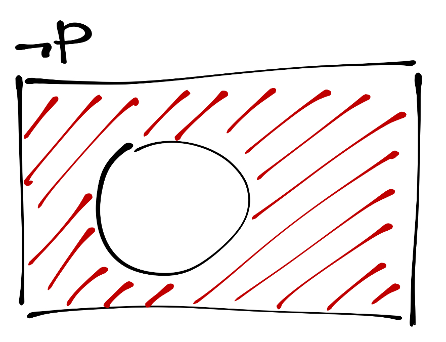

# (PART) Теория вероятностей и математическая статистика {-}

# Математический ликбез {#maths}

<center>

</center>


## Элементы алгебры логики {#alg_logic}

Логика исследует закономерности мышления, но делает это отлично от того, как этим занимается, например, психология. Формальная логика абстрагируется от связей мышления с какими-либо сторонами сознания и сосредотачивается на логической непротиворечивости и последовательности мышления. Таким образом, **формальная логика --- это наука об общих структурах правильного мышления в его языковой форме.**

Логика --- это нормативная наука, то есть она определяет, *как оно должно быть*, в то время как, например, психология исследуется *как оно есть* и как и почему логические законы нарушаются.


### Высказывания
Логика как наука имеет дело, прежде всего, с *высказываваниями*. Высказывание отражает определённую объективную[^4] связь между предметами. Высказывание *истинно*, если в нём содержится адеквантное отражение этой связи --- в ином случае высказывание *ложно*. В общем случае высказывание существует с форме повествовательного предложения.

Например, высказывание «Земля вращается вокруг Солнца» отражает объективное отношение, поэтому оно истинно, а высказывание «страницы этой книги зелёного цвета» не адекватно отражает существующее положение дел, поэтому оно ложно.

Прежде всего, нас будут интересовать **атомарные высказывания**. Это элементарные высказывания, которые невозможно разделить на составляющие --- более мелкие высказывания. Например, «четыре --- это целое число» --- это атомарное высказывание.


<div class="task">
Мы уже сталкивались с логическими операциями в R (например, при сабсете данных). Подумайте, какие атомарные высказывания могли бы быть сформулированы в той области, которую мы изучаем.
</div>

Атомарные высказывания могут быть *либо истинны, либо ложны*. Почему? Потому что мы находимся в рамках *двузначной логики*[^5]. Атомарные высказывания могут быть обозначены *пропозициональными переменными*. Так же как и числа в математике могут быть заменены буквеными обозначениями для *абстрагирования от значения числа*, так же и высказывания заменяются переменными для *абстрагирования от содержания высказывания*. Для обозначения пропозициональных переменных используются латинские буквы. А так как само высказывания имеет опредлённое *значение истинности* (*истина*, или `TRUE`, и *ложь*, или `FALSE`), то и переменная, которой мы обозначаем это высказывание, также будет обладать этим же значением истинности. Всё аналогично математике.


### Логические операции {#logic_operations}

С атомарными высказываниями можно выполнять различные логические операции.


#### Инверсия

Самая простая операция --- *инверсия*, или *отрицание*. Оно обозначается с помощью оператора $\neg$. Это *унарная операция*, то есть она применяется к одной переменной. При отрицании значение истинности высказывания изменяется на противоположное, поэтому мы можнм составить следующую *таблицу истинности* для отрицания:

|$p$|$\neg p$|
|:-:|:---:|
|`TRUE`|`FALSE`|
|`FALSE`|`TRUE`|

В данном случае с помощью переменной $p$ обозначено некоторые атомарное высказывание.

Особо стоит отметить, что при отрицании *отрицается всё высказывание целиком*, а не какой-то отдельный его элемент. То есть формально правильным вариантом отрицания высказывания *«все лебеди белые»* будет следующий --- *«неверно, что все лебеди белые»*.

Графически инверсия отображается так:

<center>


</center>

Кружком обозначена часть пространства, где утверждение истинно. Соответственно, в любой иной области пространства оно ложно.


##### Инверсия в R

Оператор отрицания в R обозначается восклицательным знаком `!`. Если его поставить перед некоторой командой, которая возвращает логическое значение, то этот оператор изменит его на противоположное:

```{r}
3 > 6; !(3 > 6)
"sing" == "sign"; !("sing" == "sign"); "sing" != "sign"
a <- c(TRUE, FALSE, FALSE, TRUE); !a
```


### Сложные высказвания

Из атомарных высказываний можно составлять *сложные высказывания* при помощи логических операторов. Например, высказывание «если четыре делится на два, то четыре --- чётное число» является сложным, посколько состоит из двух атомарных --- «четыре делится на два» и «четыре --- чётное число» --- соединённых союзом «если…, то…».

Далее мы пристумаем с знакомству с *бинарными операторами*, то есть такими, которые функционируют на двух аргументах.


#### Конъюнкция {#and}

**Конъюнкция (логическое умножение, логические И)** представляет собой такое высказывание, которое наиболее точно передается следующей конструкцией естественного языка --- «как $p$, так и $q$». $p$ и $q$ в данном случае пропозициональные переменные, которые заменяют конкретные высказывания. Конъюнкция истинна тогда и только тогда, когда обе пропозициональные переменные, входящие в её состав, имеют значении истинности `TRUE`. В любом ином случае конъюнкция ложна.

Конъюнкция обозначается символом $\wedge$ и имеет следующую таблицу истинности:

|$p$|$q$|$p \wedge q$|
|:-:|:-:|:-:|
|`TRUE`|`TRUE`|`TRUE`|
|`TRUE`|`FALSE`|`FALSE`|
|`FALSE`|`TRUE`|`FALSE`|
|`FALSE`|`FALSE`|`FALSE`|

Графически конъюнкция отображается так:

<center>

</center>


##### Конъюнкция в R

В качестве оператора логического И в R используется символ `&`:

```{r}
4 != 2 & 1 > 4
4 != 2 & 1 < 4
a <- c(TRUE, TRUE, FALSE, FALSE); b <- c(TRUE, FALSE, TRUE, FALSE)
a & b
```


#### Дизъюнкция {#or}

**Дизъюнкция (логическое сложение, логические ИЛИ)** представляет собой такое высказывание, которое наиболее точно передается следующей конструкцией естественного языка --- «или $p$, или $q$, или и то и другое». Поэтому дизъюнкция истинна тогда, когда хотя бы одна пропозициональная переменная, входящая в её состав, имеет значении истинности `TRUE`. В случае, если оба высказывания ложны, дизъюнкция будет ложна.

Дизъюнкция обозначается символом $\vee$ и имеет следующую таблицу истинности:

|$p$|$q$|$p \vee q$|
|:-:|:-:|:-:|
|`TRUE`|`TRUE`|`TRUE`|
|`TRUE`|`FALSE`|`TRUE`|
|`FALSE`|`TRUE`|`TRUE`|
|`FALSE`|`FALSE`|`FALSE`|

Графически дизъюнкция отображается так:

<center>

</center>


##### Дизъюнкция в R

В качестве оператора логического ИЛИ в R используется символ `|`:

```{r}
4 != 2 | 1 > 4
4 == 2 | 1 == 4
a <- c(TRUE, TRUE, FALSE, FALSE); b <- c(TRUE, FALSE, TRUE, FALSE)
a | b
```


#### Разделительная дизъюнкция {#xor}

**Разделительная дизъюнкция (исключающее ИЛИ)** --- это такое высказывание, которое наиболее полно описывается следующим выражением естественного языка --- «либо $p$, либо $q$». На её графическом представлении хорошо видно, чем она отличается от обычной дизъюнкции --- она *исключает* ту часть пространства, где верны оба высказывания:

<center>

</center>

\newcommand{\xor}{\mathrm{XOR}}

Для обозначения разделительно дизъюнкции есть много различных операторов, но мы будем записывать её так --- $p \; \xor \; q$. По иллюстрации можно восстановить таблицу истинности для этого оператора:

|$p$|$q$|$p \; \xor \; q$|
|:-:|:-:|:-:|
|`TRUE`|`TRUE`|`FALSE`|
|`TRUE`|`FALSE`|`TRUE`|
|`FALSE`|`TRUE`|`TRUE`|
|`FALSE`|`FALSE`|`FALSE`|

Таким образом, видно, что исключающее ИЛИ истинно тогда, когда значения истинности пропозициональных переменных, входящих в сложное высказывание, различны.


##### Разделительная дизъюнкция в R

В R эта логическая функция реализована, в отличие от предыдущих, не как оператор, а как функция с соответствующим названием:

```{r}
a <- c(TRUE, TRUE, FALSE, FALSE); b <- c(TRUE, FALSE, TRUE, FALSE)
xor(a, b)
```


### Условные высказывания

#### Импликация {#implication}

Сложное высказывание, описываемое конструкцией естественного языка «если $p$, то $q$» в формальной логике носит название **импликации**. Она отражает следование одного утверждения из другого и обозначается следующим образом --- $p \rightarrow q$. Высказывание $p$ называется *антецедентом* имликации, а $q$ --- *консеквентом*.

Импликация имеет следующую таблицу истиности:

|$p$|$q$|$p \rightarrow q$|
|:-:|:-:|:-:|
|`TRUE`|`TRUE`|`TRUE`|
|`TRUE`|`FALSE`|`FALSE`|
|`FALSE`|`TRUE`|`TRUE`|
|`FALSE`|`FALSE`|`TRUE`|

Как видно из таблицы, импликация ложна только тогда, когда её антецедент истинен, и консеквент --- ложен. Но что более интересно, так это то, что, согласно таблице, *из ложного утверждения может следовать любое*[^6]. Это факт мы вспомним, когда будем обсуждать [тестирование статистических гипотез](#hypotheses).

Импликацию утвержает то же самое, что и следующее сложное высказывание --- $\neg (p \wedge \neg q)$. Отсюда можно получить графическое изображение импликации:

<center>

</center>


<div class="task">
Таблица истинности для импликации $p \rightarrow q$ у нас есть. Постройте таблицу истинности для высказывания $\neg (p \wedge \neg q)$ и проверьте, действительно ли значенния истинности обоих сложных высказывания совпадают.
</div>


#### Репликация {#replication}

**Репликация** похожа на импликацию, но действует как бы в обратном направлении, что отражено в её обозначении --- $p \leftarrow q$. Эта конструкция читается как «$p$ реплицирует $q$» и является эквивалентом естественноязыкового «только если $p$, то $q$». Соответствующим образом изменяется и таблица истиности:

|$p$|$q$|$p \leftarrow q$|
|:-:|:-:|:-:|
|`TRUE`|`TRUE`|`TRUE`|
|`TRUE`|`FALSE`|`TRUE`|
|`FALSE`|`TRUE`|`FALSE`|
|`FALSE`|`FALSE`|`TRUE`|

Идея здесь в том, что если мы получили в результате *ложь*, то *истины* в начале быть не могло. Графическое изобажение репликации выглядит так:

<center>

</center>


<div class="task">
Выведите равносильное репликации высказывание, содержащее только операторы инверсии, конъюнкции и дизъюнкции. Под равносильностью мы пониманием одинаковый набор значений истинности двух утверждений.

Для импликации $p \rightarrow q$ таким утверждением является $\neg (p \wedge \neg q)$. А для репликации?
</div>


#### Эквиваленция {#equivalence}

Если мы соединим с помощью конъюнкции импликацию и репликацию, то есть запишем вот такое высказывание --- $(p \rightarrow q) \wedge (p \leftarrow q)$ --- то получим **эквиваленцию**. По своей сути она является логическим отражением языковой конструкции «только если $p$, то $q$», поэтому она обозначается вот так --- $p \leftrightarrow q$ --- и её таблица истинности выглядит соответствующим образом:

|$p$|$q$|$p \leftrightarrow q$|
|:-:|:-:|:-:|
|`TRUE`|`TRUE`|`TRUE`|
|`TRUE`|`FALSE`|`FALSE`|
|`FALSE`|`TRUE`|`FALSE`|
|`FALSE`|`FALSE`|`TRUE`|

Из неё легко вывести графическое представление эквиваленции:

<center>

</center>


<div class="task">
Проверьте, действительно ли равносильны высказывания $p \leftrightarrow q$ и $(p \rightarrow q) \wedge (p \leftarrow q)$. Для этого необходио построить таблицу истинности для представленно конъюнкции.
</div>


## Элементы теории множеств {#set_theory}

> На базе теории множеств стоит вся современная математика. Мы ознакомимся только в некоторыми концепциями этого раздела математики, но вообще полезно с ним познакомиться гораздо глубже.

### Множество {#set}

Понятие множества неопределимо. По крайней мере силами самой теории множеств. Но мы будем понимать под множеством **совокупность, или набор, некоторых (любых) объектов**. Это могут быть числа, буквы, точки и любые другие объекты. Объекты, входящие в состав мноежства, называются **элементами** этого множества.

Множества обозначают заглавными латинскими буквами (например, $A$), а его элемента прописными латинскими буквами (например, $a_1$, $a_2$ и т.д.).

Множества удобно изображать кружочками. Примерно так:

<center>

</center>

Если элемент входит в данное множество, то мы говорим, что этот элемент *принадлежит* данному множеству, и записываем это следующим образом:

$$
a_i \in A
$$

Символ $\in$ читается как «принадлежит».

Если мы хотим задать множество через перечисление элементов, то можно это сделать так:

$$
B = \{0, 1, 2, 3, 4, 5\}
$$
В данном случае множество $B$ содержит 6 элементов --- числа от нуля до пяти.


Приведём примеры множеств.

1) Множество букв русского алфавита:

$$L = \{\text{а, б, в, г, д, …, э, ю, я}\}$$

2) Множество всех [натуральных](https://ru.wikipedia.org/wiki/Натуральное_число) чисел[^7]:

$$\mathbb{N} = \{0, 1, 2, 3, \dots\}$$

3) Множество всех [целых](https://ru.wikipedia.org/wiki/Целое_число) чисел:

$$\mathbb{Z} = \{0, 1, -1, 2, -2, 3, -3, \dots\}$$

Также из числовых множеств мы можем вспомнить [рациональные](https://ru.wikipedia.org/wiki/Рациональное_число) числа $\mathbb{Q}$, [действительные (вещественные)](https://ru.wikipedia.org/wiki/Вещественное_число) числа $\mathbb{R}$ и [комплексные](https://ru.wikipedia.org/wiki/Комплексное_число) числа $\mathbb{C}$.

Мы можем взять и рассмотреть не все элементы какого-то множества, а какую-то их часть. Например, взять элементы $a_1$ и $a_2$ и объединить их в множество поменьше.

<center>

</center>

Мы получим множество $A_1 = \{a_1, a_2\}$, которое является *подмножеством* множества $A$. Иначе говоря, множества $A_1$ включается во множество $A$:

$$
A_1 \subset A
$$

В частности, множество натуральных чисел включается во множество целых --- $\mathbb{N} \subset \mathbb{Z}$. А если продолжить эту цепочку, то можно получить что-то такое:

$$
\mathbb{N} \subset 
\mathbb{Z} \subset 
\mathbb{Q} \subset 
\mathbb{R} \subset
\mathbb{C}
$$

Вот такая пирамижка получается.


### Операции над множествами {#sets_operations} 

Над множествами можно производить определённые операции. Во-первых, множества можно **складывать, или объединять**:

$$
A + B = A \cup B = \{x: x \in A \vee x \in B\}
$$

<center>

</center>

Тогда в новом множестве окажутся все элементы обоих исходных множеств. [Что-то](#or) это напоминает.

Во-вторых, множества можно **умножать, или находить их пересечение**:

$$
A + B = A \cap B = \{x: x \in A \wedge x \in B\}
$$

<center>

</center>

Тогда в новом множестве окажутся те элементы, которые принадлежат обоим множествам сразу. Это тоже [что-то](#and) напоминает.

В-третьих, можно искать разность множеств --- такая операция называется **дополнение**:

$$
A \backslash B = \{x: x \in A \wedge x \notin B\}
$$

<center>

</center>

А ещё можно вычитать множества друг из друга, то есть искать их **симметрическую разность**:

$$
A \, \triangle \, B = (A \backslash B) \cup (B \backslash A) = \{x: x \in A \, \xor \, x \in B\}
$$

<center>

</center>

У меня снова [déjà vu](#xor).


### Отображения

Мы можем сопоставлять элементы много множества элементам другого. Тогда мы получим **отображение**. Например, мы можем взять множество букв латинского алфавита и сопоставить каждому элменту этого множества число, которое будет отображать позицию буквы в алфавите. Пусть у нас есть множество $L = \{\text{a, b, c, d,…, x, y, z}\}$ и множество $N = \{1, 2, 3, \dots, 24, 25, 26\}$. Тогда мы можем задать такое отображение:

$$
F: L \rightarrow N
$$

Более того, мы даже можем реализовать его в R:

```{r}
letter_number <- function(x) {
  which(x == letters)
}
letter_number("a"); letter_number("z"); letter_number("i")
```

Заметьте, что мы реализовали в коде отображение, написав функцию. Это не случайно. Не вдаваясь в детали, можно сказать, что термины «отображение» и «функция» --- синонимы. Ведь по сути что делает [математическая] функция? Сопоставляет между собой значения числовых множеств. То есть *отображает* одно множество в другое.

Например, простая функция $y = x$[^8] отображает множество вещественных чисел в само себя: $F: \mathbb{R} \rightarrow \mathbb{R}$. Функция модуля $y = |x|$ отображает множество вещественных чисел во множество положительных вещественных чисел: $F: \mathbb{R} \rightarrow \mathbb{R_+}$. И так далее.

Вот такая вот интересная история.


## Немного комбинаторики {#combinatorics}

### Перестановки {#permutations}

Представим такую задачу: 

### Размещения {#accomodations}
### Сочетания {#combinations}


## Элементы математического анализа {#calculus}

### Последовательность

### Предел последовательности

### Функции

#### Дискретные и непрерывные функции

### Дифференцируемость функции. Производная

### Функции нескольких переменных

### Частные производные

### Интеграл


## Элементы линейной алгебры {#matrix}

\newcommand{\A}{\boldsymbol{A}}
\newcommand{\B}{\boldsymbol{B}}
\newcommand{\C}{\boldsymbol{C}}
\newcommand{\E}{\boldsymbol{E}}
\newcommand{\I}{\boldsymbol{I}}
\newcommand{\O}{\boldsymbol{O}}
\newcommand{\x}{\boldsymbol{x}}
\newcommand{\a}{\boldsymbol{a}}
\newcommand{\b}{\boldsymbol{b}}
\newcommand{\c}{\boldsymbol{c}}
\newcommand{\T}{\mathrm{T}}


### Что такое матрица?

> «Увы, невозможно объяснить, что такое матрица. Ты должен увидеть это сам.» <br>
*Морфеус (Матрица, 1999)*

Матрица выглядит как таблица чисел, записанных в определенном порядке. Например, вот так:

$$
\A = 
\begin{pmatrix}
1 & 6 & 11 \\
2 & 7 & 13 \\
3 & 8 & 15 \\
4 & 9 & 18 \\
5 & 0 & 19
\end{pmatrix}
$$

В данном случае это прямоугольная матрица $\A$. Матрицы обозначаются заглавными буквами (иногда еще и полужирным написанием, чтобы отличать от обычных переменных). Количество строк и столбцов определяет размер матрицы. То есть данная матрица имеет размер 5×3 --- $\A_{5×3}$. При указании размера сначала указывается количество строк, затем --- число столбцов.

Ну, и, собственно, всё. Это и есть матрица.


### Откуда берутся матрицы?

Матрицы возникают при решении систем линейных уравнений. Рассмотрим систему.

$$
\begin{cases}a_{11}x_1 + a_{12}x_2 + \ldots + a_{1m}x_m = b_1
\\a_{21}x_1 + a_{22}x_2 + \ldots + a_{2m}x_m = b_2
\\ \dots \dots \dots \dots \dots \dots \dots \dots \dots \dots
\\a_{n1}x_1 + a_{n2}x_2 + \ldots + a_{nm}x_m = b_n
\end{cases}
$$

Система состоит из $n$ линейных уравнений относительно $m$ неизвестных. Её можно переписать в *матричном виде*:

$$
\A \x = \b,
$$

где 

$$
\A =
\begin{pmatrix}
a_{11} & a_{12} & \dots & a_{1m} \\
a_{21} & a_{22} & \dots & a_{2m} \\
\vdots & \vdots & \ddots & \vdots \\
a_{n1} & a_{n2} & \dots & a_{nm}
\end{pmatrix} ; \quad 
\x = \begin{pmatrix}
x_1 \\
x_2 \\
\vdots \\
x_m
\end{pmatrix} ; \quad
\b = \begin{pmatrix}
b_1 \\
b_2 \\
\vdots \\
b_n
\end{pmatrix}
$$

Здесь мы видим матрицу коэффициентов системы $\A$. Размер этой матрицы $n × m$. Также мы видим две особых матрицы $\x$ и $\b$. Количество столбов у них равно единице. Такие матрицы носят название **векторов**.

Но ведь мы можем написать вектор всего с одной строкой. Например, некоторый вектор $\c$:

$$
\c = \begin{pmatrix}
c_1 & c_2 & \dots & c_k
\end{pmatrix}
$$

Для большей точности принята следующая терминология: векторы вида $\x$ называют «вектор-столбец», а векторы вида $\c$ называют «вектор-строка». Векторы часто также обозначаются полужирным начертанием, чтобы отличать их от отдельных значений.

Так как отдельные столбцы матрица мы можем представить в виде векторов, то матрицу $\A$ можно написать еще одним способом:
$$
\A = \begin{pmatrix} \A_1 & \A_2 & \dots & \A_m \end{pmatrix},
$$

где

$$
\A_i = \begin{pmatrix} a_{1i} \\ a_{2i} \\ \vdots \\ a_{ni} \end{pmatrix}, \quad 0<i \leq m
$$

Ок, но остается вопрос: почему матричная запись равносильна причной нам записи системы?

***
**Деталь 1**

Есть две замечательные матрицы: единичная матрица $\E$ (иногда $\I$) и нулевая матрица $\O$:
$$
\E = \begin{pmatrix}
1 & 0 & \dots & 0 \\
0 & 1 & \dots & 0 \\
\vdots & \vdots & \ddots & \vdots \\
0 & 0 & \dots & 1
\end{pmatrix} ; \quad
\O = \begin{pmatrix}
0 & 0 & \dots & 0 \\
0 & 0 & \dots & 0 \\
\vdots & \vdots & \ddots & \vdots \\
0 & 0 & \dots & 0
\end{pmatrix}
$$

**Деталь 2**

Матрица размером $n × n$ называется *квадратной матрицей*.

Квадратная матрица, все элементы которой, кроме стоящих на главной диагонали, равны нулю, называется *диагональной матрицей*.

***


### Действия с матрицами

#### Сложение матриц

Сложение определено только для матриц *одинакового размера*.

$$
\A_{n×m} + \B_{n×m} = 
\begin{pmatrix}
a_{11} + b_{11} & a_{12} + b_{12} & \dots & a_{1m} + b_{1m} \\
a_{21} + b_{21} & a_{22} + b_{22} & \dots & a_{2m} + b_{2m} \\
\vdots & \vdots & \ddots & \vdots \\
a_{n1} + b_{n1} & a_{n2} + b_{n2} & \dots & a_{nm} + b_{nm}
\end{pmatrix}
$$

**Свойства сложения матриц:**

1) $\A + \B = \B + \A$ (коммутативность)
2) $(\A + \B) + \C = \A+ (\B + \C)$ (ассоциативность)
3) $\A + \O = \A$ (существование нулевого элемента)
4) $\A + (-\A) = \O$ (существование противоположного элемента)

Все, описанное выше, справедливо для векторов.


#### Умножение матрицы на число
Умножение на вещественное число определено для любой матрицы $n × m$.

$$
\lambda \A = \begin{pmatrix}
\lambda a_{11} & \lambda a_{12} & \dots & \lambda a_{1m} \\
\lambda a_{21} & \lambda a_{22} & \dots & \lambda a_{2m} \\
\vdots & \vdots & \ddots & \vdots \\
\lambda a_{n1} & \lambda a_{n2} & \dots & \lambda a_{nm}
\end{pmatrix}, \; \forall \lambda \in \mathbb{R}
$$

**Свойства умножения матрицы на число:**

1) $1 \cdot \A = \A$
2) $-1 \cdot \A = -\A$
3) $\lambda(\mu \A) = (\lambda \mu) \A$ (ассоциативность)
4) $(\lambda + \mu) \A = \lambda \A + \mu \A$ (дистрибутивность)
5) $\lambda (\A + \B) = \lambda \A + \lambda \B$ (дистрибутивность)

Все, описанное выше, справедливо для векторов.


### Скалярное произведение векторов
Скаларное произведение определено для векторов одинаковой размерности как сумма произведений их соответствующих координат.

$$
\a = \begin{pmatrix} a_1 & a_2 & \dots & a_n \end{pmatrix} \\
\b = \begin{pmatrix} b_1 & b_2 & \dots & b_n \end{pmatrix}\\
$$
$$
\a \cdot \b = a_1 b_1 + a_2 b_2 + \dots + a_n b_n
$$


### Векторное произведение векторов

> мы рассматривать не будем :)


### Произведение матриц (матричное умножение)

Ну, вот и начался треш.

Умножение определено для матриц $\A_{n × k}$ и $\B_{k × m}$, то количество столбцов матрицы, стоящей слева от знака умножения, должно быть равно количество строк матрицы, стоящей справа от знака умножения.

Произведением матрицы $\A_{n × k}$ на матрицу $\B_{k × m}$ называется матрица $\C_{n × m}$, элемент которой $c_{ij}$ равен скалярному произведению $i$-го вектора-строки матрицы $\A$ и $j$-го вектора-столбца матрицы $\B$.

<center>

</center>

Пусть 
$$
\A = 
\begin{pmatrix}
\a_1 \\
\a_2 \\
\vdots \\
\a_n
\end{pmatrix} = 
\begin{pmatrix}
a_{11} & a_{12} & \dots & a_{1k} \\
a_{21} & a_{22} & \dots & a_{2k} \\
\vdots & \vdots & \ddots & \vdots \\
a_{n1} & a_{n2} & \dots & a_{nk}
\end{pmatrix}, \\
\B = 
\begin{pmatrix}
\b_1 & \b_2 & \dots \b_m
\end{pmatrix} = 
\begin{pmatrix}
b_{11} & b_{12} & \dots & b_{1m} \\
b_{21} & b_{22} & \dots & b_{2m} \\
\vdots & \vdots & \ddots & \vdots \\
b_{k1} & b_{k2} & \dots & b_{km}
\end{pmatrix}
$$

Тогда,

$$
\A \times \B = 
\begin{pmatrix}
\a_1 \cdot \b_1 & \a_1 \cdot \b_2 & \dots & \a_1 \cdot \b_m \\
\a_2 \cdot \b_1 & \a_2 \cdot \b_2 & \dots & \a_2 \cdot \b_m \\
\vdots & \vdots & \ddots & \vdots \\
\a_n \cdot \b_1 & \a_n \cdot \b_2 & \dots & \a_n \cdot \b_m \\
\end{pmatrix} = \\ = 
\begin{pmatrix}
(a_{11} b_{11} + a_{12} b_{21} + \dots + a_{1k}b_{k1}) & (a_{11} b_{12} + a_{12} b_{22} + \dots + a_{1k}b_{k2}) & \dots & (a_{11} b_{1m} + a_{12} b_{2m} + \dots + a_{1k}b_{km}) \\
(a_{21} b_{11} + a_{22} b_{21} + \dots + a_{2k}b_{k1}) & (a_{21} b_{12} + a_{22} b_{22} + \dots + a_{2k}b_{k2}) & \dots & (a_{21} b_{1m} + a_{22} b_{2m} + \dots + a_{2k}b_{km}) \\
\vdots & \vdots & \ddots & \vdots \\
(a_{n1} b_{11} + a_{n2} b_{21} + \dots + a_{nk}b_{k1}) & (a_{n1} b_{12} + a_{n2} b_{22} + \dots + a_{nk}b_{k2}) & \dots & (a_{n1} b_{1m} + a_{n2} b_{2m} + \dots + a_{nk}b_{km})
\end{pmatrix} = \\ = 
\begin{pmatrix}
c_{11} & c_{12} & \dots & c_{1m} \\
c_{21} & c_{22} & \dots & c_{2m} \\
\vdots & \vdots & \ddots & \vdots \\
c_{n1} & c_{n2} & \dots & c_{nm}
\end{pmatrix} = \C
$$

$$
c_{ij} = \sum_{t=1}^k a_{it} b_{tj}
$$

Вот так вот.


**Cвойства произведения матриц:**

1) $\A (\B \C) = (\A \B) \C$ (ассоциативность)
2) $\lambda (\A \B) = (\lambda \A) \B = (\lambda \B) \A$ (ассоциативность)
3) $\A (\B + \C) = \A \B + \A \C$ (дистрибутивность)
4) $(\A + \B) \C = \A \C + \B \C$ (дистрибутивность)
5) $\A \B \neq \B \A$ (отсутствие коммутативности)
6) $\E \A = \A; \, \A \E = \A$ (умножение на единичный элемент)
7) $\O \A = \O; \, \A \O = \O$ (умножение на нулевой элемент)
8) $\A \A^{-1} = \A^{-1} \A = \E$ (умножение на обратную матрицу --- *только для некоторых квадратных матриц*)

Матричное умножение определено для векторов-столбцов (матриц-столбцов) и векторов-строк (матриц-строк) и выполняется по тем же правилам.


### Транспонирование матрицы
В матрице строки и столбцы можно поменять местами --- получится транспонированная матрица.

$$
\A = 
\begin{pmatrix}
\a_1 \\
\a_2 \\
\vdots \\
\a_n
\end{pmatrix} = 
\begin{pmatrix}
a_{11} & a_{12} & \dots & a_{1k} \\
a_{21} & a_{22} & \dots & a_{2k} \\
\vdots & \vdots & \ddots & \vdots \\
a_{n1} & a_{n2} & \dots & a_{nk}
\end{pmatrix}
$$
$$
\A^\T =
\begin{pmatrix}
\a_1 & \a_2 & \dots & \a_n
\end{pmatrix} = 
\begin{pmatrix}
a_{11} & a_{21} & \dots & a_{n1} \\
a_{12} & a_{22} & \dots & a_{n2} \\
\vdots & \vdots & \ddots & \vdots \\
a_{1k} & a_{2k} & \dots & a_{nk}
\end{pmatrix}
$$
Транспонированная матрица будет иметь размер $k × n$.


### Детерминант и обратная матрица

*Детерминант (определитель)* $\det \A, \; |\A|, \Delta \A$ --- величина, которая может быть вычислена и поставлена в однозначное соответствие квадратной матрице. Он «определяет» свойства матрицы, в том числе, её **обратимость**.

Детерминан матрицы из одного элемента равен этому элементу:

$$
\det \begin{pmatrix} a_{11} \end{pmatrix} = a_{11}
$$
Детерминант матрицы $2×2$ вычисляется следующим образом --- это разность произведений элементов главной[^1] и побочной[^2] диагоналей:

$$
\det \begin{pmatrix} a_{11} & a_{12} \\ a_{21} & a_{22} \end{pmatrix} = a_{11} a_{22} - a_{12} a_{21}
$$

Вычисление дереминанта матрицы произвольного размера $n × n$ требует введения ещё пары определений.

**Дополнительный минор** $M_{ij}$ матрицы $\A$ --- это дереминант матрицы, полученной из матрицы $\A$ путём вычеркивания $i$-ой строки и $j$-го столбца.

**Алгебраическое дополнение** элемента $a_{ij}$ матрицы $\A$ --- число, которое получается при умножении минора $M_{ij}$ на $(-1)^{i+j}$:

$$
A_{ij} = (-1)^{i+j} M_{ij}
$$

<center>

</center>

Детерминант матрицы произвольного размера $n×n$ вычисляется так[^3]:

$$
\det \A_{n×n} = \sum_{j=1}^n (-1)^{1 + j} a_{1j} M_{1j} = \sum_{j=1}^n a_{1j}A_{1j},
$$
где $M_{1j}$ --- дополнительный минор к элементу $a_{1j}$. 

Но жизнь упрощается, когда есть R:

```{r}
A <- matrix(sample(20:30, 9), nrow = 3)
det(A) # так вычисляется детерминант матрицы
```


### След матрицы

**След матрицы** --- сумма элементов (квадратной) матрицы, стоящих на главной[^1] диагонали.

$$
\mathrm{tr}(\A) = \sum_i a_{ii}
$$

О нём мы чуть-чуть вспомним, когда будем обсуждать ковариационные матрицы.


<div class="task">
В R нет специальной функции, которая вычисляет след матрицы. Давайте её напишем!

Функция должна принимать на вход матрицу, проверять, является ли матрица квадратной, и, если да, то возвращать значение следа матрицы, если нет, то печатать в консоль «матрица не является квадратной».

*Подсказка:* `?diag`

```{r, include=FALSE}
tr <- function(A) {
  ifelse(dim(A)[1] == dim(A)[2],
         sum(diag(A)),
         "матрица не является квадратной")
}
```
```{r}
B <- matrix(sample(1:100, 25), nrow = 5)
C <- matrix(sample(1:100, 12), nrow = 4)
tr(B)
tr(C)
```
</div>


<div class="task">
Дано:
$$
\A = 
\begin{pmatrix}
1 & 3 \\
2 & 4
\end{pmatrix} ; \quad
\B = 
\begin{pmatrix}
5 & 6 & 7 \\
8 & 9 & 0
\end{pmatrix} ; \\
\a = 
\begin{pmatrix}
11 & 22 & 33
\end{pmatrix}; \quad
\b = 
\begin{pmatrix}
101 \\
102 \\
103
\end{pmatrix};
$$


Вычислить:

1) $\A \times \B$;
2) $\B \times \A$;
3) $\a \times \b$;
4) $\b \times \a$;
5) $\a \times \a^\T$

*Чтобы проверить ответ, введите в соответствующее поле значения элементов матрицы построчно. Элементы одной строки разделяйте пробелами, строки разделяйте [только] запятыми.*


<ol style="list-style-type: decimal">

<li style="margin-top: 10px;margin-bottom:10px">
<input type="text" id="first">
<input type="button" value="Проверить" style="margin-left:30px" onclick="check1()">
<div class="feedback" id="ffirst" hidden></div>
</li>

<li style="margin-top:10px;margin-bottom:10px">
<input type="text" id="second">
<input type="button" value="Проверить" style="margin-left:30px" onclick="check2()">
<div class="feedback" id="fsecond" hidden></div>
</li>

<li style="margin-top:10px;margin-bottom:10px">
<input type="text" id="third">
<input type="button" value="Проверить" style="margin-left:30px" onclick="check3()">
<div class="feedback" id="fthird" hidden></div>
</li>

<li style="margin-top:10px;margin-bottom:10px">
<input type="text" id="fourth">
<input type="button" value="Проверить" style="margin-left:30px" onclick="check4()">
<div class="feedback" id="ffourth" hidden></div>
</li>

<li style="margin-top:10px;margin-bottom:10px">
<input type="text" id="fifth">
<input type="button" value="Проверить" style="margin-left:30px" onclick="check5()">
<div class="feedback" id="ffifth" hidden></div>
</li>

</ol>


<script>

  var v1 = document.getElementById('first');
  var v2 = document.getElementById('second');
  var v3 = document.getElementById('third');
  var v4 = document.getElementById('fourth');
  var v5 = document.getElementById('fifth');
  
  var f1 = document.getElementById('ffirst');
  var f2 = document.getElementById('fsecond');
  var f3 = document.getElementById('fthird');
  var f4 = document.getElementById('ffourth');
  var f5 = document.getElementById('ffifth');

  function check1()
  {
    if (v1.value == "29 33 7,42 48 14")
    {
      f1.hidden = false;
      f1.innerHTML = "Всё супер!";
      f1.style = "color:  #00aa4a";
    } else {
      f1.hidden = false;
      f1.innerHTML = "Надо проверить вычисления…";
      f1.style = "color:  #b73239";
    }
  }

  function check2()
  {
    if (v2.value.toLowerCase() == "матрицы нельзя перемножить")
    {
      f2.hidden = false;
      f2.innerHTML = "Всё супер!";
      f2.style = "color:  #00aa4a";
    } else {
      f2.hidden = false;
      f2.innerHTML = "Надо проверить вычисления…";
      f2.style = "color:  #b73239";
    }
  }

  function check3()
  {
    if (v3.value == "6754")
    {
      f3.hidden = false;
      f3.innerHTML = "Всё супер!";
      f3.style = "color:  #00aa4a";
    } else {
      f3.hidden = false;
      f3.innerHTML = "Надо проверить вычисления…";
      f3.style = "color:  #b73239";
    }
  }

  function check4()
  {
    if (v4.value == "1111 2222 3333,1122 2244 3366,1133 2266 3399")
    {
      f4.hidden = false;
      f4.innerHTML = "Всё супер!";
      f4.style = "color:  #00aa4a";
    } else {
      f4.hidden = false;
      f4.innerHTML = "Надо проверить вычисления…";
      f4.style = "color:  #b73239";
    }
  }

  function check5()
  {
    if (v5.value == "1694")
    {
      f5.hidden = false;
      f5.innerHTML = "Всё супер!";
      f5.style = "color:  #00aa4a";
    } else {
      f5.hidden = false;
      f5.innerHTML = "Надо проверить вычисления…";
      f5.style = "color:  #b73239";
    }
  }
</script>

</div>


[^1]: Та, которая идёт слева сверху вправо вниз.
[^2]: Та, которая идёт справа сверху влево вниз.
[^3]: Эта формула называется разложением по строке. Есть и [другие](https://ru.wikipedia.org/wiki/Определитель)
[^4]: Обсуждение критериев объективности мы оставим за рамками этого курса и постулируем, что мы их как-то хотя бы интуитивно пониманием. Для некоторой концептуальной рамки обозначим следующее: мы говорим об объективной связи между предметами, если (1) определённым предметам (или индивидам) присущи определённые признаки и если (2) определённым признакам свойственны определённые признаки.
[^5]: Есть в другие подходы к определению истинности высказываний --- таковый различные виды многозначной логики. Но они не-необходимы нам для целей курса, поэтому оставим их за бортом.
[^6]: Этот факт часто используется при доказательстве всяких невозможных математических утверждений, когда изначально принимается неверная посылка, но это не очевидно.
[^7]: В теории множеств натуральные числа начинаются с нуля. Если нас интересуют натуральные числа без нуля, то мы будем использовать обозначение $\mathbb{Z}_+$, то есть целые положительные числа.
[^8]: По умолчанию считаем, что $x \in \mathbb{R}$.
