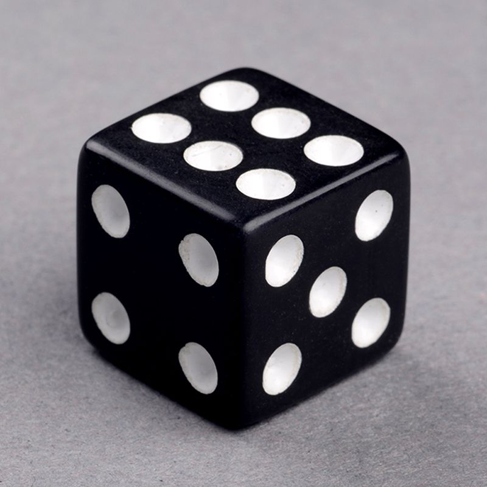
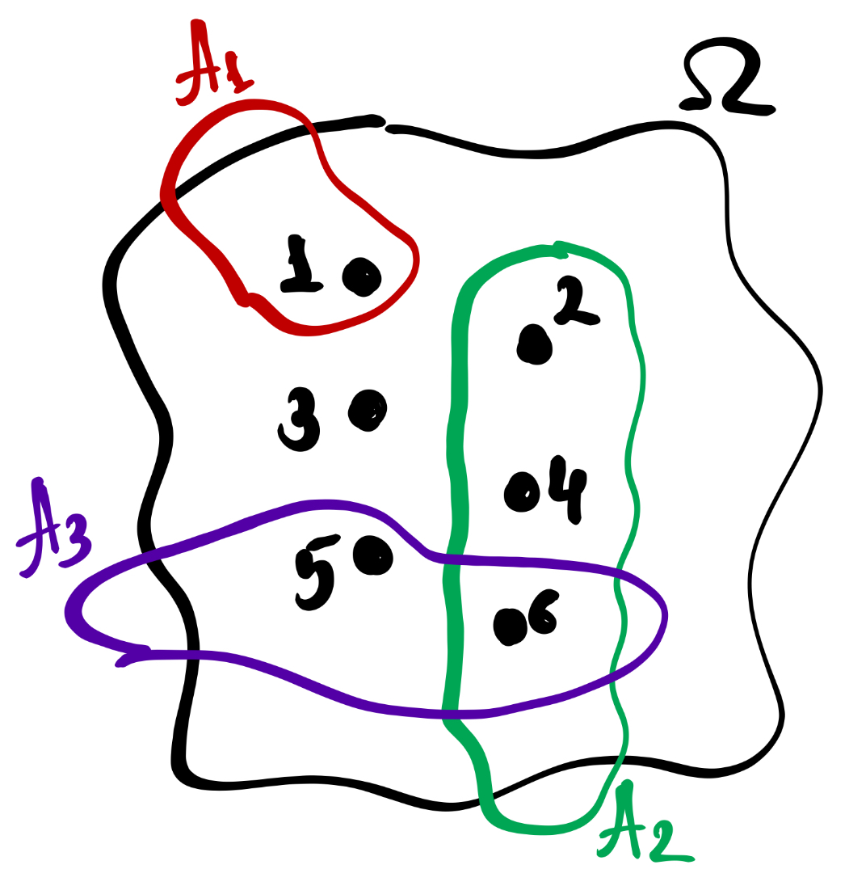
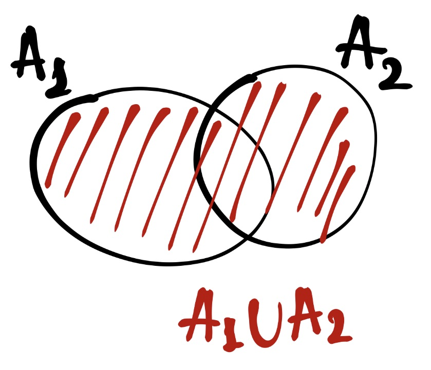
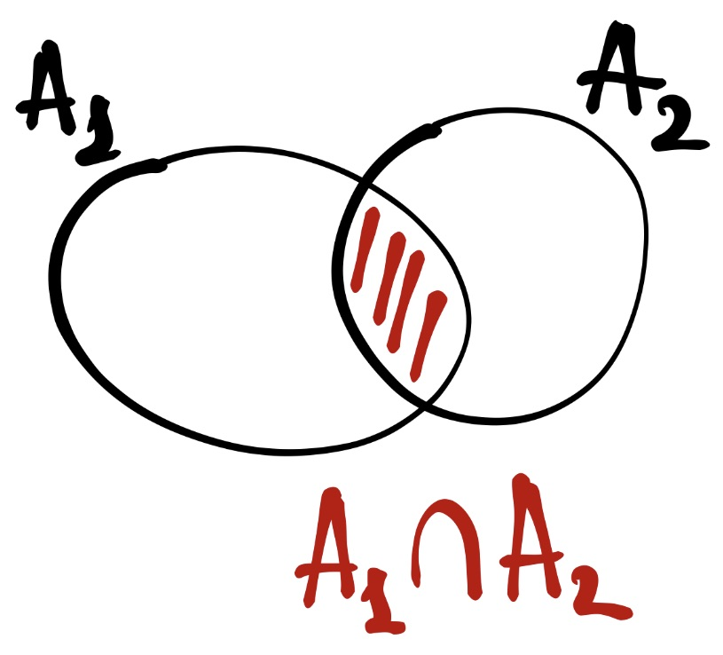
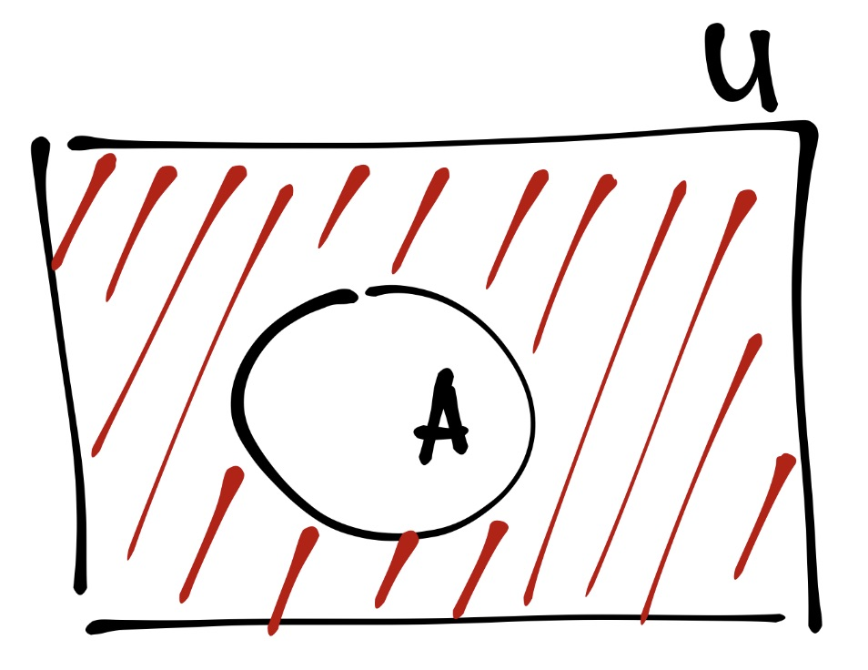
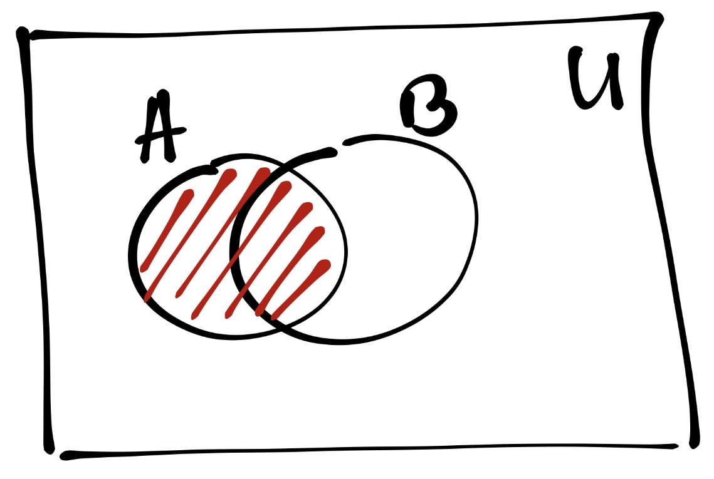
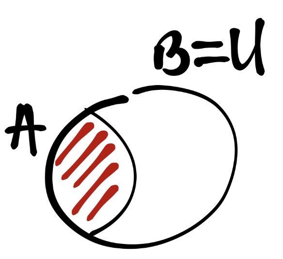

# Случайный эксперимент {#randexp}

## Ход исследования

Представим в самом общем виде, как происходит любое исследование. Мы:

* генерируем идею исследования
* анализируем литературу
* выдвигаем *теоретическую гипотезу* (или несколько)
* раскладываем её (их) на *эмпирические гипотезы*
* определяем ЗП и НП (а также ПП)[^1]
* выбираем инструмент для измерения
* *получаем циферки* по результатам измерения
* анализируем их
* интерпретируем
* публикуемся[^2]

[^1]: ЗП --- зависимая переменная, НП --- независимая переменная, ПП --- побочная переменная
[^2]: или нет…

Теперь пристально посмотрим на то, как мы получаем те самые *циферки*. Процесс измерения хорошо описывается такой математической моделью, как **случайный эксперимент**.


## Событие. Пространство элементарных событий.

### Игральный кубик

Начнём издалека. С самого излюбленного объекта теории вероятностей.

<center>

</center>

**Случайный эксперимент (или случайное испытание)** --- это математическая модель соотвутствующего реального эксперимента, результат который невозможно точно предсказать.

Каждый раз, когда мы бросаем кубик, мы проводим реальное испытание, а с математической точки зрения мы совершаем случайное испытание, генерируя число от 1 до 6. Какое точно число мы сгенерируем --- неизвестно.


#### Игральный кубик в R

Мы с вами уже знаем ряд функций R и даже умеем писать свои. Так как с точки зрения математики игральный кубик случайным образом генерирует некоторое число, то мы можем написать его аналог с помощью кода:

```{r}
dice <- function() sample(1:6, 1)
dice()
```

Вот так вот всё просто.


<div class="task">
Наш кубик сейчас способен дать нам только одно число за один вызов. Это не совсем удобно. Скорректируйте имеющуюся функцию, которая будет за один вызов бросать кубик столько раз, сколько нам надо.

```{r, echo=FALSE}
dice <- function(x) sample(1:6, x, replace = TRUE)
dice(20)
```
</div>


<div class="task">
Мы написали функцию, которая симулиует «честный» кубик. Напишите функцию `dice2()`, которая описывает «кривой» кубик. У такого кубика едница выпадает в два раза чаще, чем остальные грани. Функция за один вызов должна подбрасывать кубик сколько раз, сколько указано в её аргументе.

```{r, echo=FALSE}
dice2 <- function(x) sample(1:6, x, replace = TRUE, prob = c(2, rep(1,5)))
v <- dice2(100); v
table(v)
```
</div>

***

В нашем эксперименте всего возможно шесть исходов. Падения на рёбра и прочие ЧП мы не учитываем. Эти шесть исходов образуют *пространство элементарных событий*.

**Пространство элементарных событий** --- это множество $\Omega$ всех различных исходов случайного эксперимента. Элемента такого множества $\omega_i \in \Omega$ называется **элементарным событием**.

$$
\Omega = \{1, 2, 3, 4, 5, 6\}
$$

Однако нас может интересовать не только выпадение конкретного числа. Здесь мы подходим к опредлению *случайного события*.

**Случайное событие** --- это любое подмножество множества $\Omega$ элементарных событий.

<center>

</center>

На рисунке можно увидеть множество элементальных событий $\Omega$ и его элементы $\omega_i$ (черные точки), которые объединяются в события $A_i$. Например, $A_1$ --- «выпадение единицы», $A_2$ --- «выпадение чётного числа», $A_3$ --- «выпадение числа, большего четырёх».


### Действия над событиями {#events_operations}

С событиями можно делать всё то же самое, что и со [множествами](#sets_operations).

События можно *[логически] складывать, или объединять*:

<center>

</center>

Пусть событие $A_1$ --- «выпало чётное число», а событие $A_2$ --- «выпало число, большее двух». Тогда

$$
A_1 = \{2, 4, 6\}; \quad A_2 = \{3, 4, 5, 6\}\\
A_1 \cup A_2 = \{2, 3, 4, 5, 6\}
$$

События можно *[логически] умножать, или пересекать [друг с другом]*:

<center>

</center>

Пусть событие $A_1$ --- «выпало чётное число», а событие $A_2$ --- «выпало число, большее двух». Тогда

$$
A_1 = \{2, 4, 6\}; \quad A_2 = \{3, 4, 5, 6\}\\
A_1 \cap A_2 = \{4, 5, 6\}
$$


Если события не пересекаются, то они являются *несовместными*.

Например, Пусть событие $A_1$ --- «выпало чётное число», а событие $A_2$ --- «выпало число, *меньшее* двух». Тогда

$$
A_1 = \{2, 4, 6\}; \quad A_2 = \{1\}\\
A_1 \cap A_2 = \varnothing
$$

Можно искать *событие, противоположное данному*:

<center>

</center>

Например, Пусть событие $A$ --- «выпали чётверка или единица». Тогда

$$
A = \{1, 4\}, \quad \Omega = \{1, 2, 3, 4, 5, 6\} \\
\bar A = \Omega - A = \{2, 3, 5, 6\}
$$

Если мы внимательно посмотрим на множество элементарных исходов эксперимента под название «бросание игрального кубика», то обнаружим, что элементарные исходы составляют *полную группу попарно несовместных событий*.

**Полная группа попарно несовместных событий** задаётся двумя условиями:

$$
\cases{A_i A_j = \varnothing, \; i \neq j \\
\sum_{i=1}^n A_i = \Omega}
$$

На самом деле эти два условия раскрывают математическим языком само название. *Полная группа* означает, что если мы соберем в одно множество все элементарные события, входящие в состав случайных событий, то получим пространство элементарных событий. А попарная несовместность значит, что отсутствуют пересечения между двумя любыми случайными событиями.


## Классическое определение вероятности

Мы готовы подползти к термину *вероятность*.

Вообще **вероятность** --- это степень возможности наступления некоторого события. 

Первым подходом к её вычислению был такой. Пусть у нас есть множество *попарно несовместных равновероятных* $n$ исходов в $\Omega$. Пуст событию $A$ соответствует $m$ исходов. Тогда

\newcommand{\prob}{\mathrm{P}}

$$
\prob (A) = \frac{m}{n}
$$

Это хорошо работает с кубиком. Например, какова вероятность, что при некотором броске выпадет единица?

$$
\mathrm{N}(\Omega) = 6, \; \mathrm{N}(A) = 1 \\
\prob(A) = \frac{1}{6}
$$

Или какова вероятность, что выпадет чётное число?

$$
\mathrm{N}(\Omega) = 6, \; \mathrm{N}(A) = 3 \\
\prob(A) = \frac{3}{6} = 0.5
$$


<div class="task">
Какова вероятность случайно верно решить качественное тестовое задание с чётырьмя вариантами ответа, только один из которых верный?
</div>


## Статистическое определение вероятности

Всё это хорошо работает до тех пор, пока мы не сталкиваемся с тем, что условие равновероятности исходов выполняется не всегда. На помощь нам приходит э-э-эксперимент. 
Пусть у нас имеется некоторый реальный эксперимент. $A$ --- это наблюдаемый в эксперименте результат. Допустим, что произведено $n$ экспериментов, в которых результат $A$ может реализоваться, а может и не делать этого. Обозначим через $k$ число реализаций наблюдаемого результата $A$ в $n$ произведённых *независимых* испытаниях.

Тогда 

$$
N_n(k) = \frac{k}{n}
$$
будет *функцией относительной частоты реализации эксперимента*.

Окей. Теперь представим, что мы получили столько ресурсов (временных и материальных), что можем производить бесконечное количество испытаний. Тогда у нас получится вычислить вероятность статистически:

$$
\prob (A) = \underset{n \rightarrow \infty}{N_n(k)} \\
\prob (A) = \frac{k}{n}, \; n \rightarrow \infty
$$


<div class="task">
Выше мы создавали функцию, которая симулирует «нечестный» кубик. Но [предположим] мы забыли, по каким правилам он играет. Используя статистический подход к вероятности, рассчитайте, какова вероятность выпадения каждой из граней кубика.

```{r echo=FALSE}
round(table(dice2(100000))/100000, 2)
```
</div>


## Кроме кубика

Играть с кубиком --- это, конечно, хорошо. Но мы в практике работает всё же с другими концептами. Мы фиксируем или ответы на тесты, или баллы опросника и баллы за каждый пункт опросника, или время реакции, или правильность кликов…

На самом деле, принципиально ничего не меняется. Любое измерение --- это случайный эксперимент (с точки зрения статистики). Пусть у нас наша любимая ликертовская шкала из семи пунктов. Мы никогда заранее не знаем, как ответит наш случайный респондент, поэтому по факту это всё равно, что подбросить кубик, только не шести-, а семигранный. Другое дело, конечно, что респондент --- это явно «нечесный» кубик, и [мы ожидаем, что] для него эти семь альтернатив *неравноверроятны*.

Если мы говорим об общем балле за опросник или тест, то здесь снова аналогичная история --- только пространство элементарных событий будет состоять из стольки элементарных исходов, сколько максимально можно набрать балло по данному опроснику (или тесту)[^3].

[^3]: Конечно, при том условии, что минимальный балл за опросник ноль.

Эта логика эксраполируется на любые наши зависимые переменые.


## Вероятности сложных событий

Мы говорили о том, что с событиями можно производить определенные [операции](#events_operations). В результате таких операций получаются *сложные события*, то есть события, состоящие из нескольких простых. Что будет с из вероятностью?

Вероятность объединения событий вычисляется так:

$$
\prob (A \cup B) = \prob (A) + \prob (B) - \prob (A \cap B)
$$

Всё как и со множествами.

Вероятность пересечения событий вычисляется так:

$$
\prob (A \cap B) = \prob (A) \times \prob (B|A) = \prob (B) \times \prob (A|B)
$$

Так-так-так… Стоп… Что это за странные штуки? Разбёремся постепенно.


### Условная вероятность

Случайные события бывают *независимыми* и *зависимыми*. Если факт того, что произошло событие $A$ никак не влияет на вероятного того, что произойдёт событие $B$, то эти события будут **независимыми**. Если же факт того, что событие $A$ случилось, влияет на вероятность осуществления события $B$, то эти события **зависимы**.

Отсюда происходит понятие *условной вероятности*. **Условная вероятность** $\prob (A|B)$ показывает степень возможности наступления события $A$ при условии, что событие $B$ уже произошло (это известно, инфасотка, стопроц). Посмотрим на картинки.

<center>

</center>

На этой картинке показаны отношения события $A$, события $B$ и *универсума* $U$ --- пространства, включающего в себя все события. Вероятность события $A$ обозначения красной штрифовкой. На данном этапе мы не знает, произошло событие $B$ или нет. Поэтому вероятность $A$ вот такая.

<center>

</center>

А здесь уже другая ситуаци --- событие $B$ случилось. А раз оно случилось, значит наш универсум сжался до размеров этого события $B$. То есть мы знаем, что  $\bar B$ точно не произойдёт. Мы работаем в новых условиях. А раз мы рассматриваем теперь всю ситуацию относительно события $B$, то и часть вероятности $A$, пересекавшаяся с $\bar B$ пропала. Следовательно, вероятность $A$ изменилась. Она вновь заштрихована красным.

Если события *независимы*, то $\prob (A|B) = \prob (A)$. Следовательно, $\prob (A \cap B) = \prob (A) \times \prob (B)$ для независимых событий.


### Теорема Байеса

Условная вероятность используется в теореме Байеса, которая позволяет пересчитывать вероятности при появлении новых сведений. На базе этой теоремы выросло отдельное направлении статистики, известное как *байесовская статистика*. Направление развивающееся и классное, но мы пока сосредоточимся на самой теореме.

Записывается она так:

$$
\prob (A|B) = \frac{\prob (A \cap B)}{\prob (B)} = \frac{\prob (A) \times \prob (B|A)}{\prob (B)}
$$

То есть, если нам известная вероятность $\prob (B|A)$, $\prob (A)$ и $\prob (B)$, то мы можем рассчитать обратную условную вероятность. $\prob (B)$ в свою очередь мы также можем рассчитать, используя условные вероятности:

$$
\prob (B) = \prob (B|A) \times \prob (A) + \prob (B|\bar A) \times \prob (\bar A)
$$
Эта формула называется **формулой полной вероятности**.

Итого суммарно формулу Байеса можно записать так:

$$
\prob (A|B) = \frac{\prob (A) \times \prob (B|A)}{\prob (B|A) \times \prob (A) + \prob (B|\bar A) \times \prob (\bar A)}
$$


<div class="task">
В Высшей школе экономики учится около 40 000 студентов, из которых 4600 обучается на ФКМД[^4]. У 95% студентов ФКМД есть MacBook, в то время как на остальных факультетах продукцией Apple владеют в среднем ²⁄₃ студентов. В курилке около корпуса на Армянском переулке вы столкнулись со студентом, у которого в руках был MacBook. Какова вероятность, что это студент ФКМД?

*При расчётах значения округляйте до третьего знака после запятой.*

```{r include=FALSE}
p_fkmd <- 4600 / 40000
p_not_fkmd <- 1 - p_fkmd
p_mac_fkmd <- 0.95
p_mac_not_fkmd <- 0.667
ans <- (p_fkmd * p_mac_fkmd) / ((p_fkmd * p_mac_fkmd) + (p_not_fkmd * p_mac_not_fkmd))
round(ans, 3)                                
```

<div class="autocheck">
<input class="taskinput" id="input1" type="text">
<input class="taskcheck" type="button" value="Проверить" onClick="check1()">
<div class="taskans" id="taskans1" hidden></div>
</div>

<script>
var input1 = document.getElementById("input1")
var taskans1 = document.getElementById("taskans1")

function check1() {
  if (input1.value == 0.156) {
    taskans1.hidden = false;
    taskans1.innerHTML = 'Верно!';
    taskans1.style = "color:  #00aa4a";
  } else
  {
    taskans1.hidden = false;
    taskans1.innerHTML = 'У меня другой ответ…';
    taskans1.style = "color:  #b73239";
  }
}
</script>
</div>

[^4]: Факультет коммуникации, медиа и дизайна


