# Обобщенные линейные модели. Логистическая регрессия {#logistic}

## Ограничения общих линейных моделей

Модели, которые мы изучали на предыдущих занятиях носят название **общих линейных моделей (general linear models)**. Они достаточно просты и удобны в большинстве случаев, однако имеют ряд важных ограничений.

Вспомним, как выглядит уравнение такой модели:
$$y = \beta_0 + \beta_1 x_1 + \dots + \beta_p x_p + \varepsilon$$

Предикторы в такой модели могут быть как дискретными, так и непрерывными.

Важнейшим допущением / требованием этой модели является распределение ошибки:
$$\varepsilon \thicksim \mathcal{N}(0, \, \sigma)$$

Поскольку ошибка модели должна быть распределена нормально, а моделируется среднее значение, то можно сформулировать более общее допущение / требование:
$$y_i \thicksim \mathcal{N}(\mu_i, \, \sigma)$$

Таким образом, общие линейные модели позволяют моделировать зависимости только для нормально-распределенных величин. Если же отклик модели (он же зависимая переменная) подчиняется другому распределению, эти модели не годятся.

Однако нам на помощь приходят **обобщенные линейные модели (generalized linear models)**, которые позволяют моделировать зависимости величин, подчиняющихся не только нормальному распределению, но и многим другим.

Мы познакомимся с общей логикой построения GLM, подробно рассмотрев один из вариантов таких моделей, а именно **биномиальную регрессию**.


## Биномиальное распределение

[Биномальное распределение](https://ru.wikipedia.org/wiki/Биномиальное_распределение) описывает вероятность выпадения определенного числа «успехов» в серии [испытаний Бернулли](https://ru.wikipedia.org/wiki/Схема_Бернулли).

Здесь можно [поиграться](https://angelgardt.shinyapps.io/binomial_app).


## Бинарные переменные

Эти переменные достаточно широко распространены как повседневности, так и в науке. Блюдо вкусное или невкусное, команда выиграла или проиграла, пациент в результате медицинских манипуляций выжил или умер, в ходе эксперимента была выбрана какая-то опция или нет, сдал студент экзамен или не сдал --- и т.д.

Эти события могут быть связаны с раздичными предикторами, и такую взаимосвязь можно описать с помощью регрессионных моделей.


## HR-данные

[Тут](https://raw.githubusercontent.com/angelgardt/hseuxlab-wlm2021/master/book/wlm2021-book/data/managers.csv) есть датасет про менеджеров. Это часть данных большого датасета, собранного в рамках одного из HR-исследований.


Грузим данные.
```{r}
library(tidyverse)
library(car)
theme_set(theme_bw())
```
```{r, cache=TRUE}
managers <- read_csv('https://raw.githubusercontent.com/angelgardt/hseuxlab-wlm2021/master/book/wlm2021-book/data/managers.csv')
```

Смотрим их структуру.
```{r, cache=TRUE}
str(managers)
```

У нас есть следуюшие переменные:

* `id` --- табельный номер сотрудника
* `lvl` --- уровень (`Сотрудник` или `Менеджер`)
* `qualification` --- профессиональная квалификация
* `autonomy` --- автономия в принятии решений
* `subdiv_regulations` --- участие в формировании регламентов подразделения
* `company_regulations` --- участие в формировании регламентов Компании
* `direct_juniors` --- количество прямых подчинённых
* `func_juniors` --- количество функциональных подчинённых
* `income_influence` --- влияние на доход Компании
* `error_cost` --- стоимость ошибки

Поизучаем данные.
```{r, cache=TRUE}
colSums(is.na(managers))
table(managers$lvl)
```


## Задача построения линейной модели

В наших данных есть бинарная переменная `lvl` --- она содержит две градации: `Сотрудник` и `Менеджер`. Вопрос, на который нам необходимо ответить: по каким параметрам различаются менеджеры и сотрудники?

Прежде всего надо вспомнить, что мы работаем с математической моделью, которой необходимы числа, поэтому придётся перекодировать нашу целевую переменную. Пусть `1` обозначает менеджеров, а `0` --- сотрудников.

```{r}
managers %>% 
  select(-X1, -id) %>% # заодно удалим лишние переменные
  mutate(lvl = ifelse(lvl == 'Менеджер', 1, 0)) -> managers
```

Теперь мы можем построить модель, описывающую связь `lvl` с имеющимися предикторами.

Попробуем обычную линейную регрессию.

```{r}
model0 <- lm(lvl ~ ., managers)
summary(model0)
```

Модель сошлась, всё суперклассно.

```{r lmbad}
managers %>%
  mutate(
    L = qualification +
        autonomy +
        subdiv_regulations +
        company_regulations +
        direct_juniors +
        func_juniors +
        income_influence +
        error_cost
  ) %>%
  ggplot(aes(L, lvl)) +
  geom_point(size = 2, alpha = .3) +
  geom_point(aes(y = model0$fitted.values),
             color = 'darkred', alpha = 0.5)
```

Но получается что-то странное...

Во-первых, непонятно, какая величина отложена на оси $y$. Во-вторых, предсказания модели выходят за границы допустимых значений (модель предсказывает отрицательные и большие единицы значения). Поэтому простая линейная модель нам не подходит. Надо искать что-то еще.


## Переход от дискретной величины к непрерывной

### Логистическая кривая
Собственно бинарные переменные неудобны для работы, поэтому надо найти способ превратить такую дискретную бинарную шкалу в «безграничную» и непрерывную. При моделировании нулей и единиц переходят к моделированию **вероятности получения единиц**.

Сама зависимая переменная в зависимости от предиктора распределена примерно так:

<center>
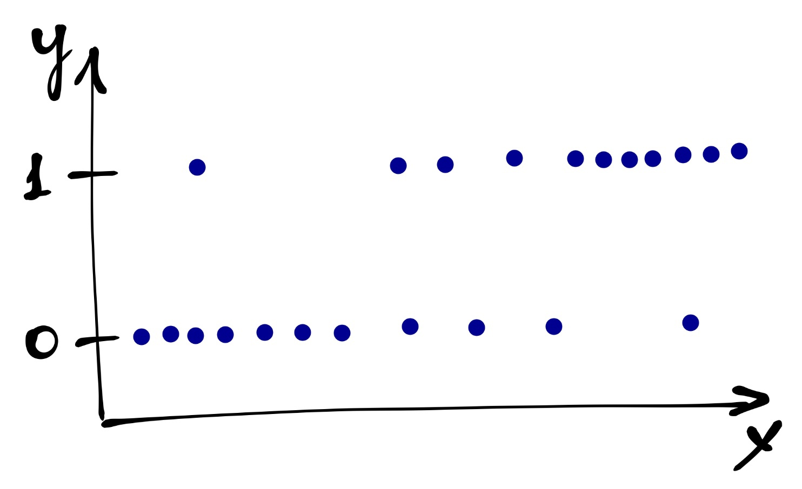
</center>


Введем новые обозначения:

* $p_i$ --- вероятность события $y_i = 1$ при данных значениях предиктора,
* $1 - p_i$ --- вероятность альтернативного события $y_i = 0$.

Получается непрерывная величина $0 \leq p_i \leq 1$.

<center>
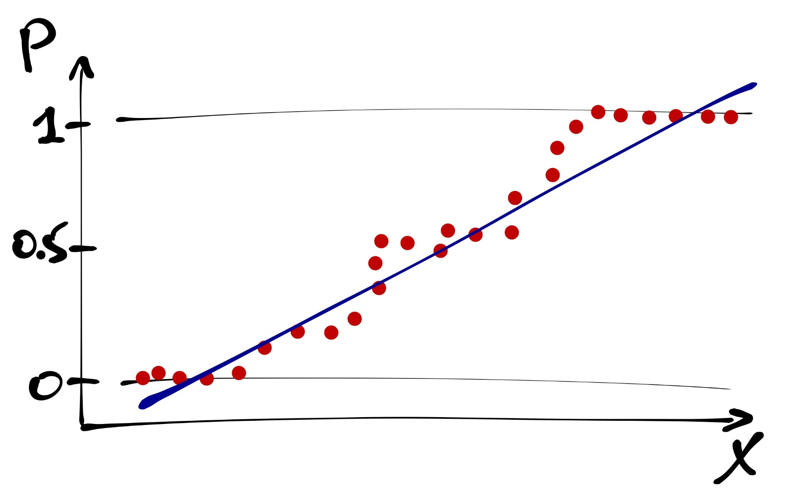
</center>

И вроде бы как ее можно уже моделировать. Но нужно помнить, что вероятность изменяется в пределах от нуля до единицы, а прямая ничем не ограничена. Поэтому прямая --- не лучший вариант.

Такая закономерность моделируется логистической кривой.

<center>
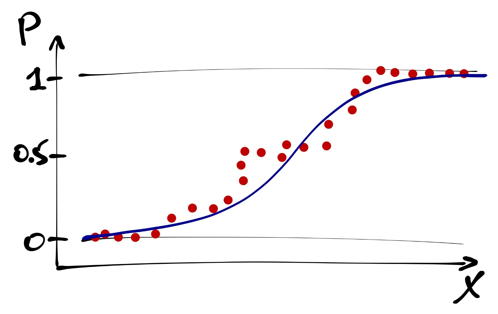
</center>

<center>
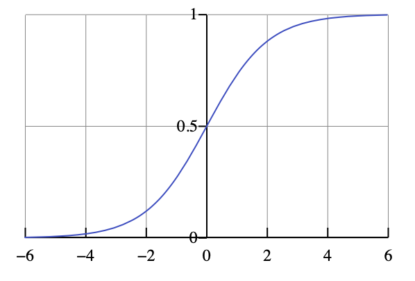
</center>

Она лежит как раз в пределах от 0 до 1. Наша логистическая кривая задается уравнением

$$p_i = \frac{e^{\beta_0 + \beta_1 x_i}}{1 + e^{\beta_0 + \beta_1 x_i}}$$

Логистическую кривую мы больше никогда не увидим [печаль :(], но она используется внутри функций, которыми мы строим модель.


### Шансы и логиты
Теперь нам надо побороться с ограниченностью логистической кривой. Для этого можно перейти от вероятностей к шансам.

**Шанс (отношение шансов, odds, odds ratio)** --- это отношение вероятности успеха к вероятности неудачи. Их величина варьируется от $0$ до $+\infty$.

Уже лучше, но все еще не самый лучший вариант... Последний шаг, необходимый нам, чтобы все было хорошо, юзануть логарифм, который преобразуем шансы в логиты.

$$
\mathrm{logit}(p) = \ln\left(\frac{p_i}{1-p_i}\right)
$$

Значения логитов --- трансформированные оценки вероятностей события. Они варьируют от $-\infty$ до $+\infty$, симметричны относительно нуля, и их удобно брать в качестве зависимой переменной для построения модели. Кроме того, logit-преобразование еще и линеаризует логистическую кривую. [Доказательство.](https://angelgardt.github.io/hseuxlab-andan/logit_transformation_proof.html)

Функция, используемая для линеаризации связи между предиктором и зависимой переменной, называется **связывающей функцией (linked function)**. Функция logit-преобразоввания --- одна из нескольких связывающих функций, применяемых для анализа бинарных переменных отклика.

Итак, summary от всего, что было выше:

1. От дискретной оценки событий (0 и 1) переходим к оценке вероятностей.
2. Связь вероятностей с предиктором описывается логистической кривой.
3. Если при помощи функции связи перейти от вероятностей к логитам, то связь будет описываться прямой линией.
4. Параметры линейной модели для такой прямой можно оценить с помощью регрессионного анализа.


## Формулирование модели в математическом виде

**GLM с биномиальным распределением отклика**

$$y_i \thicksim \mathrm{Bin}(n = 1, p_i)
\\
\mathbb{E}(y_i) = p_i = \frac{e^{\beta_0 + \beta_1 x_1 + \dots + \beta_p x_p}}{1 + e^{\beta_0 + \beta_1 x_1 + \dots + \beta_p x_p}}$$

Функция связи (linked function):
$$
\ln \left(\frac{p_i}{1 - p_i}\right) = \eta_i
\\
\eta_i = \beta_0 + \beta_1 x_{1i} + \dots + \beta_p x_{pi}
$$

Для перехода от логитов к вероятностям используется функция, обратная функции связи. В данном случае, логистическое преобразование:
$$
p_i = \frac{e^{\eta_i}}{1 + e^{\eta_i}}
$$


## Подбор линейной модели

Для построения модели используется функция `glm()`. Синтаксически она очень похожа на `lm()`, но у неё есть дополнительный аргумент `family`, в который необходимо указать тип регрессии, которую мы собираемся использовать. Внутри указания типа можно указать функцию связи, с использвоание которой будет строиться модель.

```{r}
model <- glm(lvl ~ ., managers, family = binomial(link = 'logit'))
summary(model)
```

Модель сошлась, все ровно, хотя нам R выдал предупреждение. Вызываем функцию `summary()`, чтобы посмотреть статистики модели. Вывод функции нам уже знаком, он аналогичен тому, с которым мы встречались, однако все-таки отличается некоторыми деталями.

Во-первых, нет F-статистики. Во-вторых, нет R². Это связано с тем, что алгоритм GLM не работает с дисперсией и суммой квадратов --- модель подбирается **методом максимального правдоподобия**. Данный метод позволяет учесть разную форму распределений, которые мы можем моделировать с использованием GLM.


### Метод максимального правдоподобия

**Правдоподобие (likelihood)** --- способ измерить соответствие имеющихся данных тому, что можно получить при определенных значениях параметров модели. Оно представляет собой произведение вероятностей получения каждой из точек данных:

$$
L(\theta | \mathrm{data}) = \prod_{i=1}^n f(\mathrm{data}|\theta),
$$
где $f(\mathrm{data}|\theta)$ --- функция распределения с параметрами $\theta$.

Параметры модели должны максимизировать значения [логарифма] правдоподобия, т.е.
$$
L(\theta | \mathrm{data}) \rightarrow \max
$$
Однако для упрощения вычислений используют логарифмы правдоподобий (loglikelihood) и максимизируют их
$$
\ln L(\theta | \mathrm{data}) \rightarrow \max
$$
Аналитически такие задачи решаются редко, чаще используются методы численной оптимизации.


## Анализ модели

Итак, продолжим изучать аутпут функции `summary()`. Обратимся к ней еще раз.
```{r}
summary(model)
```

Мы видим знакомую нам табличку с оценками коэффициентов.  У каждого предиктора есть информация о значении коэффициента при нем (`Estimate`), значение стандартной ошибки, z-value и p-value, рассчитанный для последнего. 

Судя по аутпуту, значимыми являются следующие предикторы: профессиональная квалификация, количество прямых и функциональных подчинённых и влияние на доход компании. Заметьте, что в этой модели значимых предикторов меньше, чем в модели обычной линейной регрессии. Но так ли это?

Внимательно посмотрим на эту табличку. Раньше у нас были значения t-статистики --- теперь z-теста. К чему это может приводить?

Чтобы ответить на этот вопрос, надо разобраться, что такое этот z-тест.

<center>

</center>

Значение z-value является результатом подсчета **теста Вальда** и позволяет оценить значимость коэффициента модели. Расчет статистики похож на подсчет t-теста, только распределение данной статистики *ассимптотически* стремиться к нормальному (отсюда и *z*). Ассимптотика приводит к тому, что опеределение значимости коэффициентов на маленьких выборках будет неточным.

$$
H_0: \beta_k = 0 \\
H_1: \beta_k \neq 0 \\
\\
z = \frac{b_k - \beta_k}{SE_{b_k}} = \frac{b_k}{SE_{b_k}} \thicksim \mathcal{N}(0,\,1)
$$

Поскольку значения теста Вальда нам не могут обеспечить достаточной точности оценки коэффициентов, нам необходимы другие метрики оценки значимости коэффициентов.


## Анализ девиансы и упрощение модели
Для получения более точных оценок необходимо поработать в логарифмами правдоподобий. Вообще логарифмы правдоподобий используются в GLM много для чего:

* для описания качества подгонки модели;
* для тестирования значимости подобранной модели в целом;
* для тестирования значимости отдельных предикторов;
* для отбора моделей.

Дла понимания механики анализа нам потребуется несколько полезных абстракций:

* **Насыщенная модель (saturated model)** --- каждое уникальное наблюдение (сочетание предикторов) описывается одним из $n$ параметров.

$$
\ln L_{\mathrm{sat}} = 0 \\
\mathrm{df}_{\mathrm{sat}} = n - p_{\mathrm{sat}} = n - n = 0
$$

* **Нулевая модель (null model)** --- все наблюдения описываются одним параметром (средним значением)

$$
\hat y_i = \beta_0 \\
\ln L_{\mathrm{null}} \neq 0 \rightarrow -\infty \\
\mathrm{df}_{\mathrm{null}} = n - p_{\mathrm{null}} = n - 1
$$

Наша **реальная (предложенная) модель**, которую мы подбираем, будет находится где-то между насыщенной и нулевой моделью (вернее, не сама модель, а значение логарифма её правдоподобия).

$$
\hat y_i = \beta_0 + \beta_1 x_{1i} + \dots + \beta_p x_{pi} \\
\ln L_{\mathrm{model}} \neq 0 \\
\mathrm{df}_\mathrm{model} = n - p_\mathrm{model}
$$

<center>
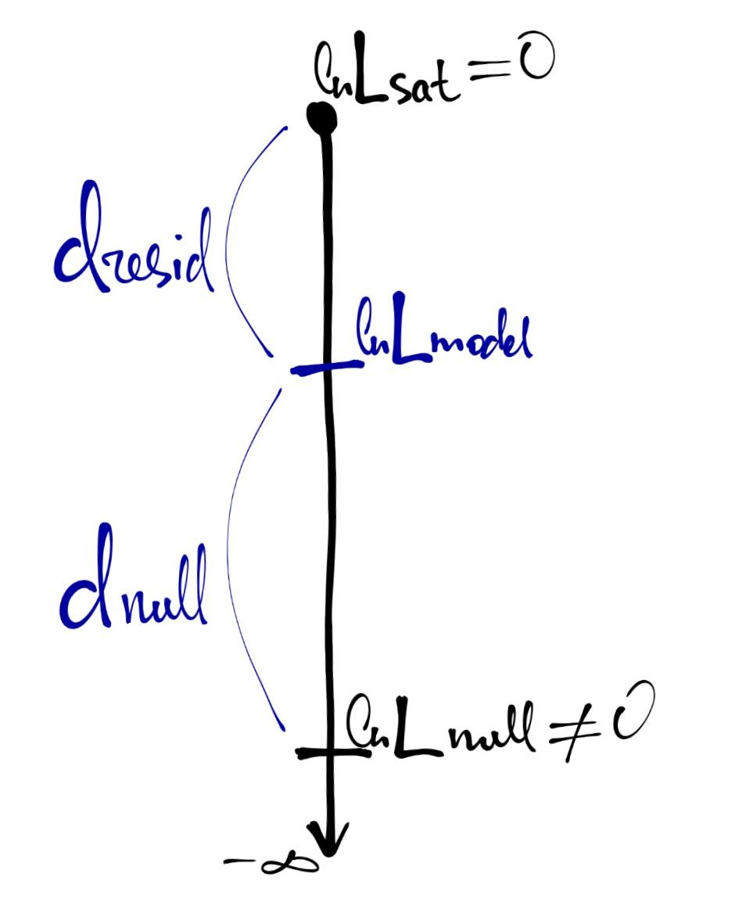
</center>

**Девианса** является мерой различия правдоподобий двух моделей (оценка разницы логарифмов правдоподобий). [см. рисунок выше]

**Остаточная девианса**
$$
d_\mathrm{resid} = 2\big(\ln L_\mathrm{sat} - \ln L_\mathrm{model} \big) = -2 \ln(L_\mathrm{model})
$$

**Нулевая девианса**
$$
d_\mathrm{null} = 2 \big(\ln L_\mathrm{sat} - \ln L_\mathrm{null}\big) = -2 \ln(L_\mathrm{null})
$$

Сравнение нулевой и остаточной девианс позволяет судить о статистической значимости модели в целом. Такое сравнение проводится с помощью **теста отношения правдоподобий (likelihood ratio test, LRT)**.

$$
d_\mathrm{null} - d_\mathrm{resid} = -2 ( \ln L_\mathrm{null} - \ln L_\mathrm{model} ) = 2 (\ln L_\mathrm{model} - \ln L_\mathrm{null}) = 2 \ln \left( \frac{L_\mathrm{model}}{L_\mathrm{null}} \right) \\
\mathrm{LRT} = 2 \ln \left( \frac{L_\mathrm{M_1}}{L_\mathrm{M_2}} \right) = 2 (\ln L_\mathrm{M_1} - \ln L_\mathrm{M_2}),
$$
где $M_1,\, M_2$ --- вложенные модели ($M_1$ --- более полная, $M_2$ --- уменьшенная),
$L_\mathrm{M_1}, \, L_\mathrm{M_2}$ --- правдоподобия.

Распределенеи разницы логарифмов правдоподобий аппроксиммируется распределением $\chi^2$ с числом степеней свободы $\mathrm{df} = \mathrm{df}_\mathrm{M_2} - \mathrm{df}_\mathrm{M_1}$.

LRT для тестирования значимости модели в целом:

$$
\mathrm{LRT} = 2 \ln \left( \frac{L_\mathrm{model}}{L_\mathrm{null}} \right) = 2 (\ln L_\mathrm{model} - \ln L_{\mathrm{null}}) = d_\mathrm{null} - d_\mathrm{resid} \\
\mathrm{df} = p_\mathrm{model} - 1
$$

LRT для тестирования значимости отдельных предикторов:

$$
\mathrm{LRT} = 2 \ln \left( \frac{L_\mathrm{model}}{L_\mathrm{reduced}} \right) = 2 (\ln L_\mathrm{model} - \ln L_\mathrm{reduced}) \\
\mathrm{df} = p_\mathrm{model} - p_\mathrm{reduced}
$$

Реализуем изученное в `R`.

Протестируем значимость модели в целом. Для этого неоходимо создать нулевую модель с одним предиктором --- среднее --- и передать эту модель и тестируемую в функцию `anova()` с указанием параметра `test = 'Chi'`. Получим нужным нам аутпут:

```{r}
model_null <- glm(lvl ~ 1, managers, family = binomial(link = 'logit'))
anova(model_null, model, test = 'Chi')
```

Как можно увидеть, наша модель получилась статистически значима.

Для тестирования значимости отдельных предикторов можно (и лучше) использовать функцию `Anova()` из пакета `car`.

```{r}
Anova(model)
```

Мы получаем табличку, похожую на результат работы `summary()`, но с другими статистиками.

У нас есть незначимые предикторы, а значит можно упростить модель:

```{r}
model1 <- update(model, . ~ . -error_cost)
drop1(model1, test = 'Chi')
model2 <- update(model1, . ~ . -subdiv_regulations)
drop1(model2, test = 'Chi')
model3 <- update(model2, . ~ . -company_regulations)
drop1(model3, test = 'Chi')
model4 <- update(model3, . ~ . -autonomy)
drop1(model4, test = 'Chi')
Anova(model4)
```

В модели остались только значимые предикторы, и таким образом, мы получили нашу финальную модель.

Кроме статистический тестов для сравнения моделей можно использовать информационные критерии. Например, **[информационный критерий Акаике](https://ru.wikipedia.org/wiki/%D0%98%D0%BD%D1%84%D0%BE%D1%80%D0%BC%D0%B0%D1%86%D0%B8%D0%BE%D0%BD%D0%BD%D1%8B%D0%B9_%D0%BA%D1%80%D0%B8%D1%82%D0%B5%D1%80%D0%B8%D0%B9_%D0%90%D0%BA%D0%B0%D0%B8%D0%BA%D0%B5) (Akaike information criterion)**, позволяющий сделать выбор из нескольких моделей. Его можно использовать и в нашем случае как дополнительную проверку.

```{r}
AIC(model, model4)
```

С удалением незначимых предикторов из модели AIC хоть и немного, но снизился, что позволяет сделать вывод о том, что модель с меньшим количеством предикторов лучше, чем модель, включающая все предложенные предикторы.


## Интерпретация коэффициентов модели

Еще раз позовем summary нашей окончательной модели:
```{r}
summary(model4)
```

Что значат эти непонятные коэффициенты при предикторах? В общих линейных моделях все ясно как белый день, а тут какая-то дичь...

Посмотрим на математическую запись нашей модели:

$$
\mathrm{Out}_i \thicksim \mathrm{Bin}(n = 1, \, p_i) \\
\mathbb{E}(\mathrm{Out}_i) = p_i \\
\ln \left(\frac{p_i}{1 - p_i}\right) = \eta_i \\
\eta_i = -22.0 + 1.6 \, \mathrm{qualification}_i + 8.8 \, \mathrm{direct\_juniors}_{i} + 3.1 \, \mathrm{func_juniors}_i + 0.6 \, \mathrm{income_influence}_i
$$


Наша зависимая переменная --- логарифм отношения шансов. От этого и будем толкаться.

Тогда,

* $b_0$, интерсепт, показывает *логарифм отношения шансов для случая, когда все остальные предикторы равны нулю* --- в данном примере он сложноинетерпретабелен;
* $b_j$ показывает, *на сколько единиц изменяется логарифм отношения шансов* при изменении значения предиктора на единицу.

Корректно, но непонятно... Чтобы разобраться лучше, немного потупим в алгебру.


### Немного алгебры для понимания сути коэффициентов

Пусть у нас есть модель с одним непрервным предиктором. Тогда она будет записываться так:

$$
\eta = b_0 + b_1 x
$$

В терминах логитов её можно записать следующим образом:

$$
\eta = \ln \left( \frac{p}{1 - p} \right) = \ln (\mathrm{odds})
$$

Как изменится предсказание модели при изменении предиктора на единицу?


$$
\eta_{x+1} - \eta_x = \ln (\mathrm{odds}_{x+1}) - \ln (\mathrm{odds}_{x}) = 
\ln \left( \frac{\mathrm{odds}_{x+1}}{\mathrm{odds}_x} \right)
$$
$$
\eta_{x+1} - \eta_x = b_0 + b_1 (x + 1) - b_0 - b_1x = b_1
$$
$$
\ln \left( \frac{\mathrm{odds}_{x+1}}{\mathrm{odds}_{x}} \right) = b_1
$$
$$
\frac{\mathrm{odds}_{x+1}}{\mathrm{odds}_{x}} = e^{b_1}
$$


Таким образом, $e^{b_1}$ показывает, во сколько раз изменится отношение шансов при увеличении предиктора на единицу. Для дискретных предикторов $e^{b_1}$ покажет, во сколько раз различается отношение шансов для данного уровня предиктора по сравнению с базовым.

***

<center>
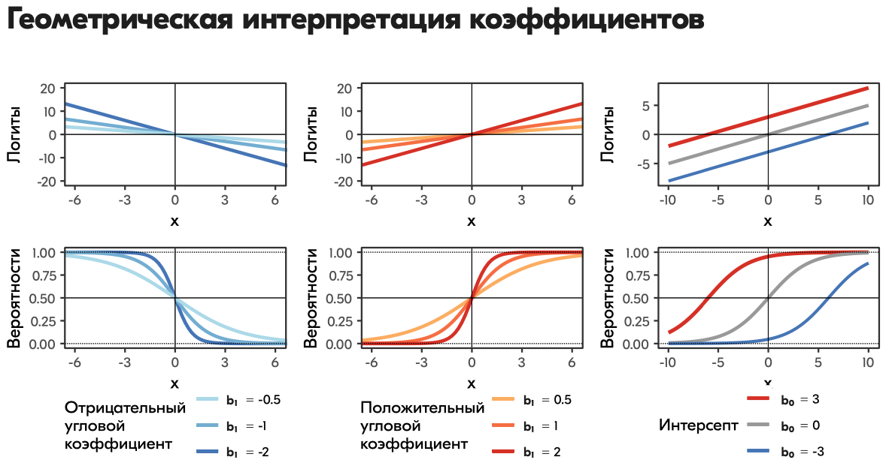
</center>

***

Теперь мы можем тракровать полученные коэффициенты нормальным языком.

$$
\eta_i = -22.0 + 1.6 \, \mathrm{qualification}_i + 8.8 \, \mathrm{direct\_juniors}_{i} + 3.1 \, \mathrm{func\_juniors}_i + 0.6 \, \mathrm{income\_influence}_i
$$

При увеличении оценки профессиональной квалификации на 1 отношение шансов принадлежать к уровню менеджеров увеличится в $e^{3.1} = 22.2$ раза. То есть работник, имеющий более высокую оценку профессиональной квалицикации, имеет больше шансов быть менеджером.


<div class="task">
Потренируйтесь в интерпретации коэффициентов при предикторах самостоятельно. Ешё раз изучите логику интерпретации и сформулируйте, как связаны предикторы `direct_juniors`, `func_juniors` и `income_influence` с целевой переменной модели.
</div>


## Предсказательная сила модели

Оценить предсказательную силу общих линейных моделей не сложно, и логика процесса интуитивно понятна. С логистической моделью же есть некоторые тонкости.

Чтобы оценить предсказательную силу модели, нам потребуется разбить наши данные на две подвыборки --- *обучающую* и *тестовую*[^1]. Первую мы использует для подбора коэффициентов модели, а вторую для проверки предсказательной силы.

```{r}
set.seed(5432)
ind_train <- sample(1:nrow(managers), size = 0.7 * nrow(managers), replace = FALSE)
managers %>% 
  slice(ind_train) -> managers_train
managers %>% 
  slice(-ind_train) -> managers_test
```

Обучим модель, то есть подберём коэффициенты, на тренировочных данных. Возьмём полную модель.

```{r}
model5 <- glm(lvl ~ ., managers_train, family = binomial)
```

Как оценить, насколько модель хорошо работает? Для этого потребуются метрики качества модели. Однако перед этим надо поработать с предсказаниями.


### Перевод непрерывных предсказаний в дискретные

Множество допустимых значений нашей целевой переменной --- $\{0, 1\}$, а наша модель возвращает вероятности принадлежности каждого из наблюдений к классу `1`:

```{r}
head(model5$fitted.values)
```

Поэтому чтобы мы смогли рассчитать метрики качества, нам необходимо перейти от вероятностей обратно к нулям и единицам. Для этого необходимо выбрать *порог* --- если значение вероятности выше него, мы будем считать, что модель предсказала `1`, если ниже, то `0`. Значение порога зависит от многих факторов и будет влиять на качество модели. Прежде всего стоит ориентироваться на сферу деятельности, в которой вы проводите анализ. Если у вас качественные чистые данные и вам важна высокая точность, то и порог для предсказаний должен быть высокий --- $\geq 0.9$. Если же вы знаете, что вы работаете с зашумлёнными данными, и цена ошибки не так высока, то можете выбрать более либеральный критерий --- $0.7-0.8$. Самый либеральный критерий из возможных --- $0.5$, что по сути есть вероятность случайного угадывания.

Итак, переведем предсказания пока на тренировочной выборке в дискретную форму. Выберем критерий $0.8$ как не очень строгий, но и не очень либеральный:

```{r}
predicted_train <- ifelse(predict(model5, type = 'response') > 0.8, 1, 0)
```


### Confusion matrix

Построим **confusion matrix** --- это таблица частот по модельным и реальным значениям нашей целевой переменной

```{r}
table(managers_train$lvl, predicted_train)
```

По столбцам идут предсказанные значения, по строкам --- реальные. В целом мы видим, что модель практически всегда предсказывает верно, однако хотелось бы как-то понять, что такое это «практически всегда» в числовом формате.

Для этого надо понять структуру confusion matrix:

<center>
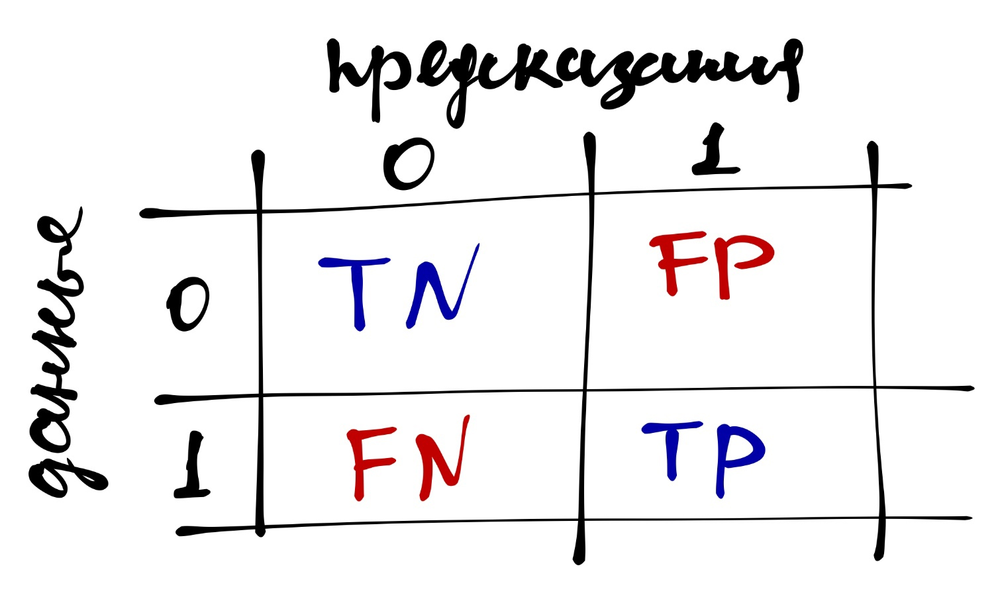
</center>

* *True Positive* ($TP$) --- верное предсказанные единицы
* *True Negative* ($TN$) --- верно предсказанные нули
* *False Positive* ($FP$) --- ложноположительные предсказания, ошибочно предсказанные единицы
* *False Negative* ($FN$) --- ложноотрицательные предсказания, ошибочно предсказанные нули

На основе данных значение можно расчитать несколько **метрик качества модели**.


### Accuracy

Чаще всего эту метрику называют «точность». Она определяется по формуле 

$$
\mathrm{accuracy} = \frac{TP + TN}{TP + TN + FP + FN}
$$

Она показывает долю верно предказанных значений.


<div class="task">
Напишите фунцию, которая будет принимать на вход confusion matrix и возвращать значение accuracy.

```{r}
confmat <- table(managers_train$lvl, predicted_train)
```
```{r, echo=FALSE}
accuracy <- function(confmat) {
  (confmat[1,1] + confmat[2,2]) / (sum(confmat))
}
```
```{r}
accuracy(confmat)
```
</div>

Это неплохая метрика, но она перестаёт работать на несбалансированных данных. Например, у нас есть такие данные по целевой переменной (`dv`):

```{r}
dv <- c(0, 0, 0, 0, 0, 1, 0, 0, 0, 1, 1) 
```

Пусть у нас есть наиболее топорная модель, которая просто всегда предсказывает ноль:

```{r}
pred <- c(0, 0, 0, 0, 0, 0, 0, 0, 0, 0, 0)
```

Тогда точность будет следующая:

```{r}
mean(dv == pred)
```

Достаточно высокий показатель, хотя модель не ухватывает закономерность вовсе. Поэтому были разработаны другие метрики качества, которые хорошо работают и на несбалансированных данных.


### Precision and Recall

**Presicion** тоже переводится как «точность», поэтому лучше пользоваться английской терминологией во избежании путаницы. Эта метрика показывается *долю верно предсказанных единиц*, то есть сколько из предсказанных единиц предсказано верно:

$$
\mathrm{precision} = \frac{TP}{TP + FP}
$$


<div class="task">
Напишите фунцию, которая будет принимать на вход confusion matrix и возвращать значение precision.

```{r, echo=FALSE}
precision <- function(confmat) {
  (confmat[2,2]) / (confmat[2,2] + confmat[1,2])
}
```
```{r}
precision(confmat)
```
</div>

**Recall** можно перевести как «полнота», хотя по сути это снова «точность». Эта метрика показывается *долю предсказанных единиц из всех единиц датасета*, то есть сколько из всех единиц датасета модель предсказала верно:

$$
\mathrm{recall} = \frac{TP}{TP + FN}
$$


<div class="task">
Напишите фунцию, которая будет принимать на вход confusion matrix и возвращать значение recall.

```{r, echo=FALSE}
recall <- function(confmat) {
  (confmat[2,2]) / (confmat[2,2] + confmat[2,1])
}
```
```{r}
recall(confmat)
```
</div>

И ещё раз обобщаюшая картинка:

<center>
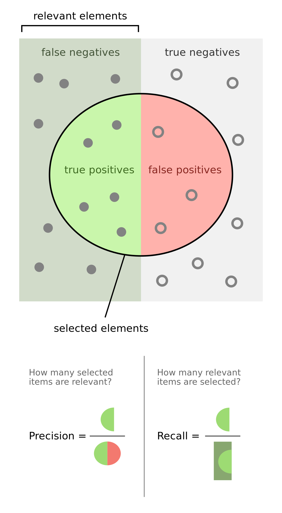
</center>

Очевидно, что чем ближе показатели всех метрик к единице, тем качество модели выше.


### F1-мера

На основе precision и recall вычисляется ещё одна метрика качества, которая является [гармоническим средним](#harmonic_mean) этих двух метрик.

$$
\mathrm{F1} = 2 \times \frac{\mathrm{precision} \times \mathrm{recall}}{\mathrm{precision + \mathrm{recall}}}
$$

Её значение также изменяется от нуля до единицы.


<div class="task">

*Опять?*

Напишите фунцию, которая будет принимать на вход confusion matrix и возвращать значение F1-меры.

<details>
<summary>Подсказка</summary>
Можно использовать функции, написанные ранее, внутри новой функции.
</details>

```{r, echo=FALSE}
F1 <- function(confmat) {
  2 * (precision(confmat) * recall(confmat) / (precision(confmat) + recall(confmat)))
}
```
```{r}
F1(confmat)
```
</div>

### ROC-AUC

Ну и напоследок, самое занятное. Ещё одна метрика качества модели. Однако логика её расчёта не такая простая.

Чем хороша эта метрика? Тем, что она работает не с предсказанными значениями (0 и 1), а с *предсказанными вероятностями*. Таким образом, она избавляет нас от вмешательства нас же в предсказания, ведь когда мы выбираем порог, мы хотя и опираемся на какое-то содержательное основание, тем не менее, глобально выбираем его условно произвольно.

Что рассчитать значение этой метрики нужно сделать следующее (разберём на некотором вымышленном примере):

1. Упорядочить объекты по убыванию значения предсказанной вероятности:

<center>
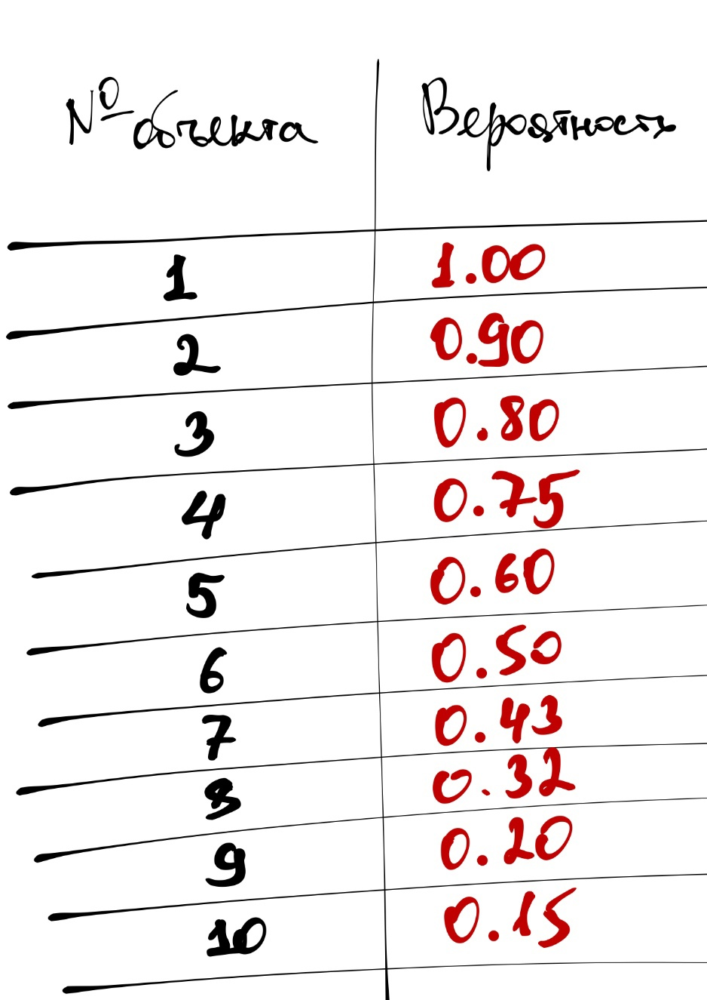
</center>

2. Добавить столбец истинных значений (0 и 1)

<center>
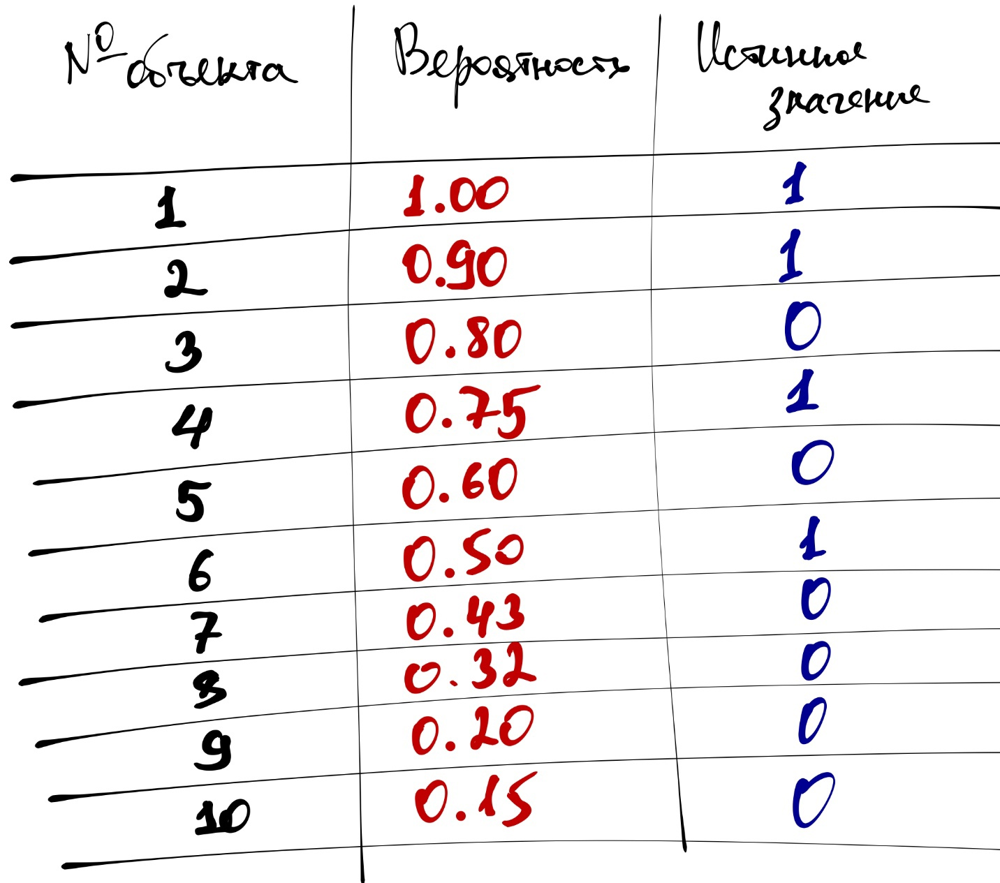
</center>

Отметим, что если модель идеально справляется с предказаниями, то в упорядоченном по значению предсказанной вероятности наборе данных сначала будут идти все наблюдения с истинным значением `1`, а потом с `0`.

3. Построим кривую, которая будет описывать качество нашей модели:
  - Стартуем из точки $(0, 0)$ и хотим прийти в точку $(1, 1)$:

<center>
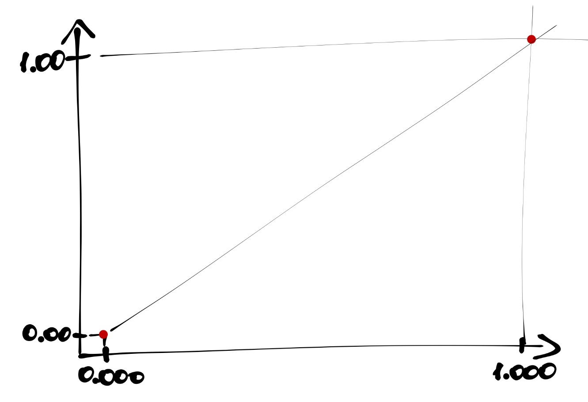
</center>

  - Ось $y$ делим на равные части, число которых равно количеству `1` в датасете:

<center>
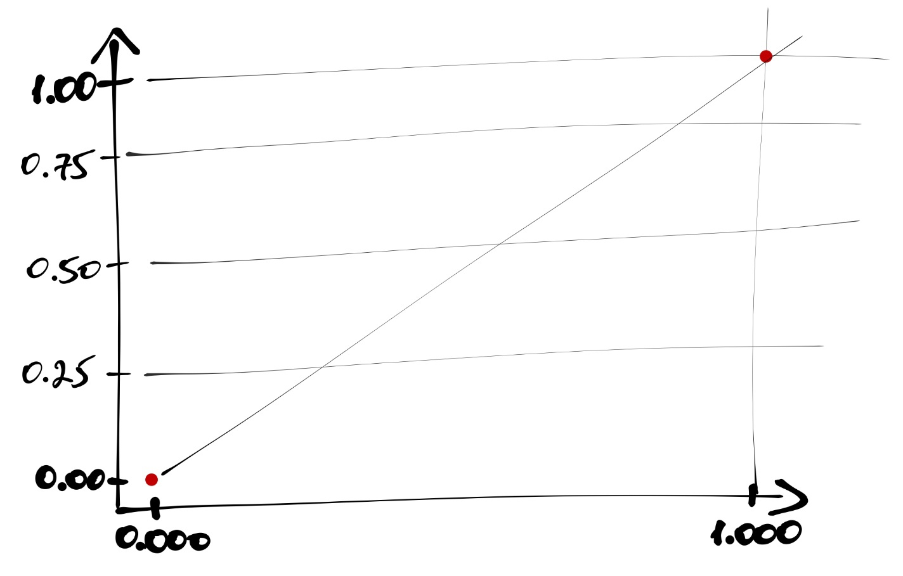
</center>

  - Ось $x$ делим на равные части, число которых равно количеству `0` в датасете:
  
<center>
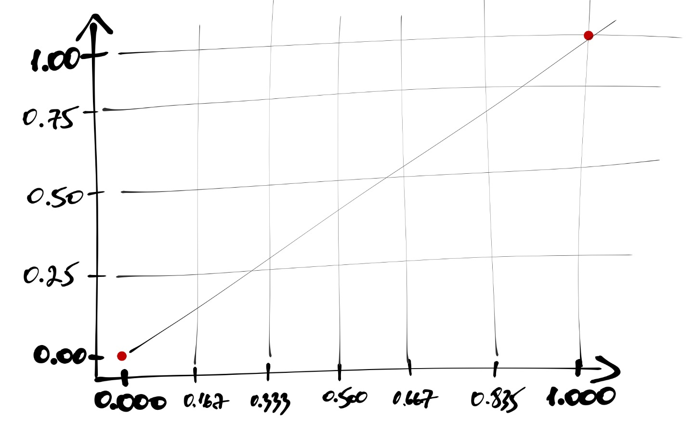
</center>

  - Идём по нашим данным сверху вниз, и когда встречаем наблюдение со значением `1`, поднимаемся на графике на одно деление вверх; когда встречаем наблюдение со значением `0`, сдвигаемся на одно деление вправо.

  - В итоге получится такая кривая:

<center>
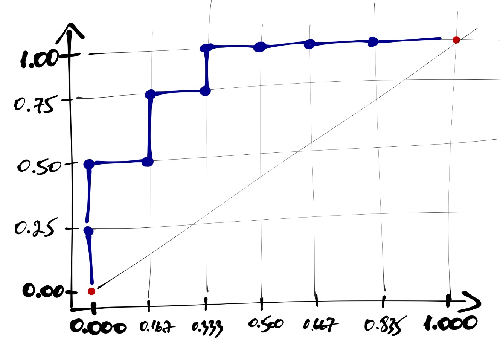
</center>

Каждая точка на этой кривой соответствует некоторому порогу вероятности отсечения объектов. Например, выделенная точка (рисунок ниже) соответствует порогу вероятности $0.6$ и имеет координаты $(\frac{1}{6}, \frac{3}{4})$. Это означает, что если при переходе к предсказаниями модели мы будем использовать порог $0.6$, то *доля true positive*, или *true positive rate (TRP)* окажется равной $\frac{3}{4}$, а *доля falce positive*, или *false positive rate (FPR)* окажется равной $\frac{1}{6}$.

<center>
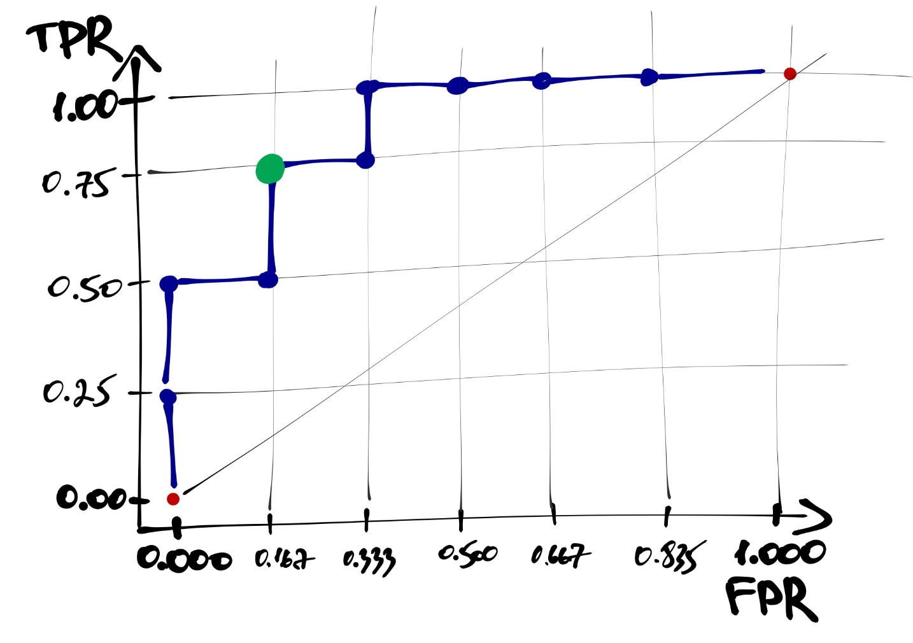
</center>


Построенная кривая называется **ROC-кривой (receiver operating characteristic)**.

4. Определяем площадь фигуры под ROC-кривой --- это и будет значением метрики ROC-AUC. *AUC --- area under a curve.*

<center>
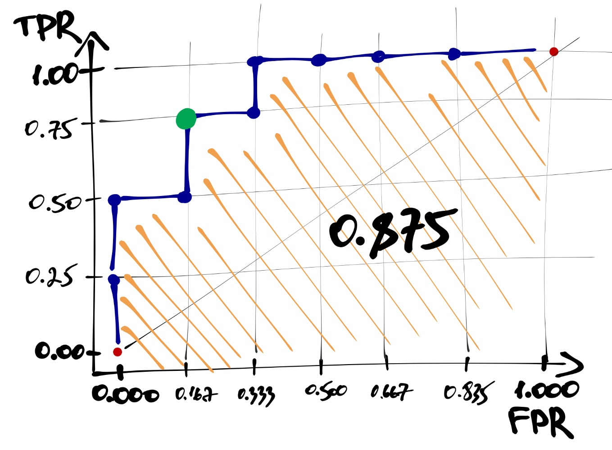
</center>

В случае идеального упорядочивания наблюдений по предсказанной вероятности площадь под кривой будет равна единице. Чем ближе значение ROC-AUC к единице, тем модель работает лучше. Значение $0.5$ указывает на то, что модель совсем не ухватывает закономерность и точность её предсказаний на уровне случайного угадывания --- ROC-кривая в этом случае будет проходить близко к диагонали $[(0,0),(1,1)]$.

В R эту метрику рассчитать с помощью функций `roc()` и `auc()` из пакета `pROC`. Первая функция хочет получить на вход вектор истинных значений и вектор предсказанных вероятностей. Вторая же хочет получить результат работы первой:

```{r}
library(pROC)
auc(roc(managers_train$lvl, model5$fitted.values)) # на тренировочных данных
```


## Предсказания на новых данных

Мы рассчитали метрики качества на тренировочных данных, но гораздо интереснее, как модель справится с предсказаниями на тех данных, которые она ещё не видела. Это просто проверить.

```{r}
predicted_test <- ifelse(predict(model5, managers_test, type = 'response') > 0.8, 1, 0)
cm <- table(managers_test$lvl, predicted_test)
```

Рассчитаем метрики качества и сравним со значениями для тренировочной выборки:

```{r}
tibble(data = c('train', 'test'),
       accuracy = c(accuracy(confmat), accuracy(cm)),
       precision = c(precision(confmat), precision(cm)),
       recall = c(recall(confmat), recall(cm)),
       F1 = c(F1(confmat), F1(cm)))
```

Здесь надо обратить внимание на следующий очень важный момент: согласно метрикам качества, модель, пусть и немного, но лучше работает на тестовых данных, чем на тренировочных. Такого, вообще-то говоря, быть не может, и любая модель будет работать на тестовых данных хуже, чем на тех, на которых она была обучена. Это приводит нас с мысли, что результат работы модели зависит не от самой модели и её коэффициентов, а, скорее, от случайного совпадения данных --- проще говоря, модель переобучилась. Мы вплотную подошли к сфере машинного обучения и дальше не пойдём, так как это не цель нашего курса. Но о самом феномене вы теперь знаете.


[^1]: Машин лёрнинг, привет 👋