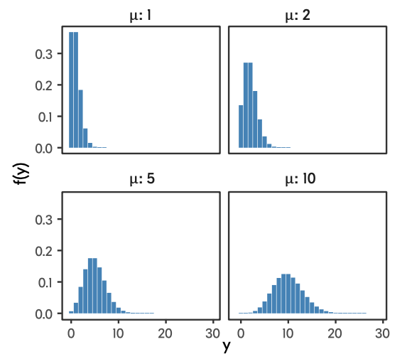
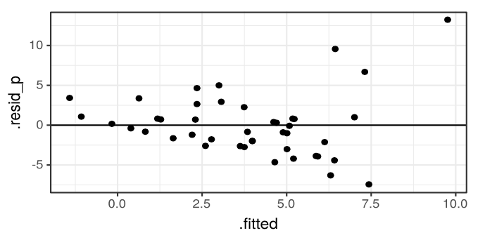

# Пуассоновская регрессия {#poisson}

В жизни и практике мы часто сталкиваемся с так называемыми *счётными величинами*. Например, число комнат в квартире, количество детей в семье, число книг на полке, число людей, прошедших через турникет и т.д. Глобально --- любые количества. Также как счётные величины можно рассмотреть шкалу Лайкерта или оценки по десятибалльной шкале --- по сути, это количество набранных баллов.

Какими свойствами обладают такие величины?

* Они могут принимать *только целочисленные значения* ($x \in \mathbb Z$)
* Также возможны *нулевые значения* ($0 \leq x \leq +\infty$)
* Разброс значений *зависит от среднего значения* ($\mathrm{var}(X) \propto \mathbb{E}(X)$)

До сих пор мы обсуждали модели, применимые только к мерным, или непрерывным, величинам[^1]. Иногда свойства данных позволяют использовать такие методы для моделирования счётных величин, однако так бывает далеко не всегда.

[^1]: Не считая, конечно, биномиальную регрессию.

В этой главе мы обсудим самый простой подход к моделированию счетных величин, а также одну его модификацию, которая может быть полезна.

Модели для счётных данных базируются н **распределении Пуассона**.

## Распределение Пуассона

Распределение Пуассона опредляется следующим образом:

$$
Y \thicksim \mathrm{Poisson}(\mu) \\
f(y) = \frac{\mu^y e - \mu}{y!}
$$

$\mu$ --- единственный параметр данного распределения[^2]. Он задаёт и математическое ожидание, и дисперсию, т. е.

[^2]: В отличие от нормального распределения, которое задается двумя параметрами $X \thicksim \mathcal{N}(\mu, \sigma^2)$

$$
\mathbb{E}(Y) = \mu \\
\mathrm{var}(Y) = \mu \\
y \in \mathbb{N}_0
$$

Как $\mathbb{N}_0$ здесь обозначено множество натуральных чисел с нулем.

В зависимости от того, какие значения принимает этот параметр, распределение принимает достаточно сильно различающиеся формы. При низких значения ($\mu = 1, \mu = 2$) в распределение присутствует сильная правосторонняя асимметрия, при высоких ($\mu = 10$) --- распределение становится симметричным и очень похожим на нормальное распределение.

Необходимо отметить, что пуассоновское распределение предполагает, что дисперсия связана с математическим ожидание через  *функцию идентичности*[^3], то есть с увеличением математического ожидания дисперсия возрастает ровно так же, как и само математичекое ожидание. Это факт нам будет важен далее.

[^3]: С этой функцией вы хорошо знакомы --- это самая простая линейная функция вида $y = x$.

## Почему обычные регрессионные модели плохо работают на счётных данных

Ещё раз отметил два ключевых свойства пуассоновского распределения:

* множество значений целевой переменной --- натуральные числа с нулём: $y \in \mathbb{N}_0$
* дисперсия целевой переменной зависит от матиматического ожидания: $\mathrm{var}(Y) \propto \mathbb E(Y)$

Первое свойство нам говорит о том, что количество не может быть отрицательным, и это логично. Обчная линейнная регрессия не имеет подобных ограничений, поэтому в предсказаниях *будут появляться отрицательные значения*. Что с ними делать не очень понятно.

Второе свойство говорит нам о том, что изначально *не будет выполнено допущение гомоскедастичности остатков*, так как чем выше математичекое ожидание, тем выше дисперсия. В итоге мы будем наблюдать воронкообразный паттер в распределении остатков:

Таким образом, оценки коэффициентов модели будут неточны, ошибки завышены, а следовательно, и результатам тестирования статистической значимости параметров модели доверять нельзя.

Что делать?

Можно пойти простым путём --- **логарифмировать целевую переменную** и построить модель для получившейся величины.

Но более корректным вариантом будет построить модель, основанную на распределении, подходящем для счётных данных. В частности, пуассоновском распределении.

## Данные

Сегодня мы будем работать в данными

## GLM с пуассоновским распределением целевой переменной

