# Кластерный анализ {#cluster}

К этому моменту мы с вами уже научились решать много разных аналитических задач, которые глобально можно объединить в две группы:

* *задачи регрессии* --- когда нам необходимо выяснить влияние определенных факторов на количественную переменную, а также предсказать её значение (простая и множественная линейная регрессия, регуляризованная регрессия, пуассоновкая регрессия, дисперсионный анализ).
* *задачи классификации* --- когда нам необходимо определить, к какому классу относиться объект на основе признаков, которыми он обладает (биномиальная регрессия).

Но нам часто бывает нужно определить, какие наблюдения наиболее похожи друг на друга, то есть разбить их на группы, при условии что нам неизвестно, какие это будут группы. Эта задача носит название *кластеризации*. Ей мы и посвятим эту главу.


## Кластерный анализ

*Задача кластерного анализа* --- разбиение набора объектов на группы, при этом попутно определяется число этих групп. Группы, на которые разбивается выборка, называются *кластеры*.


## Геометрическая интерпретация задачи кластеризации

Напомним себе, что

1) компьютер умеет работать только с *числами*
2) упорядоченое множество объектов одного типа есть *вектор*
3) каждый вектор мы [когда-то давно] договаривались начинать из начала координат, а значит, может описать его только *координатами конца*

Теперь посмотрим на данные. Как мы знаем, столбцы --- это переменные, или характеристики объектов. Строки --- это сами объекты. Любой объект мы можем описать числовым вектором, где числа задают значение характеристик объектов. Если это количественные характеристики, то тут всё понятно --- это воистину числа. А если характеристики качественные? Никаких проблем --- мы их перекодируем в числа! Если это бинарные переменные (например, пол или ступень обучения «бакалавр»/«магистр»), то одну категорию обозначим `0`, другую --- `1`. Если категорий больше, то у нас просто будет больше чисел-индикаторов. Итого, *каждое наблюдение описывается числовым вектором*, а следовательно, и *некоторой точкой в пространстве*.

Каково это пространство? Оси --- это переменные, то есть характеристики объектов. Измерений в этом *признаковом пространстве* столько, сколько переменных в нашем датасете.

Наша задача --- объединить похожие наблюдения в группы. А какие наблюдения являются похожими? Логично допустить, что те, которые обдалают схожими характеристиками. Если характеристики объектов схожи, то в признаковом пространстве они будут располагаться *близко* друг к другу.

Итого, summary геометрической задачи:

* каждый из $n$ рассматриваемых объектов --- это точка в некотором $p$-мерной признаковом пространстве;
* похожие объекты будут располагаться «близко» друг с другу;
* различающиеся объекты будут располагаться «далеко» друг от друга;
* скопления точек --- это искомые кластеры.


### Проблема кластеризации

Посмотрим на простейший вариант --- двухмерное признаковое пространство. Пусть у нас есть некоторые два признака, которые будут задавать два соответствующих измерения, и некоторое количество точек, которые располагаются примерно так:

<center>
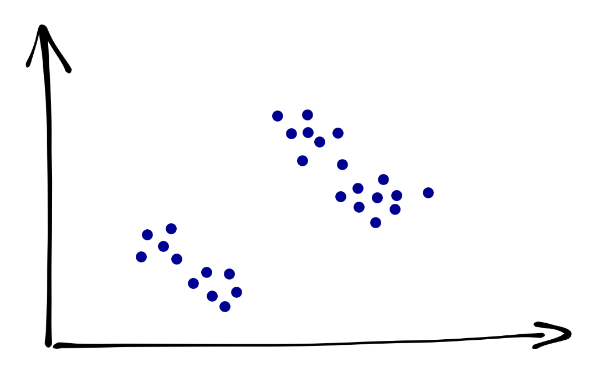
</center>

Сколько здесь кластеров? Кто-то скажет, что их три:

<center>
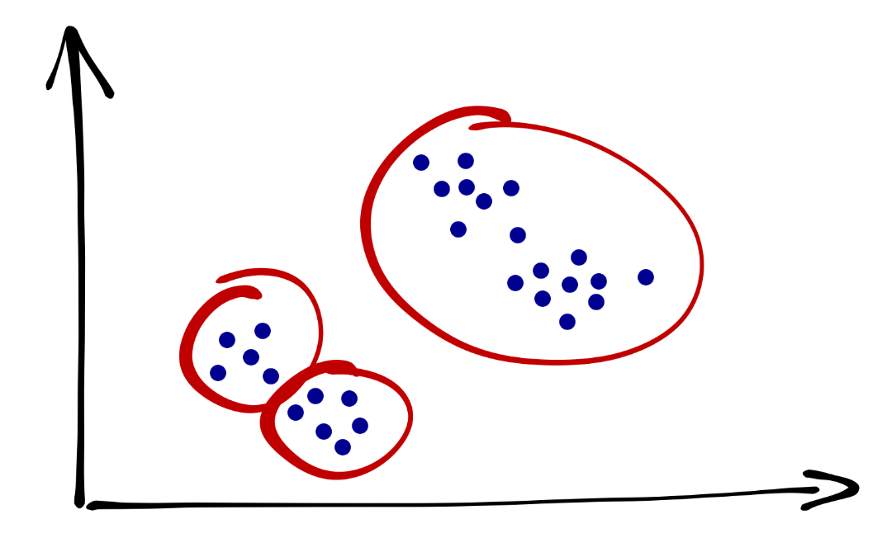
</center>

Кто-то скажет, что их четыре:

<center>
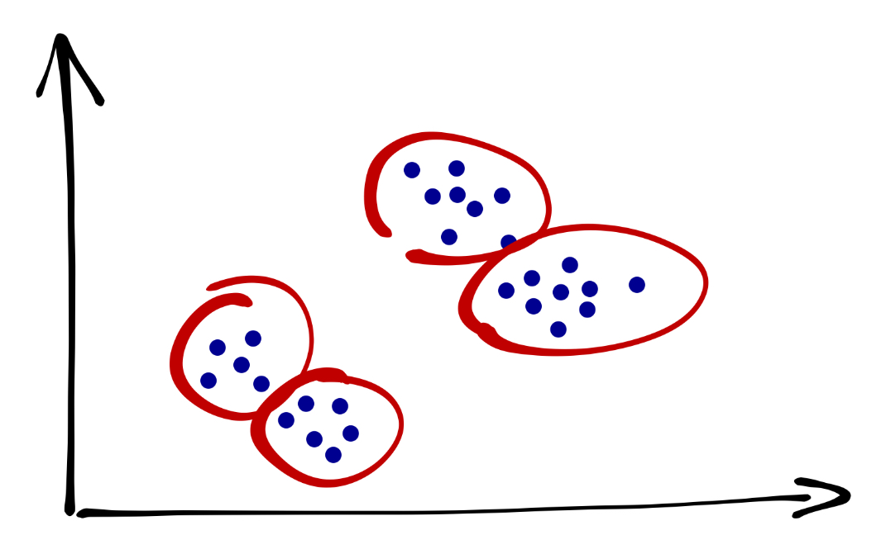
</center>

Кто-то скажет, что их всё же три, но выглядят они по-другому:

<center>
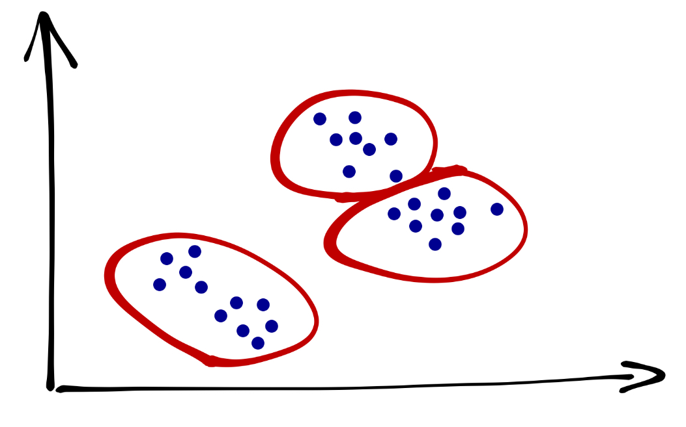
</center>

Что мы здесь наблюдаем? Проблему. **Разные методы кластеризации могут давать разные результаты.** Какой из них верный? Неясно… так как истинная группировка данных нам неизвестна. Но мы будем пытаться как-то выживать в ситуаций такой неопределённости.


### Расстояние между объектами

Обратим внимание на следующий важный момент. Мы оперируем терминами «близко» и «далеко» --- но как мы определаем расстояние между объектами? Рассмотрим самые популярные и важные для нас варианты.

#### Евклидово расстояние

С одним из них мы знакомы ещё со школы --- это **евклидово расстояние между точками**. По смыслу это длина отрезка, соединяющего две точки. Оно определяется как корень из суммы квадратов покоординатных разностей. Пусть у нас есть две точки --- $(x_1, x_2, \dots, x_p)$ и $(y_1, y_2, \dots, y_p)$. Евклидово расстояние будет определяться по формуле:

$$
d_{\text{Eucl}, XY} = \sqrt{\sum_{j=1}^p (x_j - y_j)^2}
$$

Иногда также используется **квадрат евклидова расстояния**[^1].

[^1]: Хотя математически эта метрика не является расстоянием, так как может нарушаться неравенство треугольника. Однако для задач кластерного анализа это не имеет большого значения.


#### Манхэттеновское расстояние

Оно же **блок-расстояние** или **расстояние таксиста**. Представим славный российский город Санкт-Петербург, где, как известно, улицы организованы вот так:

<center>
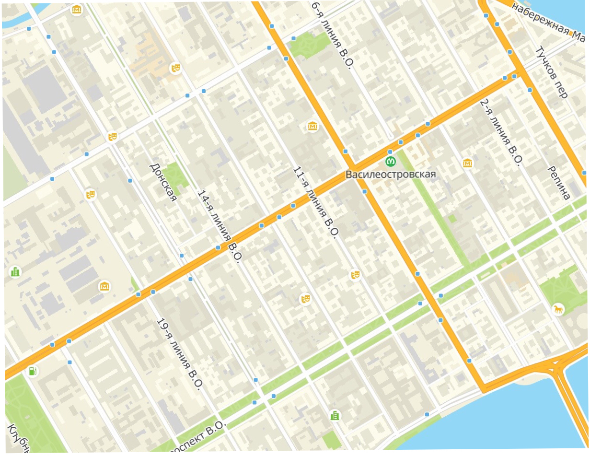
</center>

Какое расстояние проедет таксист из точки $A$ в точки $B$?

<center>
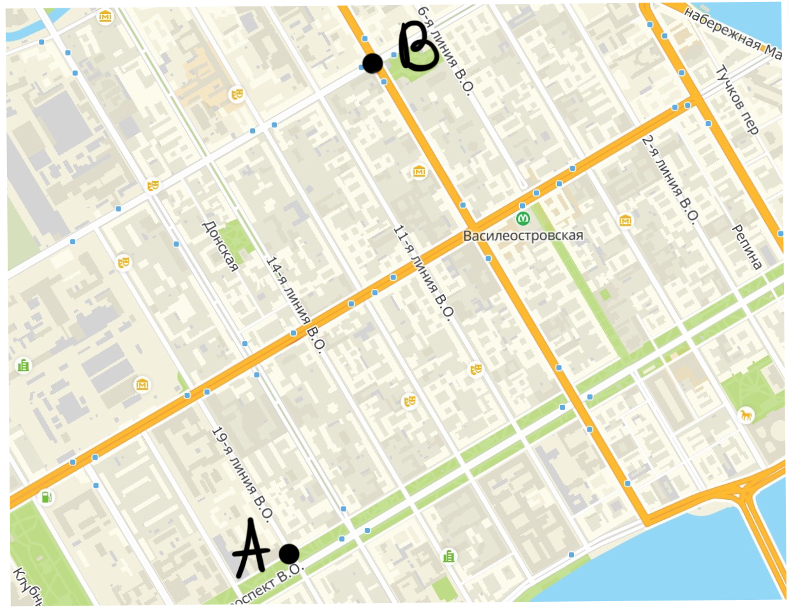
</center>

Правильно, вот такое[^3]:

[^3]: Заметьте, что в *количестве кварталов* все расстояния равны.

<center>
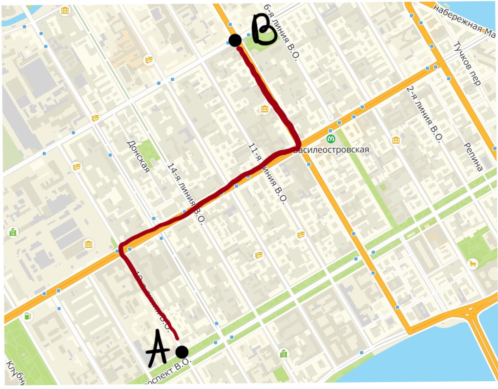
</center>

Схожая логика может быть использована и при расчёте расстояния между точками[^2]:

[^2]: Заметьте, что длина всех траекторий также будет одинакова.

<center>
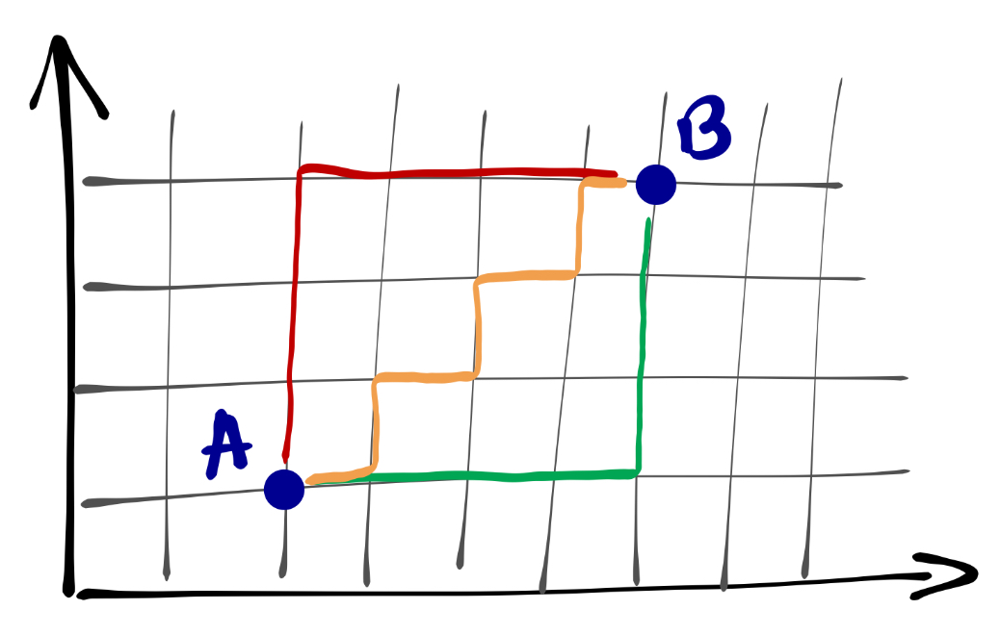
</center>

Математически это будет определено так:

$$
d_{\text{Manh}, XY} = \sum_{j=1}^p |x_j - y_j|
$$


#### Евклид vs Манхэттен

Когда какое расстояние выбирать? Здесь два важных момента.

Первый --- *математический*. Как и в случае с дисперсией, мы возводим покоординатные разности в квадрат. Если переменные измерены в различных единицах, то вклад одной из них в суммарное расстояние может быть значительно выше, чем других. По этой причине необходимо принять решение: **является ли большая разница значений по одной из переменных достаточным основанием для отнесения наблюдений к различным кластерам?** Если да, то можно использовать такое расстояние, если нет, то либо необходима стандартизация переменных, либо использование расстояния Манхэттен.

Второй --- *измерительный*. Если переменные, по которым вы кластеризуете наблюдения, непрерывные, то можно использовать евклидово расстояние. Если переменные дискретные, то более логичным вариантом будет манхэттеновское расстояние.


#### Другие виды расстояний

Отметим, что есть и другие виды расстояний, когда мы работает не с числовыми объектами. Например, мы можем пытаться кластеризовать слова --- задача непростая, но её можно пытаться решить. Например, с помощью расстояний Хэмминга или Левенштейна. Для более специфичных объектов могут понадобиться и более изощрённые метрики расстояний. Да и вообще «никакое время, потраченное на раздумья, какое расстояние выбрать, не будет потрачено зря»[^4].

[^4]: Вадим Аббакумов, лекция в Computer Science Center


### Проблема операционализации расстояния

Но вообще нам надо здесь поговорить ещё вот о чём: как вообще мы определяем, что есть расстояние между объектами? То есть как мы его операционализируем?

Например, мы хотим кластеризовать наших испытуемых на «эффективных решателей задачи» и «неэффективных решателей задачи». По каким параметрам мы это будем делать? Как вариант --- время решения и число ошибок в ходе решения. А как мы будем замерять эти переменные? Первую, видимо, в непрерывной шкале, вторую --- в дискретной. Далее будем решать вопрос о выборе конкретной метрики расстояния.

Хорошо, а как нам кластеризовать менеджеров на «хороших», «плохих» и «средненьких продажников»? Можем использовать разные подходы: оценку 360, показатели KPI и т. д.

А как нам определять расстояние между сайтами? По каким показателям? Здесь вариантов ещё больше и всё зависит от конкретной аналитической задачи.

Это всё о чем? О том, что операционализировать расстояние не так-то просто и для разных задач расстояние между одними и теми же объектами может быть операционализировано по-разному.


### Субъективность кластерного анализа

Мы плавно подъехали к ещё одной проблеме-особенности. Какова роль аналитика в кластерном анализе? Достаточно велика:

* отбор переменных для анализа
  - какие переменные включать в анализ? все? или необходимо проводить отбор?
  - возможно наличие переменных, которые будут хорошо работать с точки зрения поиска схожих объектов, но это не то сходство, которое мы ищем
  - одни переменные могут быть косвенно заменены другими (уровень дохода --- профессия, образование, стаж работы)
  - «ковариаты» могут быть важны при формировании кластеров (число учащихся и учителей в школах)
  - правильный выбор переменных крайне важен
  - критерием при отборе переменных выступает ясность интерпретации полученного результата и «интуиция исследователя»
  
* метод стандартизации
  - качество кластеризации может зависит от выбранного метода стандартизации
  
* выбор метрики для расстояния между объектами
* выбор метрики для расстояния между кластерами
  - если кластеры выражены, то метрика не важна
  - если появляются кластеры сложной формы (например, ленточные), то всё становится сложнее

* [иногда] определение числа кластеров
* интерпретация результатов
  - результаты кластерного анализа нуждаются в интерпретации (если он не решает чисто техническую задачу сокращения размерности данных)
  - лучший результат кластеризации --- это тот, который вы смогли понять и проинтерпретировать


## Расстояние между кластерами

Хорошо, мы поговорили о том, как считать расстояние между объектами, но нам надо понять, насколько (не)похожи получившиеся группы объектов. Для этого придется считать расстояние между кластерами. Варинатов, как обычно, масса.

### Среднее невзвешенное расстояние

**Среднее невзвешенное рассрояние (Average linkage clustering)** определяется так:

* находим расстояния между всеми парами объектов двух кластеров
* усредняем их

<center>
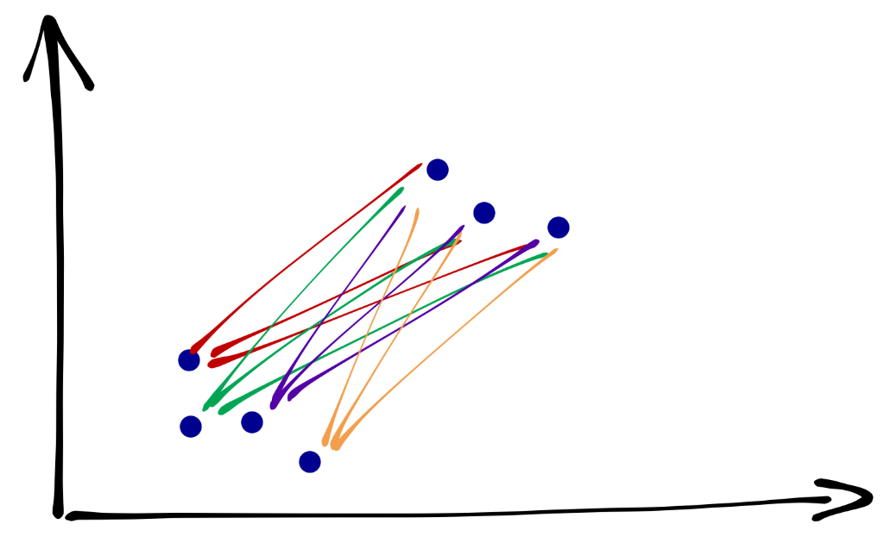
</center>


### Центроидный метод

Ранее был самым популярным из-за вычислительной простоты. Определяется расстояние между *центрами тяжести* двух кластеров:

<center>
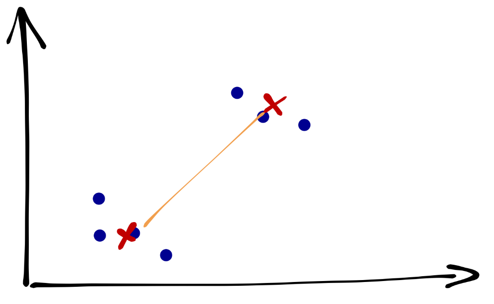
</center>

В настоящее время используется крайне мало.


### Метод дальнего соседа

Расстояние между кластерами определяется как расстояние между наиболее удалёнными объектами кластеров:

<center>
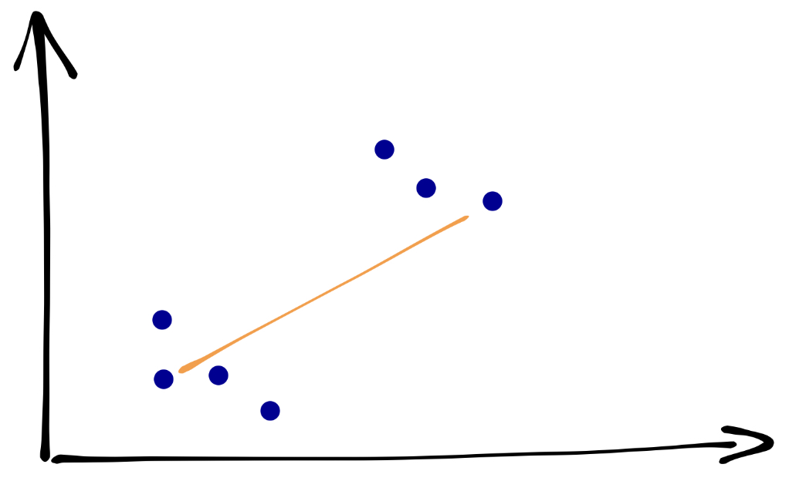
</center>


### Метод ближайшего соседа

Расстояние между кластерами определяется как расстояние между наиболее близкими объектами кластеров:

<center>
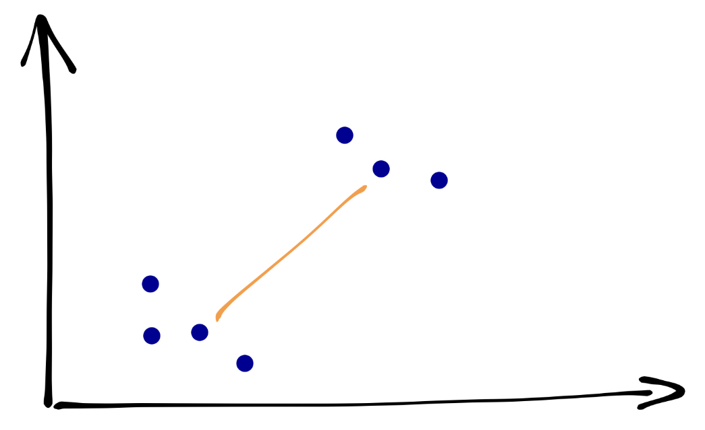
</center>

Хорошо работает с ленточными кластерами.

### Расстояние Sørensen---Dice

Довольно экзотичная метрика, но может быть полезна, например, при определии расстояний между сайтами:

$$
Q = \frac{2|A \cap B|}{|A| + |B|}
$$

Могут использоваться его модификации, например:

$$
Q = \frac{|A \cap B|}{|A| + |B| - |A \cap B|}
$$


## Иерархическая кластеризация

### Алгоритм иерархического кластерного анализа

1. Каждый объект объявляется кластером --- из $n$ наблюдений получается $n$ кластеров.
2. Выбираются два ближайших кластера --- они объединяются.
3. Выбираются два ближайших кластера --- они объединяются [2].
4. Выбираются два ближайших кластера --- они объединяются [3].
5. Так происходит до тех пор, пока не остается два кластера.
6. Оставшиеся два кластера являются ближайшими друг с другу --- поэтому объединяются в один.

Звучит, как какой-то сюр --- начали с $n$ кластеров по одному объекту, закончили один кластером, содержащим все объекты… Да, в таком исполнении, действительно, странная процедура. Однако если мы на каком-то этапе её прервём, то получим желаемый результат.

На каком этапе стоит остановиться? Когда расстояния между объединяемыми кластерами становится большим, так как большое расстояние говорит о том, что мы объединяем непохожие объекты.


### Дендрограмма

В иерархическом кластерном анализе есть удобный инструмент для определения момента, когда стоит остановиться в объединении кластеров. Он называется *дендрограмма*. По своей сути, это визуализация алгоритма иерархического кластерного анализа.

Принцип построения дендрограммы следующий:

1. На прямой располагаются все наблюдения как отдельные кластеры.
2. Каждому кластеру соответствует вертикальная линия.
3. Каждому объединению кластеров соответствует горизонтальная линия.
4. Высота, на которой кластеры соединяются, отражает расстояние между кластерами.

Разберемся с этим на примере.

<center>
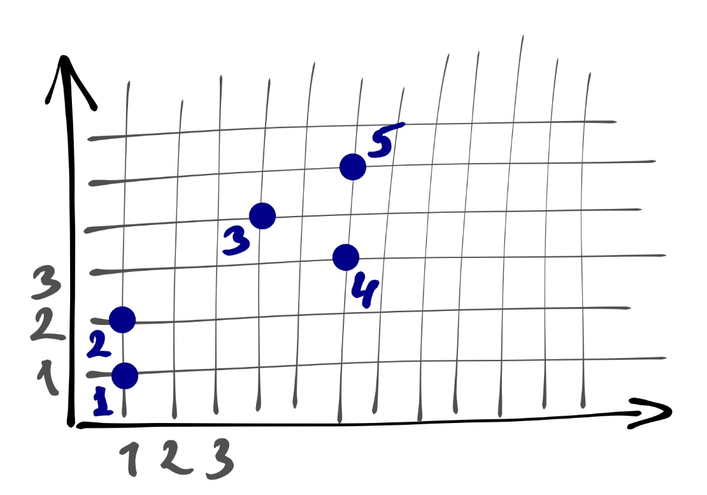
</center>

У нас есть пять наблюдений. Первоначально мы объявляем все их кластерами --- получаем пять кластеров. Договоримся, что расстояние между наблюдениями у нас манхэттеновское, а расстояние между кластерами --- среднее невзвешенное, ибо так проще считать. *[Итерация 1]* Далее ищем два ближайших --- это кластеры 1 и 2. Объединяем их. Оображаем это на дендрограмме --- соединяем линии 1 и 2 между собой на высоте 1, так как расстояние между объединяемым кластерами равно единице. Теперь у нас четыре кластера. *[Итерация 2]* Снова ищем два ближайших кластера --- это 4 и 5. Объединяем их на высоте 2, так как расстояние между ними равно двум. Остаётся три кластера. *[Итерация 3]* Снова ищем два ближайщих кластера --- на этот раз это 3 и 4-5. Объединяем их на высоте 3, так как расстояние между ними равно трём. *[Итерация 4]* Остаётся только два кластера --- соединяем их на каком-то большом расстоянии.

<center>
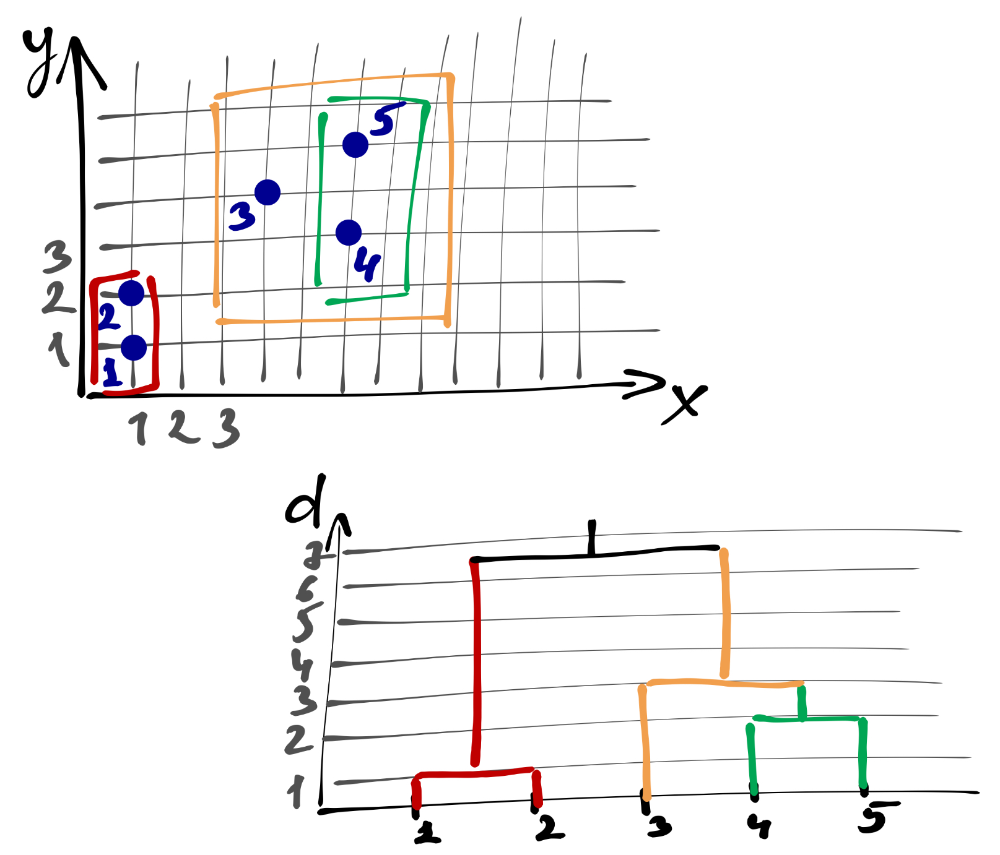
</center>

При анализе дендрограммя мы ищем *скачок расстояний*. Он обозначает момент, когда мы перешли к объединению непохожих (далёких друг от друга кластеров). Собственно, это и есть тот момент, когда необхожимо было прервать алгоритм и оставить те кластеры, которые образовались на текущий момент.


### Каменистая осыпь

Ещё один способ определить число кластеров --- это график «каменистая осыпь».

<center>
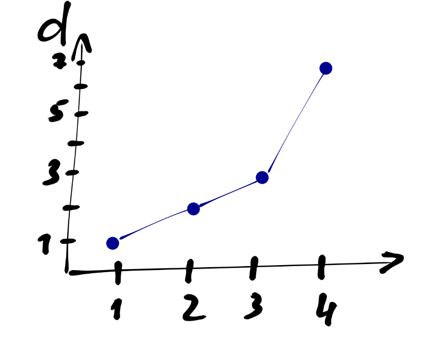
</center>

В данном случае по оси $x$ располагаются шаги объединения, по оси $y$ --- расстояние между кластерами в момент объединения. Как именно нам помогает такой график?

Мы видим, что сначала расстояние между объединяемыми кластерами растёт медленно, а затем происходит *излом* линнии, и после него расстояние начинает расти быстро. Это является указанием, что на шаге, где происходит излом линии, необходимо прервать процедуру объединения.


### Когда кластеризации нет?

Как вы понимаете, паттерны дендрограммы и каменистой осыпи могут быть крайне разнообразны в зависимости от того, что есть в данных. Однако главный момент, который нам говорит о том, что кластеризаци нет --- это отсутствие скачка расстояний на дендрограмме и/или отсутствие излома линии на графике «каменистая осыпь».


### Иерархическая кластеризация в R

#### Данные

Попробуем кластеризовать [менеджеров-продажников](https://github.com/angelgardt/hseuxlab-wlm2021/blob/master/book/wlm2021-book/data/cpi.xlsx?raw=true) на основе их характеристик. В данных есть несколько шкал (количественных) --- `Fx`, `Cs`, `Sy`, `Sp`, `In`, `Em`, `Re`, `Sc`, `Ie`, `Do`. По ним и будем пытаться поделить объекты на группы.

```{r}
library(tidyverse)
theme_set(theme_bw())
cpi <- readxl::read_xlsx('/Users/antonangelgardt/hseuxlab-wlm2021/data/cpi.xlsx')
str(cpi)
```

***

Иерархическая кластеризация проводится в R одной командой `hclust()`. Она хочет в себя несколько аргументов:

* матрицу расстояний --- она получается с помощью функции `dist()`, в которую необходимо передать датасет, содержащий переменные, по которым кластеризуются наблюдения
  - в функции `dist()` через аргумент `method` можно указать метрику расстояния между наблюдениями (`euclidean` --- по умолчанию, `manhattan` и др.)
* `method`, в который необходимо указать, как считается расстояние между крастерами (`single`, `complete`, `average` и др.)

Результат работы функции необходимо записать в объект. Попробуем несколько разных методов:

```{r}
d <- dist(cpi %>% select(-group, -prodazhi), method = 'manhattan')
hc.complete <- hclust(d, method = 'complete')
hc.average <- hclust(d, method = 'average')
hc.single <- hclust(d, method = 'single')
```

Визуализируем результаты с помощью дендрограммы:

```{r hc_complete}
plot(hc.complete)
```

```{r hc_average}
plot(hc.average)
```

```{r hc_single}
plot(hc.single)
```

Как можно наблюдать, разные методы дают значительно различающиеся результаты. Возьмем для работы результат, полученный методом `complete`.

Мы говорили выше, что алгоритм иерархического кластерного анализа необходимо остановить на каком-то этапе, чтобы получить осмысленный результат. Изучив дендрограмму, можно понять, что явного скачка в расстояниях не происходит, однако наибольшие расстояния встречаются где-то на уровне шести кластеров --- на этом варианте и остановимся.

Чтобы получить лейблы кластеров, необходимо «обрезать дерево» с помощью функции `cutree()`:

```{r}
cutree(hc.complete, 6)
```

Можно также нарисовать график каменистой осыпи. Для этого придется воспользоваться кастомной функцией, которая пользуется одно из метрик качества кластеризации --- [компактность кластеров](#cluster_cohesion):

```{r}
cstats.table <- function(dist, tree, k) {
  library(fpc)
  clust.assess <-
    c(
      "cluster.number",
      "n",
      "within.cluster.ss",
      "average.within",
      "average.between",
      "wb.ratio",
      "dunn2",
      "avg.silwidth"
    )
  clust.size <- c("cluster.size")
  stats.names <- c()
  row.clust <- c()
  output.stats <- matrix(ncol = k, nrow = length(clust.assess))
  cluster.sizes <- matrix(ncol = k, nrow = k)
  for (i in c(1:k)) {
    row.clust[i] <- paste("Cluster-", i, " size")
  }
  for (i in c(2:k)) {
    stats.names[i] <- paste("Test", i - 1)
    
    for (j in seq_along(clust.assess)) {
      output.stats[j, i] <-
        unlist(cluster.stats(d = dist, clustering = cutree(tree, k = i))[clust.assess])[j]
      
    }
    
    for (d in 1:k) {
      cluster.sizes[d, i] <-
        unlist(cluster.stats(d = dist, clustering = cutree(tree, k = i))[clust.size])[d]
      dim(cluster.sizes[d, i]) <- c(length(cluster.sizes[i]), 1)
      cluster.sizes[d, i]
      
    }
  }
  output.stats.df <- data.frame(output.stats)
  cluster.sizes <- data.frame(cluster.sizes)
  cluster.sizes[is.na(cluster.sizes)] <- 0
  rows.all <- c(clust.assess, row.clust)
  # rownames(output.stats.df) <- clust.assess
  output <- rbind(output.stats.df, cluster.sizes)[, -1]
  colnames(output) <- stats.names[2:k]
  rownames(output) <- rows.all
  is.num <- sapply(output, is.numeric)
  output[is.num] <- lapply(output[is.num], round, 2)
  output
}
```

```{r cache=TRUE}
# вычисляем данные для графика
clust.stats <-
  cstats.table(d, hc.complete, 15)
```

```{r elbow_hc_complete}
ggplot(data = data.frame(t(clust.stats)),
       aes(x = cluster.number, y = within.cluster.ss)) +
  geom_point() +
  geom_line() +
  ggtitle("Divisive clustering") +
  labs(x = "Num. of clusters", y = "Within clusters sum of squares (WSS)") +
  theme(plot.title = element_text(hjust = 0.5))
```

А вот по этому графику кластеров как будто 8… Хотя явного излома всё ещё не наблюдается…


#### Путь к интерпретации результатов кластеризации

Едва ли вам кто-то расскажет, как однозначно и правильно интерпретировать результаты кластерного анализа --- здесь у нас некоторый существенный простор для творчества. Один из вариантов --- опереться на данные, которые у нас уже умеются. Например, можно посмотреть взаимосвязи кластеров с переменными датасета. Вот несколько возможных графиков:

```{r hc1}
cpi %>% 
  ggplot(aes(Sp, Em, color = as_factor(cutree(hc.complete, 6)))) +
  geom_point() +
  theme(legend.position = 'bottom')
```

```{r hc2}
cpi %>% 
  ggplot(aes(Fx, Re, color = as_factor(cutree(hc.complete, 6)))) +
  geom_point() +
  theme(legend.position = 'bottom')
```


```{r hc3}
cpi %>% 
  ggplot(aes(Sy, Cs, color = as_factor(cutree(hc.complete, 6)))) +
  geom_point() +
  theme(legend.position = 'bottom')
```

На первых двух кластерах закономерностей на обнаруживается --- наблюдения всех кластеров распределены по плоскости более-менее случайно, а вот на третьем графике уже видна некоторая сегрегация, поэтому как первый шаг в интерпретации результатов можно взять содержание этих переменных. Далее можно идти по связям между переменными или, возможно, добавить неучтенную в кластеризации информацию, например по суммам продаж (`prodazhi`) и группе (`group`):

```{r hc4}
cpi %>% 
  ggplot(aes(prodazhi, as_factor(cutree(hc.complete, 6)),
             color = as_factor(group))) +
  geom_point() +
  theme(legend.position = 'bottom')
```


### Чем плох иерархический кластерный анализ?

У иерархического кластерного анализа практически нет недостатков, за исключением одного очень важного технического --- он требует, чтобы в оперативной памяти хранилась матрица попарных расстояний. Если у нас порядка ста объектов, то проблем никаких, а вот если объектов 100 000, уже возникают трудности. Невозможность работать с очень большими датасетами --- основная проблема этого вида кластерного анализа.


## k-means (метод k-средних)

### Алгоритм метода k-средних

Процедура кластерного анализа этим методом значительно отличается. 

1. Заранее определяется число кластеров $k$. Хотя вообще-то это невозможно, однако уже найдены способы, чтобы обойти это ограничение.
2. Для анализа выбирается $k$ точек --- центры кластеров.
3. Объект приписывается к тому кластеру, чей центр ближайший.
4. Центр кластера --- *центр тяжести* объектов кластера.
  - центр тяжести множества точек с координатами $(x_{i1}, x_{i2}, \dots, x_{ip})$ --- это точка с координатами $(\bar x_{1}, \bar x_{2}, \dots, \bar x_{p})$.
5. Повторяем поочерёдно пункты 3 и 4 до тех пор, пока центры кластеров не перестанут двигаться.


### Ограничения k-means

* Необходимо заранее определить число кластеров
* Используется только евклидово растояние
  - хотя этот недостаток исправляется в других модификациях метода
* Результат зависит от начальных центров кластеров


### Начальное положение кластеров

Если «бросать» центроиды совсем случайно, то это может привести к тому, что некоторые из них буду, например, слишком далеко от скопления точек --- в результате работы алгоритма образуются пустые кластеры. Это нехорошо, поэтому есть два наиболее популярных подхода.

*1. Forgy*
  - Случайным образом выбираются $k$ наблюдений. Они объявляются начальными центрами кластеров.

*2. Случайное разбиение (Random Partition)*
  - Каждое наблюдение случайным образом приписывается к одному из кластеров. Находятся центры тяжести кластеров. Они объявляются начальными центрами кластеров.


### k-means в R

Кластеризация методом k-means выполяется функцией --- внезапно --- `kmeans()`, которая просит в себя несколько аргументов:

* матрицу значений переменных, по которым проводится кластеризация;
* `centers` --- число кластеров;
* `iter.max` --- максимально число итераций; может быть увеличено, чтобы алгоритм сошёлся;
* `nstart` --- количество кластерных анализов, которое проводится с целью минимизации влияния начального положения центров кластеров.

Попробуем провести кластеризацию этим методом. Сколько взять кластеров? Пусть будет для начала самый простой вариант --- два кластера.

```{r}
km2 <- kmeans(cpi[-(11:12)], centers = 2)
```

Посмотрим, что получилось:

```{r}
str(km2)
```

Получившийся объект содержит много информации:
* `clusters` --- лейблы кластеров
* `centers` --- координаты центров кластеров (средние значения переменных по кластеру)
* `withinss` --- сумма квадратов расстояний от объектов кластера до центра кластера
* `tot.withinss` --- сумма элементов `withinss`
* `totss` --- сумма квадратов расстояний от объектов кластера до центра кластера для случая одного кластера
* `betweenss` = `totss` − `tot.withinss`
* `size` --- размеры кластеров (количество объектов)


Окей, мы разобрались, как работает функция, значит можем построить график «каменистая осыпь», чтобы определить «правильное» число кластеров.

```{r}
wss <- function(x, k) {
  wss <- numeric(k)
  names(wss) <- 1:k
  for (i in 2:k) {
    wss[i] <- kmeans(x, i)$tot.withinss
  }
  return(wss[-1])
}
```

```{r}
km_wss <- wss(cpi[-(11:12)], 15)
```

```{r km_elbow}
ggplot(NULL, aes(2:15, km_wss)) +
  geom_line() +
  geom_point() +
  labs(x = 'Number of Clusters',
       y = 'Within group sum of squares')
```

График в этот раз помог не сильно --- явного падения нет. Вывод, который здесь напрашивается --- кластеризации нет.


## Метрики качества кластеризации

Вообще оценка качества кластеризации --- задача крайне сложная и в строгом математическом смысле [невыполнимая](https://neerc.ifmo.ru/wiki/index.php?title=Кластеризация#.D0.A2.D0.B5.D0.BE.D1.80.D0.B5.D0.BC.D0.B0_.D0.BD.D0.B5.D0.B2.D0.BE.D0.B7.D0.BC.D0.BE.D0.B6.D0.BD.D0.BE.D1.81.D1.82.D0.B8_.D0.9A.D0.BB.D0.B5.D0.B9.D0.BD.D0.B1.D0.B5.D1.80.D0.B3.D0.B0). Однако [всякие разные метрики](https://neerc.ifmo.ru/wiki/index.php?title=Оценка_качества_в_задаче_кластеризации), которые позволяют приблизиться к такой оценки всё же были придуманы. Они делятся на *внешние* и *внутренние*. Мы рассмотрим наиболее простые.


### Внешние метрики

Внешние метрики используют дополнитльную информацию о кластеризуемом множестве объектов. Например, распределение объектов по кластерам. То есть, чтобы посчитать метрику, мы должны знать, как данные распределяются на кластеры перед тем, как будем проводить кластерный анализ.

Но зачем нам проводить кластерный анализ, если нам уже известны кластеры? Ведь это тогда не кластеры, а классы! И мы можем строить классификатор. Так-то оно, конечно, так --- и нам, аналитикам, эти метрики не очень интересны. Для разработчиков алгоритмов же они могут быть очень полезны.

Мы не будем на них останавливаться. Если хочется почитать и вникнуть, то [вот](https://neerc.ifmo.ru/wiki/index.php?title=Оценка_качества_в_задаче_кластеризации#.D0.92.D0.BD.D0.B5.D1.88.D0.BD.D0.B8.D0.B5_.D0.BC.D0.B5.D1.80.D1.8B_.D0.BE.D1.86.D0.B5.D0.BD.D0.BA.D0.B8_.D0.BA.D0.B0.D1.87.D0.B5.D1.81.D1.82.D0.B2.D0.B0).


### Внутренние метрики

Эти метрики не используют внешний информации о датасете, а опираются только на результаты кластеризации.


#### Компактность кластеров (cluster cohesion) {#cluster_cohesion}

Помним, что мы хотим собрать похожие наблюдения вместе, а похожие --- это те, которые располагаются близко друг к другу. Соответственно, разделение на кластеры тем лучше, чем ближе объекты кластера находятся к его центру. Поэтому необхожимо минимизировать внутрикластерное расстояние:

$$
WSS = \sum_{j=1}^k \sum_{i=1}^{|C_j|} (x_{ij} - \bar x_j)^2,
$$
где $k$ --- число кластеров, $|C_j|$ --- количество объектов в данном кластере.

Это самая популярная метрика качества кластеризации.


#### Отделимость кластеров (cluster separation)

Помним, что мы хотим собрать в разные кластеры непохожие друг на друга наблюдения --- это те, которые располагаются далеко друг от друга. Соответственно, чем дальше находятся друг от друга центры кластеров, тем лучше. Поэтому необхожимо максимизировать межкластерное расстояние:

$$
BSS = n \cdot \sum_{j=1}^k (\bar x_j - \bar x)^2,
$$
где $k$ --- число кластеров.

О других внутренних метриках кластеризации можно посмотреть [тут](https://neerc.ifmo.ru/wiki/index.php?title=Оценка_качества_в_задаче_кластеризации#.D0.92.D0.BD.D1.83.D1.82.D1.80.D0.B5.D0.BD.D0.BD.D0.B8.D0.B5_.D0.BC.D0.B5.D1.80.D1.8B_.D0.BE.D1.86.D0.B5.D0.BD.D0.BA.D0.B8_.D0.BA.D0.B0.D1.87.D0.B5.D1.81.D1.82.D0.B2.D0.B0).


```{r include=FALSE}
## Нечёткий кластерный анализ
```
