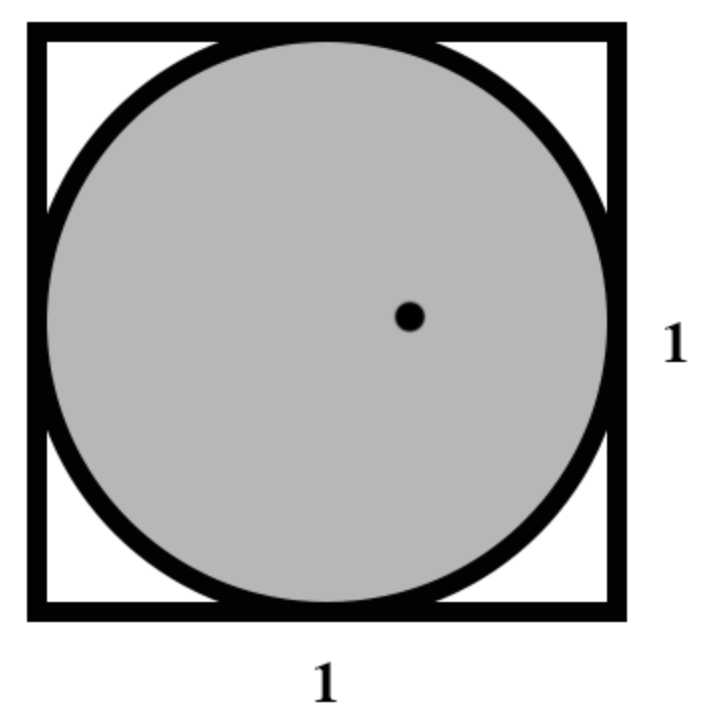
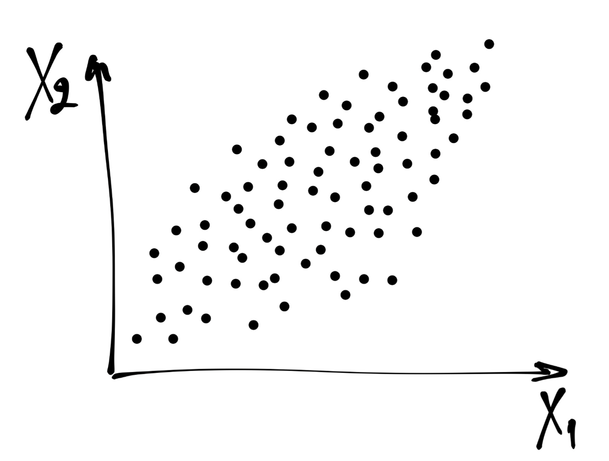
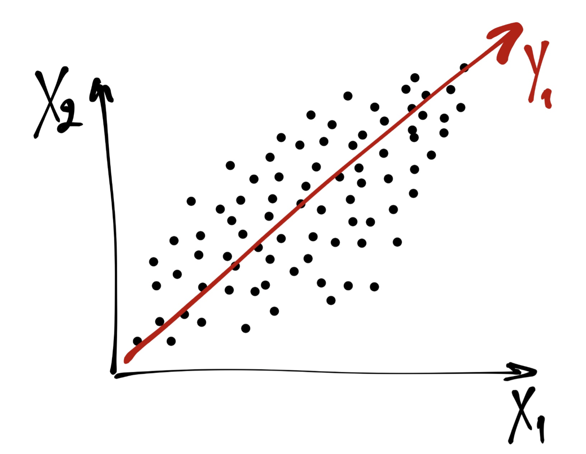
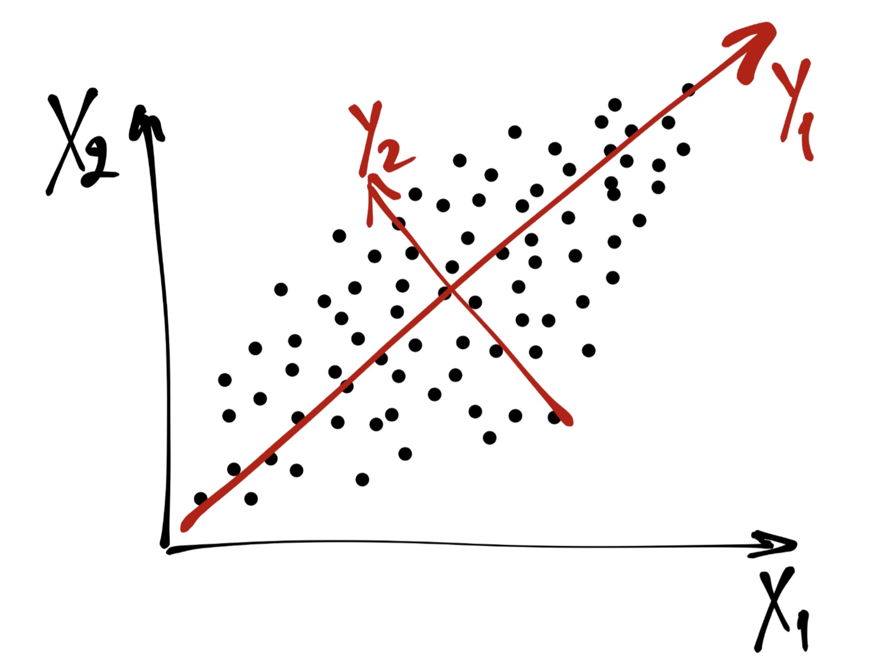
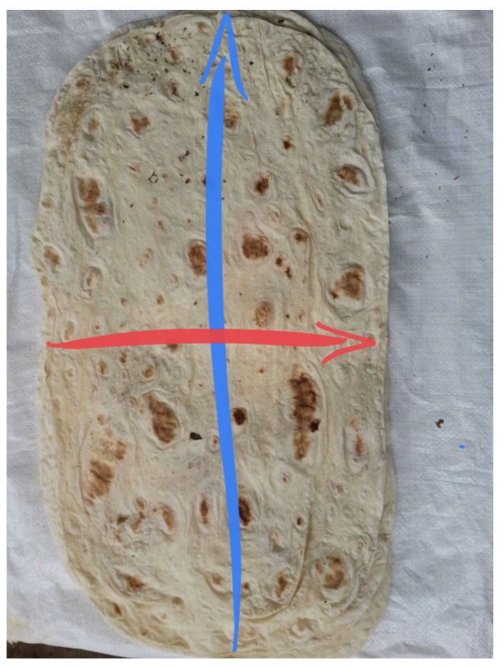

# Анализ главных компонент {#pca}

## Проклятие размерности (curse of dimensionality)

С данными могут случиться две проблемы: либо их слишком мало, либо их слищком много. С первой проблемой многие так или иначе сталкивались — во-первых, не достигается требуемая статистическая мощность анализа (мало наблюдений), во-вторых, упускаем какие-либо закономерности (мало переменных). А в чем может быть проблема, если данных много?


### Геометрическая вероятность

В единичный квадрат кидают точку. Какова вероятность, что она попадет во вписанный круг?

<center>

</center>

$$
p = \frac{S_{\text{circ}}}{S_{\text{sq}}} \\
p = \frac{\pi R^2}{1} = \pi \Big( \frac{1}{2} \Big)^2 = \frac{\pi}{4} \approx 0.79
$$

Окей, это для $\mathbb{R}^2$, то есть для пространства размерности два (оно же --- плоскость). Теперь рассмотрим ситуацию для $\mathbb{R}^3$, то есть для пространства размерности три.

$$
p = \frac{V_{\text{ball}}}{V_{\text{cube}}} \\
p = \frac{\frac{4}{3}\pi R^3}{1} = \frac{4}{3}\pi \Big( \frac{1}{2} \Big)^3 = \frac{4\pi}{24} \approx 0.52
$$

Хм, как-то маловато…

В общем случае, для $\mathbb{R}^k$ объем шара равен:

$$
k = 2n, \quad V = \frac{\pi^2}{n!}R^{2n} \\
k = 2n+1, \quad V = \frac{2\cdot(2\pi)^n}{(2n+1)!!} R^{2n+1}
$$

Можно аналитически доказать, что при $k \rightarrow \infty : V \rightarrow 0$.

***

То есть, говоря более осязаемо, места вне шара становится больше. Набирая переменных, мы делаем расстояния между точками больше, из-за объем выборки должен расти экспоненциально, чтобы сохранялась адекватная точность оценки параметров. Это и называется проклятием размерности.

Что делать? Снижать размерность.


## Факторный анализ vs анализ главных компонент

Так сложилось, что под термином «факторный анализ» часто смешиваются две вещи: *анализ главных компонент* и *собственно факторный анализ*. Кроме того, собственно факторный анализ также подразделяется на эксплораторный --- когда мы ищем факторы --- и конфирматорный --- когда у нас есть гипотеза о структуре факторов, и нам необходимо ее подтвердить..

Анализ главных компонент и факторный анализ различаются в своей математической модели, своей изначальной идеологии, но дают сходные результаты и решают сходные задачи.


## Задачи факторного анализа и анализа главных компонент

1. Сокращение числа переменных
2. Измерение неизмеримого (построение новых обобзеных показателей)
3. Наглядное представление многомерных наблюдений
4. Описание структуры взаимных связей между переменными
5. Преодоление мультиколлинеарности (в регрессионном анализе)
6. Заполнение пропущенных значений (при работе с разряженными матрицами)

и т.д.


## Математическая модель анализа главных компонент

\newcommand{\X}{\boldsymbol{X}}
\newcommand{\Y}{\boldsymbol{Y}}
\newcommand{\var}{\mathrm{var}}
\newcommand{\T}{\mathrm{T}}
\newcommand{\a}{\boldsymbol{a}}
\newcommand{\corr}{\mathrm{corr}}

Рассмотрим случайный вектор (матрицу) $(\X_1, \X_2, \dots, \X_k)$ ($\X_i$ --- некоторый столбец [числовых] данных). Мы хотим найти такую линейную комбинацию наших данных, у которой дисперсия максимальна. При это мы хотим домножать матрицу данных на вектор коэффициентов единичной длины, чтобы искусственно не раздувать дисперсию.

Формально,

$$
\Y_1 = a_{11} \X_1+ a_{12} \X_2 + \dots + a_{1k} \X_k \\
\var(\Y1) \rightarrow \max \\
\a_1 \a^\T_1=1, \quad \a_1 = (a_{11}, a_{12}, \dots, a_{1k})
$$

Далее, находим вторую линейную комбинацию наших данных с максимальной дисперсией, независимую (некоррелированную) с первой. Требования к вектору коэффициентов оставляем те же.

$$
\Y_2 = a_{21} \X_1 + a_{22} \X_2 + \dots + a_{2k} \X_{k} \\
\var(\Y_2) \rightarrow \max \\
\a_2 \a^T_2 = 1, \quad \a_2 = (a_{21}, a_{22}, \dots, a_{2k}) \\
\corr(\Y_2, \Y_1) = 0
$$

Далее, находим третью линейную комбинацию, аналогичную предыдущим и некоррелированную с ними.

$$
\Y_3 = a_{31} \X_1 + a_{32} \X_2 + \dots + a_{3k} \X_k \\
\var(\Y_3) \rightarrow \max \\
\a_3 \a^\T_3 = 1, \quad \a_3 = (a_{31}, a_{32}, \dots, a_{3k}) \\
\corr(\Y_3, \Y_1) = 0, \; \corr(\Y_3, \Y_2) = 0
$$

Так как у нас всего $k$ переменных, то мы можем найти $k$ таких линейных комбинаций.

В общем виде, они будут выглядеть следующим образом:

$$
\Y_k = a_{k1} \X_1 + a_{k2} \X_2 + \dots + a_{kk} X_k \\ \var(\Y_k) \rightarrow \max \\
\a_k \a^\T_k = 1, \quad \a_k=(a_{k1}, a_{k2}, \dots, a_{kk}) \\
∀0<i≤k \; \corr(\Y_k,\Y_i)=0
$$

Полученные $\Y_i$ и будут искомые главные компоненты --- наши новые оси, с помощью которых мы будем смотреть на данные и описывать их.

Если мы в качестве информативности компоненты используем её дисперсию, то можно сказать, что мы ищем наиболее информативные линейные комбинации. То есть, мы ищем некоторую «правильную систему координат».

Чтобы лучше понять, что все это значит, посмотрим на картинку.

<center>

</center>

Рассмотрим самый простой случай. Пусть у нас есть две переменные $(\X_1,\X_2)$ и мы подбираем их линейную комбинацию с наибольшей дисперсией. Графически это то же самое, что провести прямую $\Y_1$, то есть такую прямую, по которой наши данные будут максимально «растянуты».

<center>

</center>

Далее ищем вторую линейную комбинацию. Прицнип тот же: необходима прямая, по которой данные макисмально растянуты. Однако эта прямая должна быть перпендикулярная $\Y_1$, чтобы выполнялось условие $\corr(\Y_1,\Y_2) = 0$ (в двумерном пространстве отсутствие корреляции эквивалентно ортогональности).

<center>

</center>

Получаем что-то такое. Красные оси и есть наши главные компоненты. Их столько же, сколько изначально было переменных. Теперь мы можем рассматривать наши наблюдения относительно новой системы координат $\Y_1 O' \Y_2$.


## Сокращение размерности признакового пространства

Нуок, новые координаты мы нашли, но чё-то переменных, собственно, меньше не стало. А мы вообще-то хотели, чтобы осей стало поменьше.

Идея состоит в следующем. Представим лаваш в трехмерном пространстве. Координатные оси пройдут через оси эллипсоида. Если мы посмотрим на лаваш как на признаковое пространство, то обнаружим, что большая часть вариативности данных распределена по осям $x$ и $y$, а вариативность по оси $z$ можно отбросить, поскольку она мала и, по сути, примерно ошибка.

<ceter>

</center>

Короче, чтобы снизить размерность, мы собственными руками выбрасываем малоинформативные главные компоненты, то есть те, дисперсия которых мала.


## Реализация PCA в R

Грузим нужные пакеты:

```{r}
library(tidyverse)
library(corrplot)
theme_set(theme_bw())
```

Грузим данные:

```{r}
pizza <- read_csv('https://raw.githubusercontent.com/angelgardt/hseuxlab-andan/master/Pizza.csv')
```

```{r}
str(pizza)
```

Данные содержат следующие переменные:

* `brand` --- Pizza brand (class label)
* `id` --- Sample analysed
* `mois` --- Amount of water per 100 grams in the sample
* `prot` --- Amount of protein per 100 grams in the sample
* `fat` --- Amount of fat per 100 grams in the sample
* `ash` --- Amount of ash per 100 grams in the sample
* `sodium` --- Amount of sodium per 100 grams in the sample
* `carb` --- Amount of carbohydrates per 100 grams in the sample
* `cal` — Amount of calories per 100 grams in the sample

Поправляем данные:

```{r}
pizza %>% mutate(brand = as_factor(brand),
             id = as_factor(id)) %>% 
  select(-brand, -id) -> pizza2 # убираем номинативные переменные
```

Смотрим описательные статистики:

```{r}
summary(pizza2)
```

Отмечаем разницу единиц измерения переменных --- необходима стандартизация.

Смотрим разброс по переменным:

```{r}
apply(pizza2, 2, sd)
```

Разброс, ожидаемо, тоже различается — точно необходимо стандартизация.

Смотрим корреляции:

```{r}
round(cor(pizza2), 2)
```

Суперсильных корреляций нет, но есть достаточно высокие (по модулю) значения, что хорошо, поскольку нас интересует как раз дублирование информации.

Смотрим корреляции [2]:

```{r pca_correlations}
corrplot(cor(pizza2), diag = FALSE)
```

И еще разок:

```{r pca_cprrelations2}
GGally::ggpairs(pizza2)
```


Приступим собственно к PCA. Для этого есть команда `prcomp`:

```{r}
pca <- prcomp(pizza2, scale. = TRUE) # обязательно стандартизовать переменные
pca
```

Собственно в аутпуте есть все, что нам нужно — корелляционная матрица главных компонент и переменных и дисперсии главных компонент. Но можно дисперсии представить в более удобоваримом варианте:

```{r}
summary(pca)
```

Итак, нам будут нужны стандартные отклонения и cumulative proportion [of variance]. Как теперь отбросить компоненты?

Логический вариант следующий. Так как мы сдантартизовали переменные, то их дисперсии (стандартные отклонения) равны единице. Если дисперсия (стандартное отклонение) главной компоненты меньше единицы, значит она содержит информации меньше, чем исходная переменная, и её можно отбросить. То есть, в данно случае мы отбрасываем все компоненты, кроме $\text{PC1}$ и $\text{PC2}$.

Более аккуратный вариант, основанный на численных экспериментах, диктует нам правило, что нужно оставить все главные компоненты, дисперсия которых больше 0.8 (то есть стандартное отклонение больше 0.89).

Можно сделать визуализации:

```{r pca_elbow_variance}
ggplot(NULL, aes(names(summary(pca)$importance[2,]), summary(pca)$importance[2,])) +
  geom_point(size = 2) +
  geom_line(aes(group = 1)) +
  xlab('Principal components') + ylab('Variance Proportion')
```

```{r pca_elbow_cumulative}
ggplot(NULL, aes(names(summary(pca)$importance[3,]), summary(pca)$importance[3,])) +
  geom_point(size = 2) +
  geom_line(aes(group = 1)) +
  xlab('Principal components') + ylab('Cumulative Proportion')
```

Окей, мы сократили размерность. Как это использовать дальше? Нам нужны значения главных компонент. Их можно вытащить следующим образом:

```{r}
pca$x
```

Так мы вытаскиваем сами значения главных компонент для всех наблюдений. Их далее можем использовать, например, в регрессии.

А что еще можно сделать с самими результатами PCA? Можем посмотреть, как соотносятся категориальные переменные с главными компонентами.

```{r}
pizza_pca <- tibble(PC1 = pca$x[,1], PC2 = pca$x[,2], brand = pizza$brand)
```

```{r pca_clusters}
ggplot(pizza_pca, aes(PC1, PC2, color = brand)) +
  geom_point()
```

Вау! У нас тут даже явные кластеры нарисовались! А вот как бы это интерпретировать?

Здесь нам понадобиться матрица нагрузок (собственно, корреляционная матрица, которую мы видели в аутпуте PCA):

```{r}
pca$rotation[,1:2] # сразу вытащим только первые две компоненты
```

И поставим рядом описание переменных, чтобы было удобнее интерпретировать:

* `brand` --- Pizza brand (class label)
* `id` --- Sample analysed
* `mois` --- Amount of water per 100 grams in the sample
* `prot` --- Amount of protein per 100 grams in the sample
* `fat` --- Amount of fat per 100 grams in the sample
* `ash` --- Amount of ash per 100 grams in the sample
* `sodium` --- Amount of sodium per 100 grams in the sample
* `carb` --- Amount of carbohydrates per 100 grams in the sample
* `cal` --- Amount of calories per 100 grams in the sample

Компоненту мы интерпретируем исходя из того, с какими исходными переменными она коррелирует. Здесь нет никакой математики (ну, практически) --- только прошаренность в тематической области и немного воображения.

Один из вариантов интерпретации: $\text{PC1}$ --- пищевая ценность, $\text{PC2}$ --- энергетическая ценность. Можно придумать и другие, но хорошо бы чтобы они были осмысленные.

Ну, а теперь, понимая содержания компонент, можно и на предыдущую диаграмму рассеяния осмысленно посмотреть.
