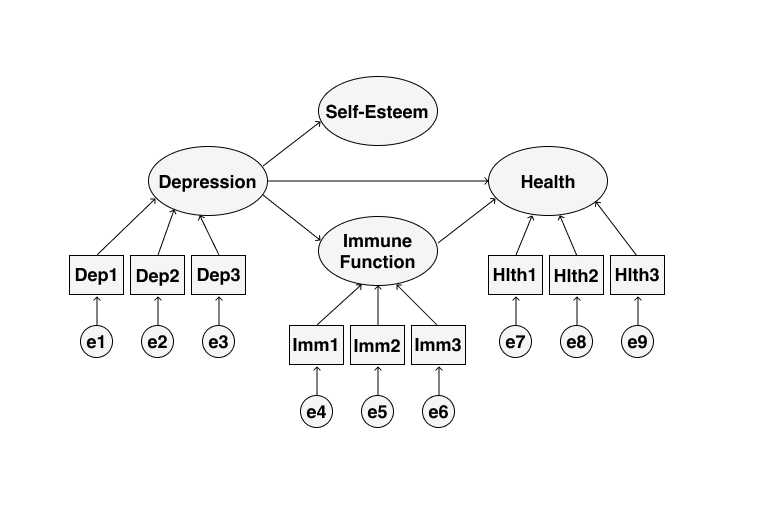
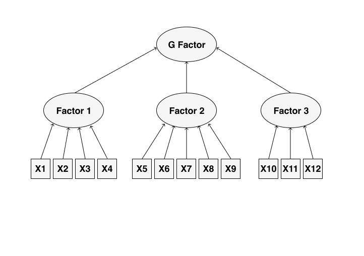
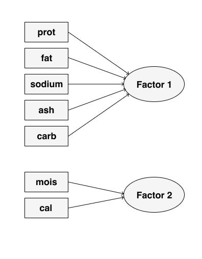

# Конфирматорный факторный анализ {#cfa}

## Экспресс-введение в структурное моделирование

<center>

</center>

Вспомним, кто мы… Мы же с вами исследователи из области социальных и/или гуманитарных наук. А чем мы богаты? Теоретическими моделями, на которых мы основываем наши исследования! А какая теоретическая модель хороша? Та, которая получила эмпирическое подтверждение![^1]

А как это?…

В предыдущей главе мы научились искать, факторы, скрытые за наблюдаемыми переменными --- это уже большой шаг. Однако недостаточный. И главное ограничение PCA и EFA --- это то, что мы ищем независимые факторы/главные компоненты, в то время как структура взаимосвязей между латентными переменными может быть гораздо сложнее. Кроме того, эти скрытые переменные могут предсказывать другие наблюдаемые переменные: например, уровень вовлеченности сотрудников [возможно] будет предсказывать выполнение KPI, что в свою очередь предсказывает заработную плату. То есть в данным случае мы движемся не от наблюдаемых переменных к латентным, а в обратном направлении. А ведь влияние одних латентных конструктов могут быть опосредованы другими… И в итоге получается что-то такое:

<center>

</center>

Короче, модель может быть сколь угодно сложна --- и надо её каким-то образом эмпирически проверять. Это позволяют делать **методы структурного моделирования (structural equation modelling, SEM)**.

Что это за методы? Это группа методов, которые проверять модели (гипотезы), описывающие наши данные. Проверка состоит из двух больших шагов:

* задание теоретической модели генерации данных;
* проверка того, насколько предложенная модель хорошо подходит под наши данные.

Но, если вдуматься, то так работают все статистические методы --- даже в линейной регрессии мы сначала задаём линейную модель, а потом проверяем, насколько хорошо она описывает взаимосвязи, представленные в данных. В чем же особенность SEM?

Во-первых, в модель включаются *латентные переменные* --- мы получаем возможность их моделировать и использовать для предсказаний. Этого не может делать, например, хорошо знакомая нам линейная регрессия, так как она работает только с наблюдаемыми переменными.

Во-вторых, в модель могут быть включены *косвенные связи* --- связи между латентными переменными. То есть мы можем моделировать связи между переменными, которые мы даже не можем измерить! Ну, круто же!

Кроме того, модели удобно визуализируются с помощью диаграмм, аналогично рисунку выше.

### Сколько нужно данных? {#how_much_data}

Есть мнение, что «структурное моделирование требует большого количества данных». Не очень понятно, что считать большим количеством, однако эвристика следующая: *на один оцениваемый параметр нужно не менее 10 наблюдений*. Выглядит как что-то приемлемое.

[^1]: Это, конечно, не единственный критерий, но сейчас для нас --- аналитиков --- самый важный.


## Модель конфирматорного факторного анализа

Окей, мы брифли взглянули на то, что такое структурное моделирование. Если мы возьмем от него только часть, то получим **конфирматорный факторый анализ (confirmatory factor analysis)**. Осталось понять, какую часть надо взять.

Наша задача --- проверить факторный структуру данных, которую мы взяли из теории или нашли с помощью эксплораторного факторного анализа. То есть, в общем виде что-то такое:

<center>

</center>

Выглядит уже не так страшно и запустанно.

Как это всё работает внутри? Сложно. Но, на самом деле, за всем стоит привычная нам множественная линейная регрессия и уже знакомый нам метод максимального правдоподобия, ведь мы всё ещё в рамках линейных моделей.

Чуть выше мы обсуждали, [сколько нужно данных](#how_much_data), и сказали, что «10 наблюдений на один параметр». Однако тактично умолчали, что есть такое параметр. Так вот *параметры* --- это, проще говоря, стрелочки на схеме выше. Это либо *факторный нагрузки*, так же как и в EFA, или *коэффициенты косвенных связей* между латентными переменными.

Конфирматорный факторный анализ в некотором смысле дополняет эксплораторный. Так, он позволяет уточнить и дополнить результаты последнего, а именно ответить на вопросы:

* пересекаются ли факторы? --- действительно ли каждый переменная обусловлена влиянием одного фактора?
* достоверны ли статистически факторные нагрузки?
* как коррелируют сами факторы и как это влияет на факторные нагрузки?
* отличается ли дисперсия фактора от нуля? --- ведь если нет, тогда этот фактор не информативен, то есть не дифференцирует респондентов

Итак, модель конфирматорного факторного анализа мы осознали. Пора писать код!


## CFA в R

### Данные

Продолжаем работать с данными про пиццу. Загрузим их, а также подключим необходимые библиотеки:

```{r}
library(tidyverse) # наш любимый
library(lavaan) # для структурного моделирования
library(semPlot) # для визуализаций 
```

```{r}
pizza <- read_csv('https://raw.githubusercontent.com/angelgardt/hseuxlab-andan/master/Pizza.csv')
```

По результатам конфирматорного факторного анализа у нас получилась следующая модель:

<center>

</center>

Её и будем проверять.


### Синтаксис пакета `lavaan`

Однако первоначально нам надо освоиться с пакетом `lavaan` (**la**ten **va**rible **an**alysis). Это самый популярный пакет для структурного моделирования, однако у него несколько специфический синтаксис.

В теоретической модели могут присутствовать различные типы связей:

* **измерения** --- связи от наблюдаемых переменных к латентным (наблюдаемые → латентные)
* **регрессии** --- связи от латентных переменны к наблюдаемым (латентные → наблюдаемые)
* и **корреляции** --- связи между наблюдаемыми и латентными переменными (наблюдаемые → наблюдаемые, латентные → латентные)

Для того, чтобы записать такую структуру модели был придуман специальный «язык», а вернее, обозначения:

|Измерения|Регрессии|Корреляции|
|:-:|:-:|:-:|
|`=~`|`~`|`~~`|

Для CFA нам необходимы только *измерения*, так как мы хотим проверить структуру измеритеьной факторной модели.

Модель в `lavaan` --- это одна строка, которая передается в функцию. Далее функции сами парсят строку так, как им надо.

Наша модель будет записываться так:

```{r}
mdl1 <- "F1 =~ prot + fat + sodium + ash + carb F2 =~ mois + cal"
```

Но это может быть не очень удобно, если модель сложная, поэтому есть вариант записать модель в файл, и считать её прямо из файла:

```{r}
mdl1 <- readLines("/Users/antonangelgardt/hseuxlab-wlm2021/book/wlm2021-book/data/mdl1.txt")
```

Теперь можно перейти к подбору модели.


### Подбор модели

Для конфирматорного факторного анализа в пакета `lavaan` предусмотрена функция `cfa()`, которая хочет на вход модель и данные. Попробуем:

```{r, warning=TRUE}
model1 <- cfa(mdl1, data = pizza)
```

```{r}
summary(model1)
```

### Оценка качества модели

### Визуализация результатов

