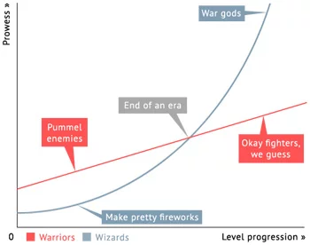

## Что такое R?

* «язык программирования для статистической обработки данных»
* а также
  + машинного обучения
  + data wrangling
  + написания сайтов
  + создания приложений
  + и др.


## Почему R?

* свободное ПО (часть [GNU Project](https://en.wikipedia.org/wiki/GNU_Project))
* динамично развивается
* громадные возможности расширения функционала
  + более 10 000 пакетов
  + открытый исходный код
  + возможность написать свои пакеты

## Почему R?

<center>

</center>
* большое сообщество по всему миру, много ресурсов для задавания вопросов
* [Linear Warriors vs Quadratic Wizards](https://1d4chan.org/wiki/Linear_Warriors,_Quadratic_Wizards)
    - в SPSS (и другие GUI пакеты) ниже порог вхождения, но развитие навыков --- линейное
    - в R порог вхождения выше, но впоследствии случается резкий буст
* [репродуцируемость](https://en.wikipedia.org/wiki/Reproducibility_Project) результатов

## R vs Python

<center>

</center>


## Установка R и RStudio

* Сначала **R**
  + на [Windows](https://cran.r-project.org/bin/windows/base/)
  + на [Mac](https://cran.r-project.org/bin/macosx/)
  + на [Linux](https://cran.rstudio.com/bin/linux/)
* Затем [**RStudio**](https://www.rstudio.com/products/rstudio/download/)

Если что-то не установилось или вы предпочитаете облачные сервисы, то можно работать через браузер в [RStudio Cloud](https://rstudio.cloud/).


## Ресурсы

* [Google](https://google.com)
* [Stack Overflow](https://stackoverflow.com/)
* [Stack Overflow на русском](https://ru.stackoverflow.com/)
* [Cookbook for R](http://www.cookbook-r.com/)
* [RStudio Community](https://community.rstudio.com/)
* [R-bloggers](https://www.r-bloggers.com/)
* [Хабр про R](https://habr.com/ru/hub/r/)
* …

# Типы данных

## `numeric`

- числа всех видов и сортов

```{r}
2 + 3; 3 - 5
6 * 8; 12 / 6
```

## `numeric`

```{r}
sqrt(25)
log(8)
exp(1)
```


## `numeric`

### `float` (`double`)

```{r}
typeof(3)
```

### `integer`

```{r}
class(3)
class(3L)
```

## `numeric`

### `complex`

```{r}
x <- 3 + 2i; y <- -7 - 1i
```
```{r}
x - y; x + y; x * y; x / y
```

## `logical` (`boolean`, `bool`)

- допустимые значения `TRUE` и `FALSE`

```{r}
3 < 2; 5 >= 1; 4 == 4; 6 != 8
```

## `logical`

```{r}
TRUE & TRUE; TRUE & FALSE; FALSE & FALSE
```
```{r}
TRUE | TRUE; TRUE | FALSE; FALSE | FALSE
```

## `character` (`string`)

```{r}
class("type smth here")
```


## `factor`

```{r, include=FALSE}
x <- as.factor(sample(x = c("Greek", "Latin", "Cyrillic"), size = 10, replace = TRUE))
```
```{r}
class(x)
x
```


# Структуры данных

## `vector`

- *упорядоченный* набор
- элементов *одного типа*

```{r}
x <- c(1,3,5,7)
x
x[1]; x[2]; x[1:3]
```


## `matrix`

```{r}
m1 <- matrix(x, nrow = 2)
m2 <- matrix(x, ncol = 1)
m1; m2
```

## `matrix`

```{r}
m1[2]
m1[1,2]
```

## `arrays`

```{r}
array(1:12, c(3,2,2))
```

## `list`

- позволяет объединять различные типы данных в один объект

```{r}
l <- list(sequence = 1:10, grthan4 = 1:10 > 4, lable = 'spisok')
l
```

## `list`

```{r}
l[1]
l[[2]]
l$lable
```


## `dataframe`

- `matrix` + `list` = `dataframe`
- привычная «таблица»
- столбцы --- вектора

```{r}
d <- data.frame(id = 1:10,
                sex = rep(c("f", "m"), time = 5),
                score = sample(0:5, 10, replace = TRUE))
head(d)
```


## `dataframe`

```{r}
d[1]
```

## `dataframe`

```{r}
d[[2]]
```

```{r}
d$score
```

```{r}
d[7,]
```

# The end