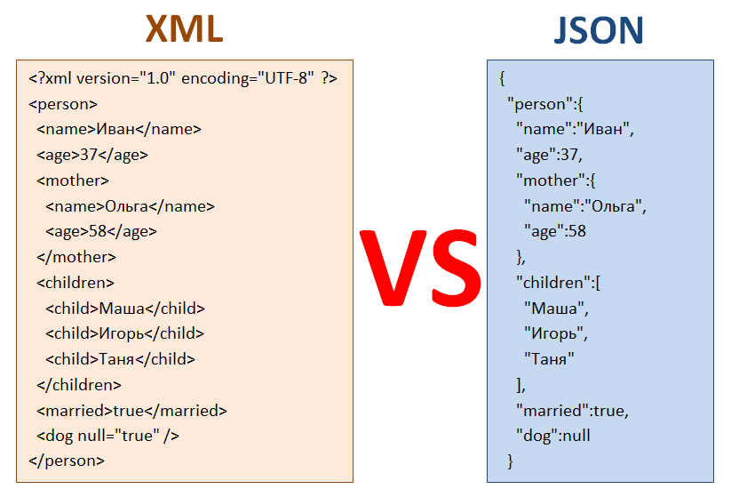
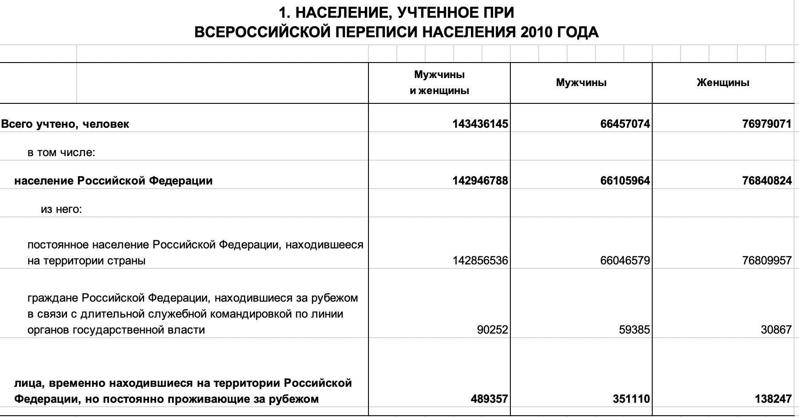
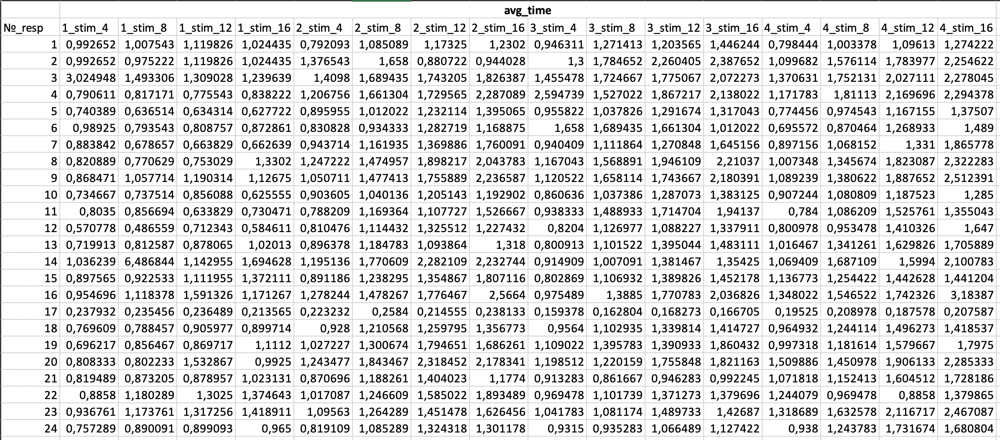
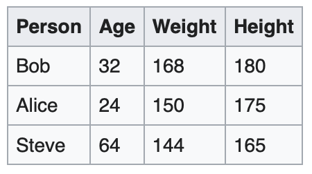
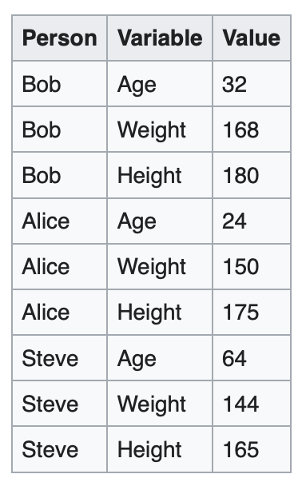

# Форматы данных


## Текстовые форматы

- `.txt`, `.tsv`, `.csv`
- важны разделители столбцов, строк, а также десятичные разделители
- они могут быть любыми

```{r, eval=FALSE}
read.table(file, sep, dec, quote, encoding, stringsAsFactors)
read.tsv()
read.csv()
read.csv2()
```


## Табличные форматы

- `.xls`, `.xlsx`

```{r, eval=FALSE}
readxl::read_excel(file, sheet)
```


## Формат данных других статистических программ

- `.sav`

```{r, eval=FALSE}
foreign::read.spss(file, use.value.labels, to.data.frame)
```

## Форматы данных с особой разметкой

- `.json`, `.xml`

<center>

</center>


# Tidy data

## Подготовка данных

- 80% анализа данных --- это предобработка данных (data tidying)
- «все упорядоченные наборы данных похожи друг на друга, каждый беспорядочный набор данных беспорядочен по-своему» [©](https://habr.com/ru/post/248741/)


## «Опрятные» данные

- [чаще всего] данные --- это таблицы из *строк* и *столбцов*
- данные содержат определенные *значения* (качественные или количественные)
- каждая строка --- одно *наблюдение*
- каждый столбец --- одна *переменная*

## Примеры «неопрятных» данных

<center>

</center>

## Примеры «неопрятных» данных

<center>

</center>


# Манипуляции с данными

## `tydyverse`

- семейство пакетов
- позволяют удобно манипулировать с данными в ходе предобработки
- имеют несколько особый синтаксис

```{r, message=FALSE}
library(tidyverse)
sum(2, 3)
2 %>% sum(3)
```

## Сабсет данных

- `filter()` фильтрация (сабсет) данных по определенному условию
- `slice()` извлечение строк по индексам
- `select()` извлечение определённых колонок


## Сортировка 

- `sort()` сортирует вектор
- `arrange()` сортирует весь датасет по определенной переменной (по дефолту --- по возрастанию)
- `desc()` указывает на сортировку по убыванию


## Уникальные значения и уникальные сочетания

- `unique()` извлекает уникальные значения по вектору
- `distinct()` извлекается уникальные значения по вектору, а также уникальные сочетания значений

## Создание новых переменных

- `mutate()` создает новые переменные и добавляет их в имеющийся датафрейм
- `transmute()` создает новые переменные, удаляя при этом старые

## Группировка датасета

- `group_by()` группирует датасет
- `ungroup()` убирает группировку

## Аггрегация данных

- `summarize()` аггрегирует данные

## Широкий и длинный формат


<center>

</center>

<center>

</center>

## Широкий и длинный формат

- `pivot_longer()` приводит данные к длинному формату
- `pivot_wider()` приводит данные к широкому формату


# The end
