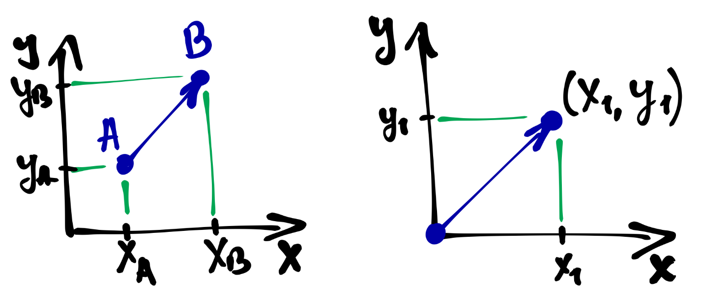
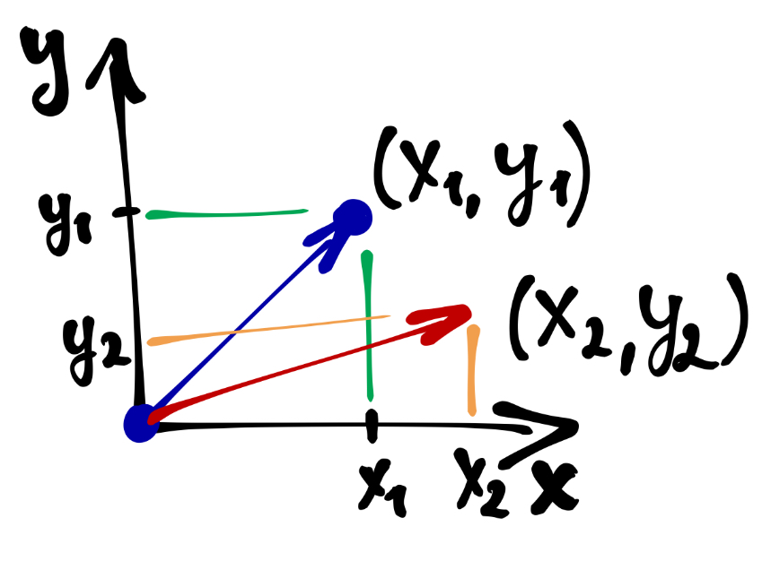
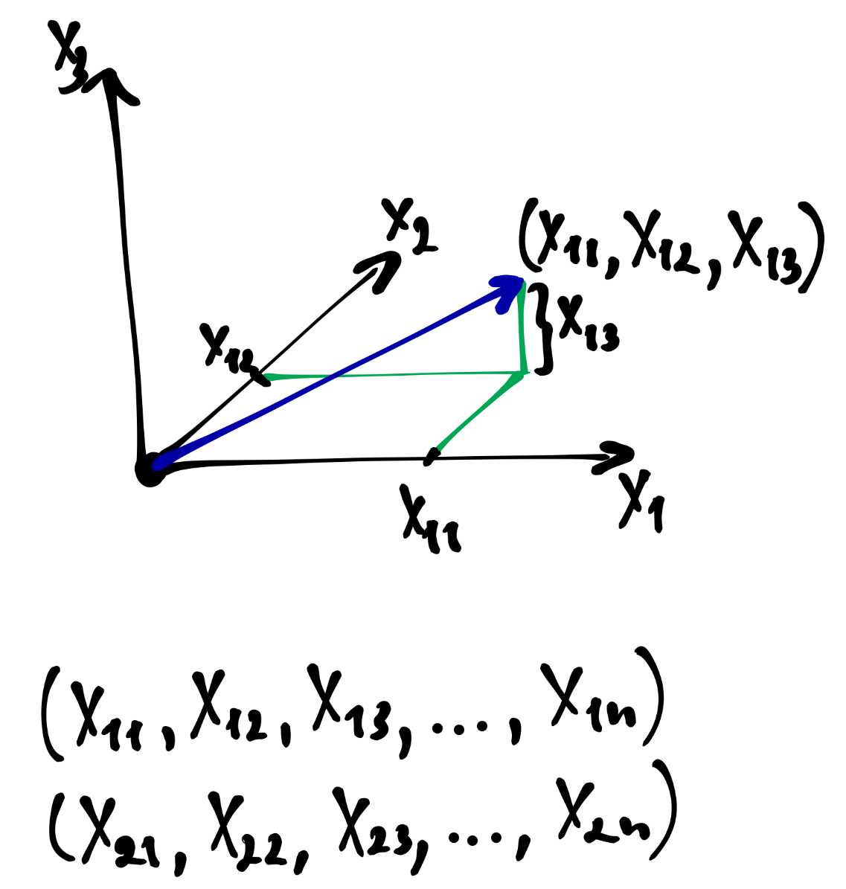

\newcommand{\A}{\pmb{A}}
\newcommand{\B}{\pmb{B}}
\newcommand{\C}{\pmb{C}}
\newcommand{\E}{\pmb{E}}
\newcommand{\I}{\pmb{I}}
\newcommand{\O}{\pmb{O}}
\newcommand{\x}{\pmb{x}}
\newcommand{\a}{\pmb{a}}
\newcommand{\b}{\pmb{b}}
\newcommand{\c}{\pmb{c}}
\newcommand{\T}{\mathrm{T}}


# Матрицы

## Что такое матрица?

> «Увы, невозможно объяснить, что такое матрица. Ты должен увидеть это сам.» <br>
*Морфеус (Матрица, 1999)*

$$
\A = 
\begin{pmatrix}
1 & 6 & 11 \\
2 & 7 & 13 \\
3 & 8 & 15 \\
4 & 9 & 18 \\
5 & 0 & 19
\end{pmatrix}
$$

## Откуда берутся матрицы?

- cистема из $n$ линейных уравнений относительно $m$ неизвестных

$$
\begin{cases}a_{11}x_1 + a_{12}x_2 + \ldots + a_{1m}x_m = b_1
\\a_{21}x_1 + a_{22}x_2 + \ldots + a_{2m}x_m = b_2
\\ \dots \dots \dots \dots \dots \dots \dots \dots \dots \dots
\\a_{n1}x_1 + a_{n2}x_2 + \ldots + a_{nm}x_m = b_n
\end{cases}
$$

## Матричный вид

$$
\A \x = \b,
$$
где
$$
\A =
\begin{pmatrix}
a_{11} & a_{12} & \dots & a_{1m} \\
a_{21} & a_{22} & \dots & a_{2m} \\
\vdots & \vdots & \ddots & \vdots \\
a_{n1} & a_{n2} & \dots & a_{nm}
\end{pmatrix} ; \quad 
\x = \begin{pmatrix}
x_1 \\
x_2 \\
\vdots \\
x_m
\end{pmatrix} ; \quad
\b = \begin{pmatrix}
b_1 \\
b_2 \\
\vdots \\
b_n
\end{pmatrix}
$$

$\A$ --- матрица коэффициентов системы, $\x$ --- вектор неизвестных, $\b$ --- вектор свободных членов.


# Векторы

## Направленный отрезок vs набор чисел

<center>
 <br>

</center>

## Многомерный вектор

<center>

</center>


# Действия с матрицами

## Сложение матриц

$$
\A_{n×m} + \B_{n×m} = 
\begin{pmatrix}
a_{11} + b_{11} & a_{12} + b_{12} & \dots & a_{1m} + b_{1m} \\
a_{21} + b_{21} & a_{22} + b_{22} & \dots & a_{2m} + b_{2m} \\
\vdots & \vdots & \ddots & \vdots \\
a_{n1} + b_{n1} & a_{n2} + b_{n2} & \dots & a_{nm} + b_{nm}
\end{pmatrix}
$$

**Свойства сложения матриц:**

1) $\A + \B = \B + \A$ (коммутативность)
2) $(\A + \B) + \C = \A+ (\B + \C)$ (ассоциативность)
3) $\A + \O = \A$ (существование нулевого элемента)
4) $\A + (-\A) = \O$ (существование противоположного элемента)


## Умножение матрицы на число 

$$
\lambda \A = \begin{pmatrix}
\lambda a_{11} & \lambda a_{12} & \dots & \lambda a_{1m} \\
\lambda a_{21} & \lambda a_{22} & \dots & \lambda a_{2m} \\
\vdots & \vdots & \ddots & \vdots \\
\lambda a_{n1} & \lambda a_{n2} & \dots & \lambda a_{nm}
\end{pmatrix}, \; \forall \lambda \in \mathbb{R}
$$

**Свойства умножения матрицы на число:**

1) $1 \cdot \A = \A$
2) $-1 \cdot \A = -\A$
3) $\lambda(\mu \A) = (\lambda \mu) \A$ (ассоциативность)
4) $(\lambda + \mu) \A = \lambda \A + \mu \A$ (дистрибутивность)
5) $\lambda (\A + \B) = \lambda \A + \lambda \B$ (дистрибутивность)


## Скалярное произведение векторов

$$
\a = \begin{pmatrix} a_1 & a_2 & \dots & a_n \end{pmatrix} \\
\b = \begin{pmatrix} b_1 & b_2 & \dots & b_n \end{pmatrix}\\
$$
$$
\a \cdot \b = a_1 b_1 + a_2 b_2 + \dots + a_n b_n = \sum_{i=1}^n a_i b_i
$$

```{r}
a <- 1:10; b <- 10:1
a %*% b
```


## Произведение матриц (матричное умножение)

$$
\A = 
\begin{pmatrix}
\a_1 \\
\a_2 \\
\vdots \\
\a_n
\end{pmatrix} = 
\begin{pmatrix}
a_{11} & a_{12} & \dots & a_{1k} \\
a_{21} & a_{22} & \dots & a_{2k} \\
\vdots & \vdots & \ddots & \vdots \\
a_{n1} & a_{n2} & \dots & a_{nk}
\end{pmatrix}, \\
\B = 
\begin{pmatrix}
\b_1 & \b_2 & \dots \b_m
\end{pmatrix} = 
\begin{pmatrix}
b_{11} & b_{12} & \dots & b_{1m} \\
b_{21} & b_{22} & \dots & b_{2m} \\
\vdots & \vdots & \ddots & \vdots \\
b_{k1} & b_{k2} & \dots & b_{km}
\end{pmatrix}
$$

## Произведение матриц

$$
\A \times \B = 
\begin{pmatrix}
\a_1 \cdot \b_1 & \a_1 \cdot \b_2 & \dots & \a_1 \cdot \b_m \\
\a_2 \cdot \b_1 & \a_2 \cdot \b_2 & \dots & \a_2 \cdot \b_m \\
\vdots & \vdots & \ddots & \vdots \\
\a_n \cdot \b_1 & \a_n \cdot \b_2 & \dots & \a_n \cdot \b_m \\
\end{pmatrix} =
$$

## Произведение матриц
$$ = 
\begin{pmatrix}
c_{11} & c_{12} & \dots & c_{1m} \\
c_{21} & c_{22} & \dots & c_{2m} \\
\vdots & \vdots & \ddots & \vdots \\
c_{n1} & c_{n2} & \dots & c_{nm}
\end{pmatrix} = \C
$$

$$
c_{ij} = \sum_{t=1}^k a_{it} b_{tj}
$$

## Произведение матриц

**Cвойства произведения матриц:**

1) $\A (\B \C) = (\A \B) \C$ (ассоциативность)
2) $\lambda (\A \B) = (\lambda \A) \B = (\lambda \B) \A$ (ассоциативность)
3) $\A (\B + \C) = \A \B + \A \C$ (дистрибутивность)
4) $(\A + \B) \C = \A \C + \B \C$ (дистрибутивность)
5) $\A \B \neq \B \A$ (отсутствие коммутативности)
6) $\E \A = \A; \, \A \E = \A$ (умножение на единичный элемент)
7) $\O \A = \O; \, \A \O = \O$ (умножение на нулевой элемент)
8) $\A \A^{-1} = \A^{-1} \A = \E$ (умножение на обратную матрицу --- *только для некоторых квадратных матриц*)

## Замечательные матрицы

$$
\E = \I = \begin{pmatrix}
1 & 0 & \dots & 0 \\
0 & 1 & \dots & 0 \\
\vdots & \vdots & \ddots & \vdots \\
0 & 0 & \dots & 1
\end{pmatrix} ; \quad
\O = \begin{pmatrix}
0 & 0 & \dots & 0 \\
0 & 0 & \dots & 0 \\
\vdots & \vdots & \ddots & \vdots \\
0 & 0 & \dots & 0
\end{pmatrix}
$$

## Транспонирование матрицы

$$
\A = 
\begin{pmatrix}
\a_1 \\
\a_2 \\
\vdots \\
\a_n
\end{pmatrix} = 
\begin{pmatrix}
a_{11} & a_{12} & \dots & a_{1k} \\
a_{21} & a_{22} & \dots & a_{2k} \\
\vdots & \vdots & \ddots & \vdots \\
a_{n1} & a_{n2} & \dots & a_{nk}
\end{pmatrix}
$$

$$
\A^\T =
\begin{pmatrix}
\a_1 & \a_2 & \dots & \a_n
\end{pmatrix} = 
\begin{pmatrix}
a_{11} & a_{21} & \dots & a_{n1} \\
a_{12} & a_{22} & \dots & a_{n2} \\
\vdots & \vdots & \ddots & \vdots \\
a_{1k} & a_{2k} & \dots & a_{nk}
\end{pmatrix}
$$

## Детерминант матрицы и обратная матрица

$$
\A_{n×n} \times \A^{-1}_{n×n} = \E_{n×n}
$$

$$
\det A_{n×n} \neq 0 \Rightarrow \exists \, A^{-1}_{n×n} \\
\det A_{n×n} = 0 \Rightarrow \nexists \, A^{-1}_{n×n}
$$

Одним из условий *вырожденности матрицы* является линейная зависимость строк или столбцов.


## Детерминант матрицы и обратная матрица в R

```{r}
A <- matrix(sample(1:10, 9, replace = TRUE), nrow = 3)
det(A)
solve(A)
```

# The end