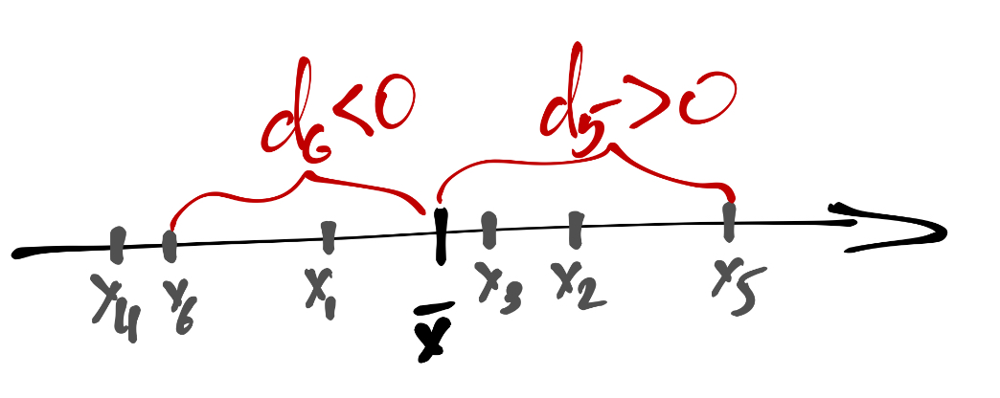
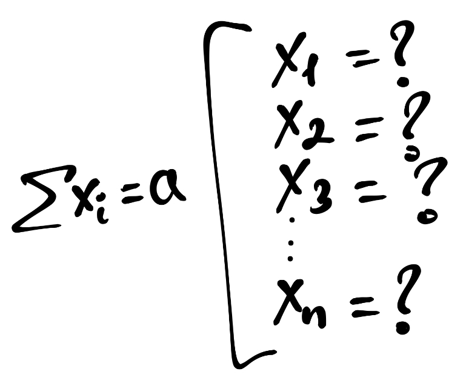
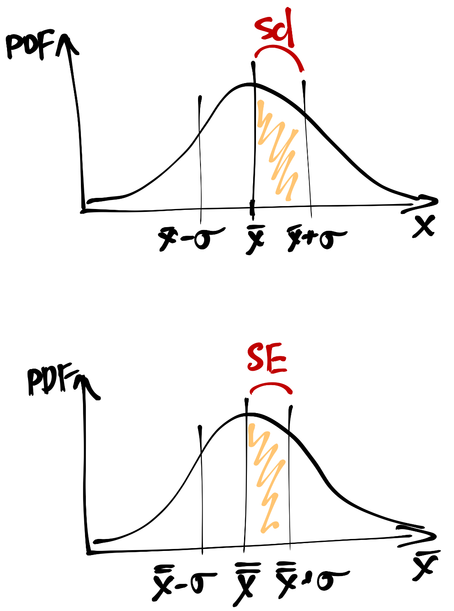
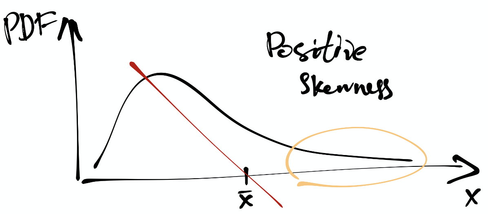
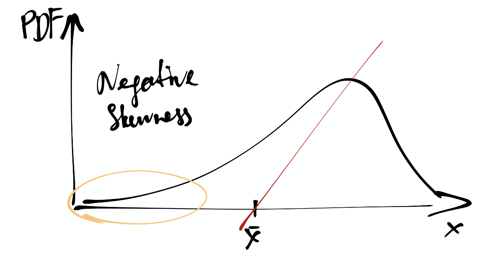
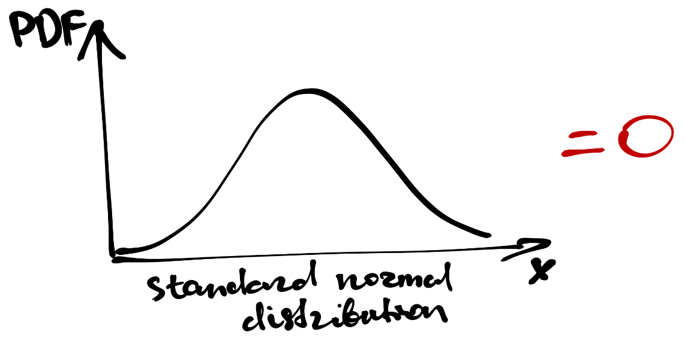
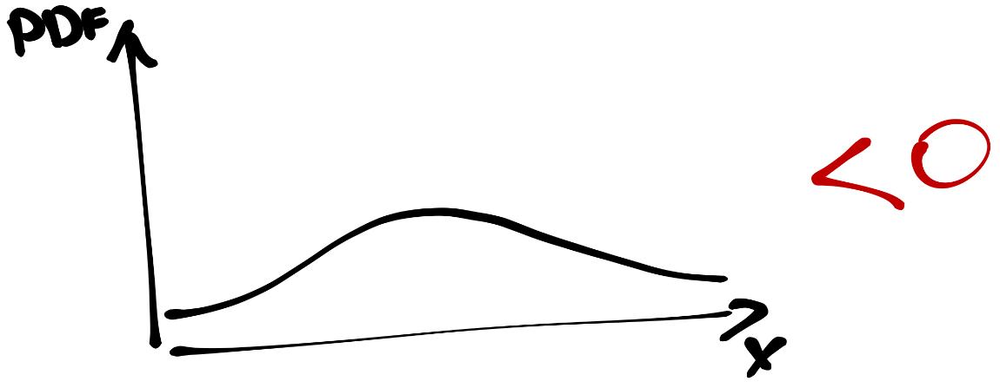
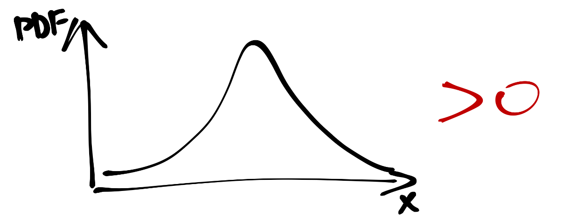

```{r setup, include=FALSE}
knitr::opts_chunk$set(echo = FALSE)
library(tidyverse)
theme_set(theme_bw())
```

## Описательная статистика
**Описательные статистики** --- обобщенные статистики, количественно описывающие особенности имеющихся данных.

**Описательная статистика** --- области статистики, занимающаяся обработкой статистических данных, их наглядным представлением, и собственно описанием через описательные статистики.


## Зачем нужны описательные статистики?

- ёмко описать имеющиеся данные
- составить на основе этих описаний общее представление о них
- обнаружить особенности, которые могут повлиять на дальнейший анализ


# Меры центральной тенденции

## Мода

- наиболее часто встречающееся значение данной переменной

$$
\mathrm{mode}(X) = \max(\mathrm{PMF}(X))
$$

$$
X = [1,1,4,5,2,4,3,4,3,3,3,4,3,5]
$$

```{r}
x <- c(1,1,4,5,2,4,3,4,3,3,3,4,3,5)
table(x)
```

## Мода

<center>
```{r}
as_tibble(table(x)) %>% 
  ggplot(aes(x, n/sum(n))) +
  geom_point() +
  annotate('text', x = 3, y = 0.35, label = 'Мода', color = 'blue') +
  xlab('X') + ylab('PMF(X)')
```
</center>

## Медиана

- значение, которые располягается на середине сортированного вектора значений переменной
- второй квартиль

$$
\mathrm{median} = \begin{cases}
X(\frac{n+1}{2}), & \text{ if } n \text{ is odd},\\
\dfrac{X(\frac{n}{2}) + X(\frac{n}{2}+1)}{2}, & \text{ otherwise}
\end{cases}
$$

$$
X_{\text{sort}} = [\underbrace{1,1,2,3,3,3,3}_{50\%},\underbrace{3,4,4,4,4,5,5}_{50\%}]\\
\text{median}(X) = \frac{3+3}{2}=3
$$


## Арифметическое среднее

$$
\bar x = \frac{x_1 + x_2 + \dots + x_n}{n} = \frac{\sum_{i=1}^{n}x_i}{n},
$$

## Мода vs медиана vs арифметрическое среднее

<center>
```{r, echo=FALSE}
# mode function
mode <- function(x) {
  values <- sort(unique(x))
  freqs <- tabulate(x)
  which(freqs == max(freqs))
}
```
```{r}
set.seed(220)
symm <- sample(
  x = seq(1, 10, 0.5),
  size = 200,
  replace = TRUE,
  prob = c(
    .05,
    .05,
    .07,
    .1,
    .1,
    .15,
    .20,
    .30,
    .35,
    .5,
    .35,
    .30,
    .20,
    .15,
    .1,
    .1,
    .07,
    .05,
    .05
  )
)
asymm <- sample(
  x = seq(1, 10, 0.5),
  size = 200,
  replace = TRUE,
  prob = c(
    .1,
    .2,
    .25,
    .4,
    .5,
    .5,
    .4,
    .35,
    .3,
    .25,
    .2,
    .25,
    .2,
    .15,
    .1,
    .1,
    .07,
    .05,
    .05
  )
)
ggplot(NULL) +
  geom_density(aes(symm)) +
  geom_density(aes(asymm), linetype = 'dashed') +
  geom_vline(xintercept = mean(symm), color = 'darkred') +
  geom_vline(xintercept = median(symm), color = 'darkblue') +
  geom_vline(xintercept = mode(symm), color = 'darkgreen') +
  geom_vline(xintercept = mean(asymm), color = 'darkred', linetype = 'dashed') +
  geom_vline(xintercept = median(asymm), color = 'darkblue', linetype = 'dashed') +
  geom_vline(xintercept = mode(asymm), color = 'darkgreen', linetype = 'dashed') +
  labs(x = 'Value',
       y = 'Density')
```
</center>

<center style="margin-top: -2%;">
<div style="display:inline-block; margin-right: 1%; color: #7f170e; font-size: 12px;">mean</div>
<div style="display:inline-block; margin-right: 1%; color: #000d85; font-size: 12px;">median</div>
<div style="display:inline-block; color: #2a6218; font-size: 12px;">mode</div>
</center>


## Усеченное и межквартильное среднее

### Усеченное среднее

- отбросить по 2.5% наблюдений с обеих стороны сортированного вектора (низких и высоких)
- вычислить среднее по оставшимся

### Межквартильное среднее
$$
X_{\mathrm{IQM}} = \frac{2}{n} \sum_{i=\frac{n}{4}+1}^{\frac{3n}{4}} x_i
$$

## Усеченное и межквартильное среднее

<center>
```{r}
set.seed(220)
symm <- sample(
  x = seq(1, 10, 0.5),
  size = 200,
  replace = TRUE,
  prob = c(
    .05,
    .05,
    .07,
    .1,
    .1,
    .15,
    .20,
    .30,
    .35,
    .5,
    .35,
    .30,
    .20,
    .15,
    .1,
    .1,
    .07,
    .05,
    .05
  )
)
asymm <- sample(
  x = seq(1, 10, 0.5),
  size = 200,
  replace = TRUE,
  prob = c(
    .1,
    .2,
    .25,
    .4,
    .5,
    .5,
    .4,
    .35,
    .3,
    .25,
    .2,
    .25,
    .2,
    .15,
    .1,
    .1,
    .07,
    .05,
    .05
  )
)
ggplot(NULL) +
  geom_density(aes(symm)) +
  geom_density(aes(asymm), linetype = 'dashed') +
  geom_vline(xintercept = mean(symm), color = 'dimgray') +
  # geom_vline(xintercept = median(symm), color = 'darkblue') +
  # geom_vline(xintercept = mode(symm), color = 'darkgreen') +
  geom_vline(xintercept = mean(symm, trim = 0.25), color = 'darkred') +
  geom_vline(xintercept = mean(symm, trim = 0.025), color = 'darkblue') +
  geom_vline(xintercept = mean(asymm), color = 'dimgray', linetype = 'dashed') +
  # geom_vline(xintercept = median(asymm), color = 'darkblue', linetype = 'dashed') +
  # geom_vline(xintercept = mode(asymm), color = 'darkgreen', linetype = 'dashed') +
  geom_vline(xintercept = mean(asymm, trim = 0.25), color = 'darkred', linetype = 'dashed') +
  geom_vline(xintercept = mean(asymm, trim = 0.025), color = 'darkblue', linetype = 'dashed') +
  labs(x = 'Value',
       y = 'Density')
```
</center>

<center style="margin-top: -2%;">
<div style="display:inline-block; margin-right: 1%; color: #696969; font-size: 12px;">mean</div>
<div style="display:inline-block; margin-right: 1%; color: #000d85; font-size: 12px;">trimmed mean</div>
<div style="display:inline-block; color: #7f170e; font-size: 12px;">IQM</div>
</center>

## Геометрическое среднее

$$
G_{X} = \sqrt[n]{x_1 \cdot x_2 \cdot \dots \cdot x_n} = \sqrt[n]{\prod_{i=1}^n x_i} = \Big(\prod_{i=1}^n x_i\Big)^{\tfrac{1}{n}}
$$

## Гармоническое среднее

$$
H_X = \frac{n}{\tfrac{1}{x_1} + \tfrac{1}{x_2} + \dots + \tfrac{1}{x_n}} = \frac{n}{\sum_{i=1}^n \tfrac{1}{x_i}}
$$

## Квадратичное среднее

$$
X_{\mathrm{RMS}} = \sqrt{\frac{\sum_{i=1}^n x_i^2}{n}}
$$

## Взвешенное среднее
- $x_i$ --- некоторый параметр
- $w_i$ --- его вес в суммарном балле ($w_i \in \mathbb{R}^+$)

$$
\bar x = \frac{\sum_{i=1}^n w_i x_i}{\sum_{i=1}^n w_i} = \sum_{i=1}^n w_i' x_i
$$


# Меры разброса

## Минимум, максимум, размах
$$
\mathrm{range}(X) = \max(X) - \min(X)
$$


## Дисперсия
### Отклонение

$$
d_i = \bar x - x_i
$$

<center>

</center>

$$
\sum_{i=1}^n d_i \approx 0
$$

## Дисперсия

### Среднее отклонение

$$
\bar d = \frac{\sum_{i=1}^n (\bar x - x_i)}{n} \approx 0
$$

### Сумма квадратов

$$
\mathrm{SS}(X) = \sum_{i=1}^n (\bar x - x_i)^2
$$


## Степени свободы

Сколько нужно сделать измерений, чтобы узнать все значения на выборке, если известно среднее?

<center>

</center>

$n-1$ --- число «степеней свободы»


## Генеральная и выборочная дисперсии

### Генеральная (смещённая) дисперсия
$$
\sigma^2 = \frac{\sum_{i=1}^n (\bar x - x_i)^2}{n}
$$

### Выборочная (несмещённая, исправленная) дисперсия
$$
s^2 = \frac{\sum_{i=1}^n (\bar x - x_i)^2}{\mathrm{df}} = \frac{\sum_{i=1}^n (\bar x - x_i)^2}{n-1}
$$


## Стандартное отклонение

- возвращаемся к исходным единицам измерения

$$
\sigma = \sqrt{\sigma^2}
$$

$$
\mathrm{sd}(X) = s = \sqrt{s}
$$

## Стандартная ошибка

<center>

</center>

$$
\mathrm{se}(X) = \frac{\mathrm{sd}(X)}{\sqrt{n}}
$$

# Форма распределения
## Асимметрия

$$
\text{skew}(X) = \frac{m_3}{s^3} = \frac{\frac{1}{n} \sum_{i=1}^n (\bar x - x_i)^3}{\big(\frac{1}{n-1} \sum_{i=1}^n (\bar x - x_i)^2\big)^{3/2}}
$$
<br>

<center>


</center>

## Эксцесс

$$
\text{kurt}(X) = \frac{m_4}{s^4} - 3 = \frac{\frac{1}{n} \sum_{i=1}^n (\bar x - x_i)^4}{\big(\frac{1}{n-1} \sum_{i=1}^n (\bar x - x_i)^2\big)^2} - 3
$$
<br>

<center>




</center>


# The end