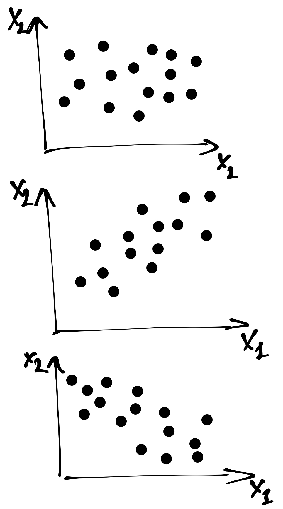
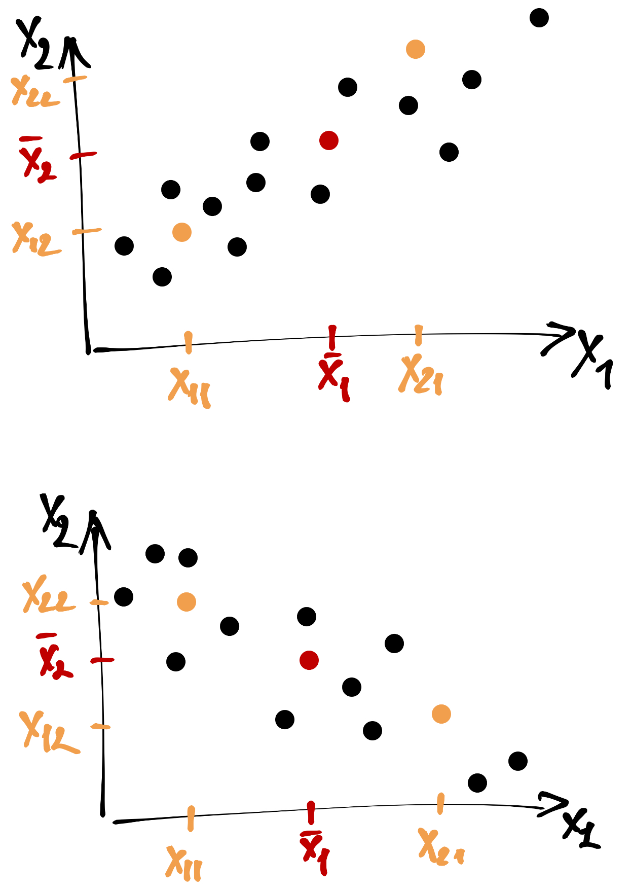
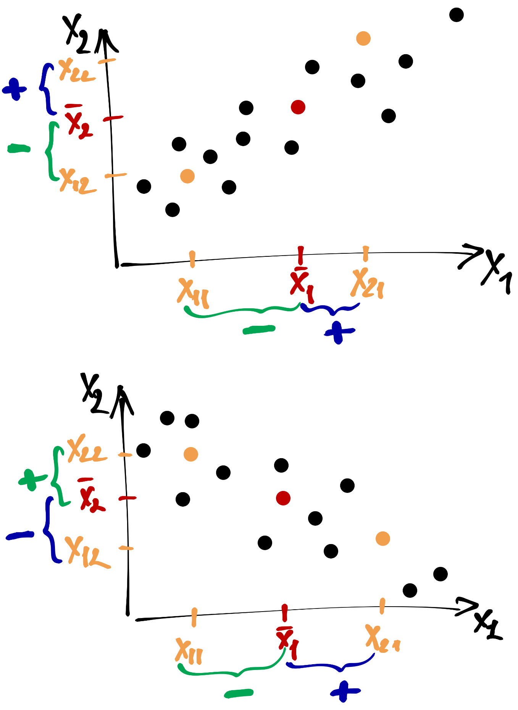
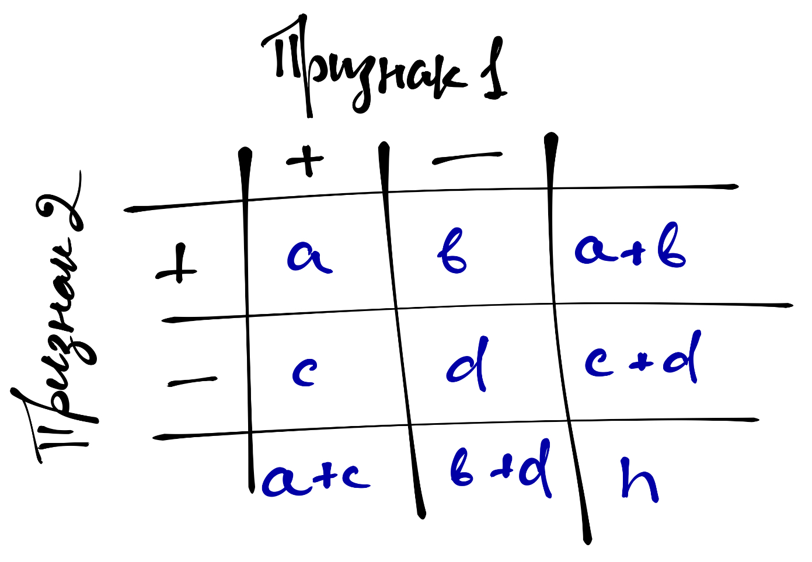

# Признаковое пространство

## Многомерность

- мы практически никогда не работаем с одним признаком
- мы измеряем несколько характеристик объекта → получаем *несколько измерений* (в геометрическом смысле)
- мы хотим обнаруживать закономерности в этом *многомерном признаковом пространстве*

## Начнём с двумерного

- есть два вектора измерений двух каких-либо параметров (рост / вес, успеваемость по математике / балл ЕГЭ, openess по Big Five / machiavellianism по Dark Triad)
- мы хотим узнать, если ли между ними какая-либо связь

Как это сделать?

Величины связаны → каким-либо образом *совместно изменяются* → требуется мера совместной изменчивости

# Ковариация

## Тренд

## Совместная изменчивость

## Ковариация

$$
\mathrm{cov}(X_1, X_2) = \frac{1}{n-1} \sum_{i=1}^n (\bar x_1 - x_{i1}) (\bar x_2 - x_{i2})
$$

- мера *линейной* взаимосвязи
- размерная величина
- показывает только направление связи

# Корреляция

## Убираем влияние размерности и разброса

- стандартизация переменных

$$
x_i^* = \frac{x_i - \bar x}{s}
$$

## Ковариация стандартизованных переменных (корреляция)

$$
\mathrm{cov}(X_1^*, X_2^*) = \frac{1}{n-1} \sum_{i=1}^n (\bar x_1^* - x_{i1}^*) (\bar x_2^* - x_{i2}^*) = \\
= \frac{1}{n-1} \sum_{i=1}^n x_{i1}^* x_{i2}^* = \mathrm{corr}(X_1, X_2),
$$

## Корреляция
$$
\mathrm{corr}(X_1, X_2) = \frac{\mathrm{cov}(X_1, X_2)}{s_1 s_2}
$$

- мера *линейной* взаимосвязи
- безразмерна
- имеет пределы изменения $[-1, 1]$
- показывает *силу и направление* связи

## Интерпретация коэффициента корреляции

|Значение|Интерпретация|
|:-------|:------------|
|$r > 0$|Прямая связь|
|$r < 0$|Обратная связь|
|$0.0 < |r| \leq 0.2$|Очень слабая взаимосвязь|
|$0.2 < |r| \leq 0.5$|Слабая взаимосвязь|
|$0.5 < |r| \leq 0.7$|Средняя взаимосвязь|
|$0.7 < |r| \leq 0.9$|Сильная взаимосвязь|
|$0.9 < |r| \leq 1.0$|Очень сильная взаимосвязь|

## Тестирование статистической значимости

$$
H_0: \rho = 0 \\
H_1: \rho \neq 0 \\

t = \frac{r}{\mathrm{SE}_r} = \frac{r}{\sqrt{\frac{1 - r^2}{n-2}}} \sim \mathrm{t}(n-2)
$$

# Больше переменных

## Корреляции более двух переменных

- можно прокорреллировать между собой более двух переменных
- результат удобно представить в виде *корреляционной матрицы*

$$
R = 
\begin{pmatrix}
1 & r_{12} & r_{13} \\
r_{21} & 1 & r_{23} \\
r_{31} & r_{32} & 1
\end{pmatrix}
$$

Это квадратная симметричная ($r_{ij} = r_{ji}$) матрица.

## Частная корреляция

- показывает степень связи между двумя переменными без учета влияния третьей переменной

$$
r_{12,3} = \frac{r_{12} - r_{13}r_{23}}{\sqrt{(1 - r^2_{23})(1 - r^2_{13})}}
$$
$$
H_0: \rho_{12,3} = 0 \\
H_1: \rho_{12,3} \neq 0 \\

t = \frac{r_{12,3} \sqrt{n-3}}{\sqrt{1-r^2_{12,3}}} \sim \mathrm{t}(n-3)
$$

# Корреляции различных шкал

## Корреляция Пирсона

- всё, что было до этого слайда, касалось корреляции Пирсона
- работает с сырыми значениями переменной
- параметрический критерий
- применима для интервальной шкалы и шкалы отношений

## Корреляция Спирмена

- применима для порядковой, интервальной и абсолютной шкал
- работает с рангами

$$
\rho = 1 - \frac{6}{n^3+n} \sum_{i=1}^n \big(\text{rank}(x_{i1}) - \text{rank}(x_{i2})\big)^2
$$

- чувствителен к повторяющимся значениям

## Корреляция Кендалла

- для порядковой шкалы
- работает с рангами
- оценивает согласованность пар рангов

$$
\tau = 1 - \frac{4}{n(n-1)} \sum_{i=1}^{n-1} \sum_{j=i+1}^{n} \Big( (x_i < x_j) \neq (y_i < y_j) \Big)
$$

# Меры связи для дихотомических шкал

## Таблица сопряженности

$a, b, c, d$ --- эмпирические частоты, $n$ --- общее количество наблюдений

## $\chi^2$-коэффициент

$$
\chi^2 = \sum_{i=1}^n \frac{(O_i - E_i)^2}{E_i},
$$
$O_i$ --- наблюдаемые частоты, $E_i$ --- теоретические частоты

Теоретическая частота для класса $a$:
$$
E_a = \frac{(a+c) \cdot (a+b)}{n}
$$

## $\phi$-коэффициент

$$
\phi = \sqrt{\frac{\chi^2}{n}}
$$

- в интерпретации аналогичен коэффициенту корреляции Пирсона

# Корреляция дихотомической шкалы с другими

