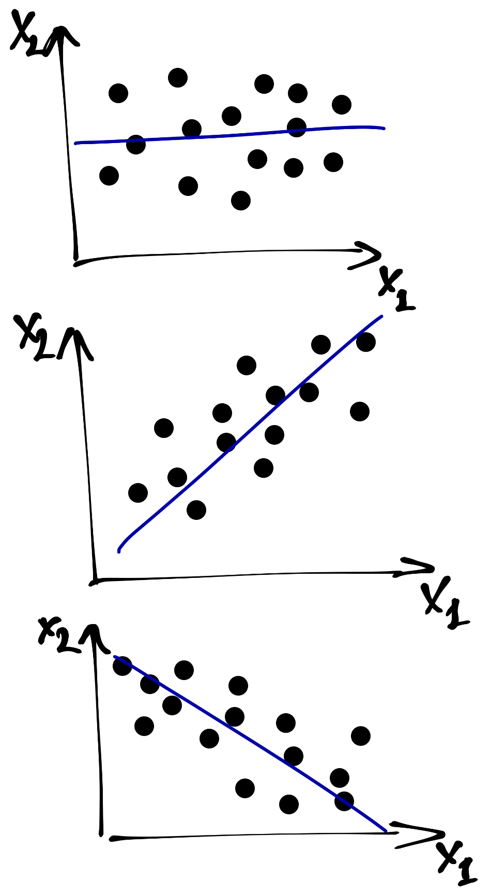
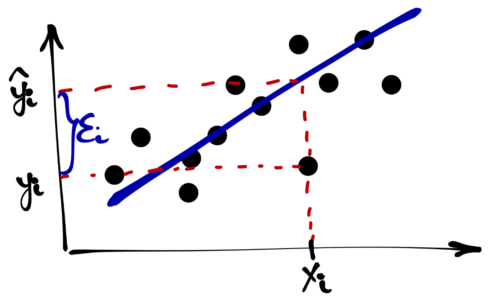
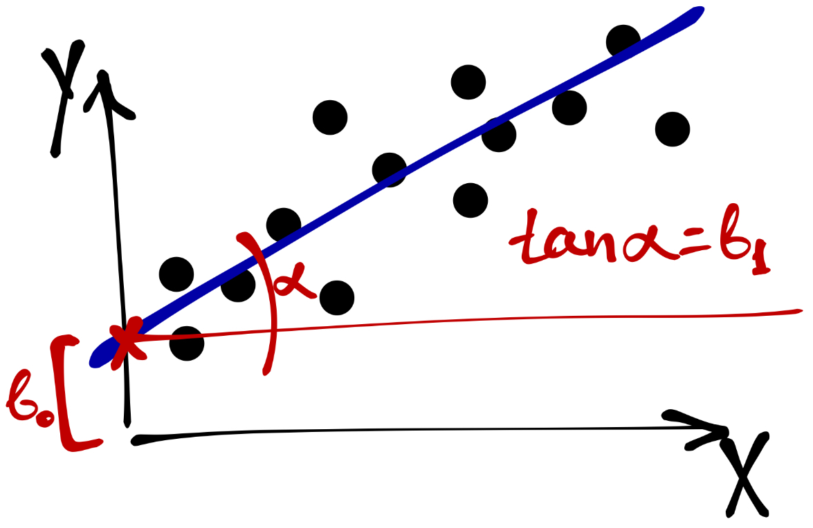
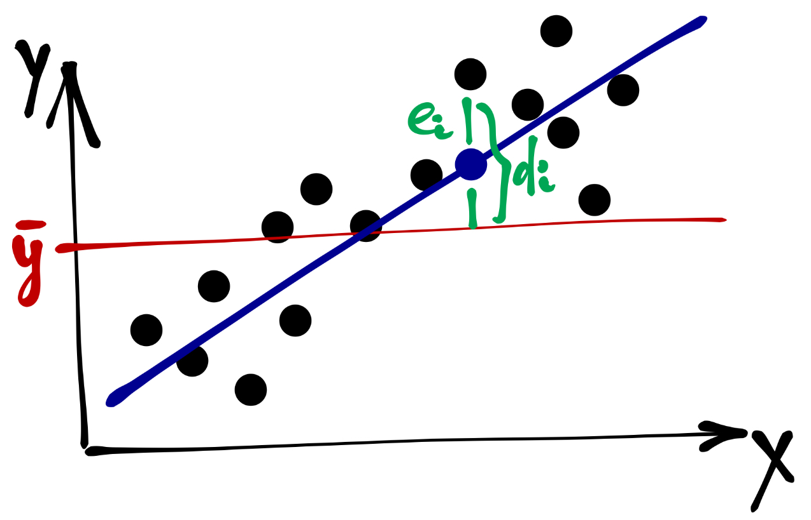

## Идея регрессионной модели

- исследуем взаимосвязь между переменными
- хотим смоделировать взаимосвязь
- определить уравнение линии тренда

## Термины

- $Y$ --- зависимая случайная величина
  - объясняемая
  - регрессант
  - функция
  
- $X$ --- независимая случайная величина
  - объясняющая
  - регрессор
  - предиктор

## Зачем нужна модель?

- *не показывает причинно-следственную связь*
- предсказывать значение зависимой переменной
- тестировать влияние предикторов
- определить способы влияния на зависимую переменную
- моделировать нелинейные закономерности

# Общий вид регрессионной модели

## Математическая модель. Общий вид

- моделируем положение переменной $Y$ в зависимости от значений переменной $X$

- положение переменной задается *математическим ожиданием*

$$
\mathbb{E}(Y|X) = f(x)
$$

- помним о неопределенности и вариативности

$$
y = f(x) + \varepsilon
$$

- хотим ухватить максимум закономерности

$$
\mathbb{E} (\varepsilon) = 0
$$

## Математическая модель. Общий вид

- аппроксимируем закономерность
- модель возвращает предсказанные (модельные) значения

$$
\hat y = f(x)
$$

$$
\varepsilon_i = y_i - \hat y_i
$$

 

- чтобы максимально ухватить закономерность, нужно минимизировать отклонения реальных значений от модельных

$$
\varepsilon_i\ \rightarrow \min
$$

# Простая линейная регрессия

## Математическая модель

- закономерность в генеральной совокупности

$$
f(x) = \beta_0 + \beta_1 x
$$

- модель для выборки

$$
f(x) = b_0 + b_1 x,
$$

где $b_0 = \hat \beta_0$, $b_1 = \hat \beta_1$.

 

$$
y = \beta_0 + \beta_1 x + \varepsilon
$$

$$
\hat y = b_0 + b_1 x + e, \; e = \hat \varepsilon
$$

## Предположения линейной регрессии

- линейность связи

$$
y = \beta_0 + \beta_1 x + \varepsilon
$$

- нормальное распределение остатков
$$
\varepsilon_i \sim \mathrm{N}(0, \, \sigma^2_i)
$$

- гомоскедастичность остатков

$$
\sigma^2_i = \sigma^2 = \mathrm{const}
$$

- независимость (некоррелированность) остатков

$$
\mathbb{E}(\underset{i \neq j}{\varepsilon_i \varepsilon_j}) = 0
$$

## Идентификация модели

$$
\hat y = b_0 + b_1 x + e
$$

$$
\begin{cases}
y_1 = b_0 + b_1 x_1 + e_1, \\
y_1 = b_0 + b_1 x_1 + e_1, \\
\cdots \\
y_n = b_0 + b_1 x_n + e_n;
\end{cases}
$$

### Метод наименьших квадратов (МНК)

$$
\sum_{i=1}^n e_i^2 \rightarrow \min
$$

## Идентификация модели

$$
e_i = y_i - \hat y_i = y_i - b_0 - b_1 x_i
$$

$$
Q_{\text{res}} = \sum_{i=1}^n (y_i - b_0 - b_1 x_i)^2 \rightarrow \underset{b_0, \, b_1}{\min}
$$

$$
\begin{cases}
\dfrac{\partial Q_{\text{res}}}{\partial b_0} = 0, \\
\dfrac{\partial Q_{\text{res}}}{\partial b_1} = 0;
\end{cases}
$$

## Идентификация модели

$$
\begin{cases}
-2 \sum_{i=1}^n (y_i - b_0 - b_1 x_i) = 0, \\
-2 \sum_{i=1}^n (y_i - b_0 - b_1 x_i) x_i = 0;
\end{cases}
$$

 
 

$$
b_1 = \frac{n \sum_{i=1}^n y_i x_i - \sum_{i=1}^n y_i \sum_{i=1}^n x_i}{n \sum_{i=1}^n x_i^2 - (\sum_{i=1}^n x_i)^2}
$$

 

$$
b_0 = \frac{\sum_{i=1}^n y_i}{n} - b_1 \frac{\sum_{i=1}^n x_i}{n}
$$

## Векторное вычисление коэффициентов

$$
\pmb{y} = \pmb{b} \pmb{x} + \pmb{e},
$$

где 
$$
\pmb{y} = \begin{pmatrix}
y_1 \\ y_2 \\ \dots \\ y_n
\end{pmatrix}, \;
\pmb{x} = \begin{pmatrix}
1 & x_1 \\
1 & x_2 \\
\vdots & \vdots \\
1 & x_n
\end{pmatrix}, \;
\pmb{b} = \begin{pmatrix} b_0 & b_1 \end{pmatrix}
$$

 

$$
\pmb{b} = (\pmb{x}^{\mathrm{T}} \pmb{x})^{-1} \pmb{x}^{\mathrm{T}} \pmb{y}
$$

# Оценка качества модели

## Goodness of fit

Сколько информации схватывает наша модель?

$$
\mathrm{TSS} = \sum_{i=1}^n (\bar y - y_i)^2 \\
\mathrm{RSS} = \sum_{i=1}^n (\hat y_i - y_i)
$$

 

$$
R^2 = \frac{\mathrm{TSS} - \mathrm{RSS}}{\mathrm{TSS}} = 1 - \frac{\mathrm{RSS}}{\mathrm{TSS}} \\
R^2 = r^2
$$

## Goodness of fit

Значима ли наша модель?

$$
H_0: b_0 = b_1 = 0 \\
H_1: b_0 \neq 0 \vee b_1 \neq 0 \\
$$

 

$$
F = \frac{R^2(k-1)}{(1-R^2)(n-k)} \sim \mathrm{F}(k-1, \; n-k)
$$

## Другие метрики качества модели

$$
\mathrm{MSE} = \frac{1}{n} \sum_{i=1}^n (\hat y_i - y_i)^2 = \frac{1}{n} \sum_{i=1}^n e_i^2 = \frac{1}{n} \pmb{e} \pmb{e}^{\mathrm{T}}
$$

$$
\mathrm{RMSE} = \sqrt{\mathrm{MSE}} = \sqrt{\frac{1}{n} \sum_{i=1}^n (\hat y_i - y_i)^2}
$$

$$
\mathrm{MAE} = \frac{1}{n} \sum_{i=1}^n |\hat y_i - y_i| = \frac{1}{n} \sum_{i=1}^n |e_i|
$$

$$
\mathrm{MAPE} = \frac{1}{n} \sum_{i=1}^n \Bigg|\frac{\hat y_i - y_i}{y_i} \Bigg|
$$

## Тестирование значимости предикторов

$$
H_0: \beta_1 = 0 \\
H_1: \beta_1 \neq 0 \\
$$

 

$$
t = \frac{b_1 - \beta_1}{\mathrm{SE}(b_1)} = \frac{b_1}{\mathrm{SE}(b_1)}
$$

 

$$
\mathrm{SE}(b_1) = \frac{\mathrm{var}(\varepsilon)}{\sum_{i=1}^n (x_i - \bar x)^2}
$$

# The end

